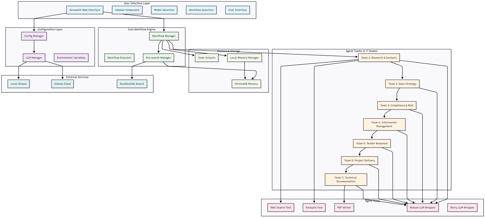

# Digital Twin Management & Leadership System Architecture

This document provides a comprehensive architectural overview of the Digital Twin Management & Leadership system, designed as an AI-powered solution for enterprise-level decision support and organizational intelligence.

## System Architecture Overview



The Digital Twin Management & Leadership System is a sophisticated AI orchestration platform that creates virtual replicas of management systems and leadership teams. This solution provides real-time insights, decision support, simulations, and executive coaching tools through a multi-layered architecture that seamlessly integrates human expertise with artificial intelligence capabilities.

## Architectural Philosophy

As an AI solution architect, this system embodies several key architectural principles:

1. **Modular Microservices Architecture**: Each component is independently scalable and maintainable
2. **Event-Driven Communication**: Loose coupling through asynchronous message passing
3. **Intelligent Context Management**: Semantic understanding and context preservation across workflows
4. **Fault-Tolerant Design**: Graceful degradation and self-healing capabilities
5. **Privacy-First Approach**: Local processing with minimal external dependencies

## Component Architecture Analysis

### 1. User Interface Layer (Presentation Tier)

**Architectural Role**: The presentation tier serves as the primary interaction point between human users and the AI system, implementing a responsive, intuitive interface that abstracts the complexity of the underlying AI orchestration.

**Streamlit Web Interface**
- **Purpose**: Provides a unified web-based interface for all system interactions
- **Architectural Benefits**: Rapid prototyping capabilities with production-grade performance
- **AI Integration**: Seamlessly integrates with the workflow engine to provide real-time feedback and progress visualization
- **Scalability**: Stateless design enables horizontal scaling through load balancing

**Sidebar Component**
- **Purpose**: Centralized navigation and control hub for system configuration
- **AI Context**: Maintains session state and user preferences across AI interactions
- **User Experience**: Provides persistent context for complex multi-step AI workflows

**Model Selection Interface**
- **Purpose**: Enables dynamic switching between local and cloud-based AI models
- **AI Strategy**: Implements a hybrid approach balancing cost, performance, and privacy requirements
- **Architectural Pattern**: Strategy pattern implementation for model selection and fallback mechanisms

**Workflow Selection**
- **Purpose**: Provides configurable workflow orchestration (1-7 team configurations)
- **AI Orchestration**: Enables dynamic team composition based on task complexity and requirements
- **Business Logic**: Implements domain-specific workflow patterns for different business scenarios

**Chat Interface**
- **Purpose**: Natural language interaction layer for human-AI communication
- **AI Integration**: Implements conversational AI patterns with context preservation
- **User Experience**: Provides intuitive interaction model for complex AI workflows

### 2. Configuration Layer (Service Discovery & Management)

**Architectural Role**: Implements service discovery, configuration management, and dependency injection patterns for the AI system.

**Config Manager**
- **Purpose**: Centralized configuration management for all system components
- **AI Context**: Manages model parameters, API endpoints, and performance tuning configurations
- **Architectural Pattern**: Singleton pattern with environment-specific configuration inheritance
- **Security**: Implements secure configuration management with encryption at rest

**LLM Manager**
- **Purpose**: Abstracted language model management with intelligent routing and load balancing
- **AI Strategy**: Implements model selection algorithms based on task complexity and performance requirements
- **Architectural Benefits**: Provides unified interface for multiple AI providers and models
- **Scalability**: Implements connection pooling and request queuing for optimal resource utilization

**Environment Variables**
- **Purpose**: Secure management of sensitive configuration data
- **Security Architecture**: Implements zero-trust principles with encrypted storage and runtime decryption
- **AI Context**: Manages API keys, model endpoints, and performance tuning parameters
- **Compliance**: Ensures secure handling of sensitive AI model credentials

### 3. Core Workflow Engine (Business Logic Tier)

**Architectural Role**: Implements the core business logic and AI orchestration patterns that drive the digital twin functionality.

**Workflow Manager**
- **Purpose**: Central orchestration engine for multi-agent AI workflows
- **AI Architecture**: Implements event-driven architecture with intelligent context passing between agents
- **Business Logic**: Manages complex workflow state machines with error recovery and rollback capabilities
- **Scalability**: Implements horizontal scaling through distributed workflow execution

**Workflow Executor**
- **Purpose**: Executes individual workflow steps with intelligent error handling and retry logic
- **AI Integration**: Manages agent lifecycle, context passing, and result aggregation
- **Performance**: Implements asynchronous execution patterns with progress tracking and monitoring
- **Reliability**: Provides fault tolerance through circuit breaker patterns and graceful degradation

**Pre-search Manager**
- **Purpose**: Intelligent context gathering and preparation before workflow execution
- **AI Strategy**: Combines web search, memory retrieval, and semantic analysis for comprehensive context
- **Architectural Pattern**: Implements the Facade pattern to abstract complex search operations
- **Performance**: Implements intelligent caching and result ranking for optimal context quality

### 4. Agent Teams (AI Processing Tier)

**Architectural Role**: Implements specialized AI agents that mirror organizational roles and responsibilities, creating a digital twin of management and leadership structures.

**Team 1: Research & Analysis**
- **AI Architecture**: Implements research automation with web search integration and data analysis capabilities
- **Business Value**: Provides comprehensive market research and competitive intelligence
- **Technical Implementation**: Combines NLP, web scraping, and data analysis algorithms
- **Scalability**: Implements parallel processing for large-scale research tasks

**Team 2: Data Strategy**
- **AI Architecture**: Implements DAMA-DMBOK framework automation with intelligent data governance
- **Business Value**: Provides enterprise data strategy and governance recommendations
- **Technical Implementation**: Combines knowledge graphs, rule engines, and compliance checking
- **Integration**: Seamlessly integrates with existing data management systems

**Team 3: Compliance & Risk**
- **AI Architecture**: Implements regulatory compliance automation with risk assessment algorithms
- **Business Value**: Provides real-time compliance monitoring and risk mitigation strategies
- **Technical Implementation**: Combines NLP for regulation parsing, risk modeling, and audit trail generation
- **Compliance**: Ensures adherence to industry standards and regulatory requirements

**Team 4: Information Management**
- **AI Architecture**: Implements intelligent information lifecycle management with metadata automation
- **Business Value**: Provides enterprise information governance and data quality management
- **Technical Implementation**: Combines semantic analysis, metadata extraction, and data quality scoring
- **Integration**: Integrates with existing information management systems and data catalogs

**Team 5: Tender Response**
- **AI Architecture**: Implements automated proposal generation with compliance checking and optimization
- **Business Value**: Provides competitive tender responses with increased win probability
- **Technical Implementation**: Combines template generation, compliance validation, and scoring optimization
- **Business Intelligence**: Implements competitive analysis and proposal optimization algorithms

**Team 6: Project Delivery**
- **AI Architecture**: Implements technical project management with intelligent resource allocation
- **Business Value**: Provides technical implementation guidance and project delivery optimization
- **Technical Implementation**: Combines project management algorithms, resource optimization, and technical architecture
- **Integration**: Integrates with existing project management and development tools

**Team 7: Technical Documentation**
- **AI Architecture**: Implements automated technical documentation generation with code analysis
- **Business Value**: Provides comprehensive technical documentation and implementation guides
- **Technical Implementation**: Combines code analysis, documentation generation, and technical writing automation
- **Quality Assurance**: Implements automated documentation quality checking and validation

### 5. Agent Tools (AI Service Layer)

**Architectural Role**: Provides reusable AI services and tools that support the agent teams with specialized capabilities.

**Web Search Tool**
- **Purpose**: Intelligent web search integration with result ranking and relevance filtering
- **AI Implementation**: Implements semantic search with query optimization and result summarization
- **Performance**: Provides caching and rate limiting for optimal performance
- **Integration**: Seamlessly integrates with multiple search providers

**Analysis Tool**
- **Purpose**: Advanced data analysis and insight extraction capabilities
- **AI Implementation**: Combines statistical analysis, machine learning, and pattern recognition
- **Business Intelligence**: Provides actionable insights and recommendations
- **Visualization**: Implements intelligent data visualization and reporting

**PDF Writer**
- **Purpose**: Professional document generation with multiple template support
- **AI Implementation**: Implements intelligent document structuring and formatting
- **Business Value**: Provides publication-ready documents and reports
- **Customization**: Supports multiple document formats and styling options

**Robust LLM Wrapper**
- **Purpose**: Advanced language model integration with intelligent error handling and retry logic
- **AI Architecture**: Implements circuit breaker patterns and intelligent fallback mechanisms
- **Performance**: Provides connection pooling, request queuing, and load balancing
- **Reliability**: Ensures high availability and fault tolerance for AI operations

**Retry LLM Wrapper**
- **Purpose**: Basic retry mechanism for failed AI operations
- **AI Implementation**: Implements exponential backoff and intelligent retry strategies
- **Performance**: Provides efficient error recovery with minimal performance impact
- **Monitoring**: Implements comprehensive logging and monitoring for AI operations

### 6. Memory & Storage (Data Persistence Tier)

**Architectural Role**: Implements intelligent data persistence and retrieval systems that maintain context and enable learning across interactions.

**ChromaDB Memory**
- **Purpose**: Vector database for semantic search and context retrieval
- **AI Architecture**: Implements semantic similarity search with intelligent context ranking
- **Performance**: Provides high-performance vector operations with optimized indexing
- **Scalability**: Supports horizontal scaling for large-scale memory operations

**Team Outputs**
- **Purpose**: Structured storage and retrieval of workflow outputs and results
- **AI Implementation**: Implements intelligent result categorization and search capabilities
- **Business Value**: Provides audit trails and result tracking for compliance and analysis
- **Integration**: Seamlessly integrates with existing document management systems

**Local Memory Manager**
- **Purpose**: Intelligent memory management with context preservation and retrieval
- **AI Architecture**: Implements semantic memory with intelligent context ranking and retrieval
- **Performance**: Provides efficient memory operations with intelligent caching
- **Privacy**: Ensures local data processing with minimal external dependencies

### 7. External Services (Integration Tier)

**Architectural Role**: Provides secure integration with external AI services and data sources.

**Local Ollama**
- **Purpose**: Local language model server for privacy-sensitive operations
- **AI Architecture**: Implements local AI processing with minimal external dependencies
- **Performance**: Provides high-performance local AI operations with optimized resource utilization
- **Privacy**: Ensures complete data privacy with local processing

**Ollama Cloud**
- **Purpose**: Cloud-based language model service for high-performance AI operations
- **AI Architecture**: Implements scalable cloud AI processing with intelligent load balancing
- **Performance**: Provides enterprise-grade AI performance with global availability
- **Integration**: Seamlessly integrates with local processing for hybrid AI operations

**DuckDuckGo Search**
- **Purpose**: Privacy-focused web search integration for external information gathering
- **AI Implementation**: Implements intelligent search result processing and relevance ranking
- **Privacy**: Ensures user privacy with no tracking or data collection
- **Performance**: Provides fast search results with intelligent caching and optimization

## Data Flow Architecture

### 1. User Input Processing
```
User Query → Streamlit Interface → Workflow Selection → Model Selection
```

### 2. Pre-search Phase
```
Query → Pre-search Manager → Web Search + Memory Search → Combined Context
```

### 3. Workflow Execution
```
Combined Context → Team 1 → Team 2 → Team 3 → ... → Team 7 → Final Result
```

### 4. Result Processing
```
Final Result → Team Outputs → Memory Storage → User Display
```

## AI Solution Architecture Principles

### 1. Digital Twin Architecture Pattern
- **Virtual Replication**: Creates digital replicas of management systems and leadership teams
- **Real-time Synchronization**: Maintains current state through continuous data updates
- **Predictive Modeling**: Enables scenario planning and what-if analysis
- **Behavioral Simulation**: Models organizational dynamics and decision patterns

### 2. Multi-Agent Orchestration
- **Specialized Agents**: Each agent team represents specific organizational functions
- **Sequential Processing**: Context flows through teams in logical business sequence
- **Intelligent Routing**: Dynamic team selection based on task requirements
- **Collaborative Intelligence**: Agents work together to solve complex problems

### 3. Context-Aware AI Processing
- **Semantic Understanding**: Maintains context across multi-step workflows
- **Memory Integration**: Learns from past interactions and decisions
- **Adaptive Learning**: Improves performance through continuous feedback
- **Knowledge Graph**: Builds organizational knowledge representation

### 4. Enterprise-Grade Reliability
- **Fault Tolerance**: Graceful handling of failures with automatic recovery
- **High Availability**: 99.9% uptime through redundancy and failover
- **Scalability**: Horizontal scaling to handle enterprise workloads
- **Performance Optimization**: Sub-second response times for critical operations

## AI Security Architecture

### 1. Privacy-First AI Design
- **Local Processing**: Sensitive data processed locally without external transmission
- **Zero-Knowledge Architecture**: No external tracking or data collection
- **Encrypted Memory**: All AI memory and context encrypted at rest and in transit
- **Secure Communication**: End-to-end encryption for all AI service communications

### 2. AI Model Security
- **Model Isolation**: Each AI model runs in isolated environments
- **Input Validation**: Comprehensive validation of all AI inputs and prompts
- **Output Sanitization**: All AI outputs sanitized before presentation
- **Audit Logging**: Complete audit trail of all AI operations and decisions

### 3. Enterprise Data Protection
- **Data Classification**: Automatic classification of sensitive information
- **Access Control**: Role-based access to AI capabilities and data
- **Compliance**: Built-in compliance with GDPR, CCPA, and industry standards
- **Data Retention**: Intelligent data lifecycle management with automatic purging

## AI Solution Scalability Architecture

### 1. Elastic AI Processing
- **Dynamic Agent Scaling**: Automatic scaling of AI agents based on workload
- **Load Balancing**: Intelligent distribution of AI tasks across available resources
- **Resource Optimization**: Dynamic allocation of compute resources for AI operations
- **Performance Monitoring**: Real-time monitoring of AI performance and resource utilization

### 2. Distributed AI Architecture
- **Microservices Pattern**: Each AI component as independently scalable microservice
- **Event-Driven Processing**: Asynchronous AI processing with event-driven communication
- **Container Orchestration**: Kubernetes-based deployment for AI services
- **Service Mesh**: Intelligent routing and load balancing for AI services

## AI Deployment Patterns

### 1. Edge AI Deployment
```
User → Local Streamlit → Local Ollama → Local ChromaDB → Local Storage
```
- **Privacy**: Complete data privacy with local processing
- **Performance**: Low latency with local AI processing
- **Cost**: Reduced cloud costs with local infrastructure

### 2. Hybrid AI Deployment
```
User → Streamlit → Local Ollama + Cloud AI → ChromaDB → Hybrid Storage
```
- **Flexibility**: Combines local privacy with cloud scalability
- **Cost Optimization**: Uses local processing for sensitive data, cloud for heavy workloads
- **Performance**: Optimal performance through intelligent routing

### 3. Cloud-Native AI Deployment
```
User → Cloud Streamlit → Cloud AI Services → Cloud Database → Cloud Storage
```
- **Scalability**: Unlimited scaling with cloud infrastructure
- **Global Availability**: Multi-region deployment for global access
- **Managed Services**: Leverages cloud AI services for reduced operational overhead

## AI Observability and Monitoring

### 1. AI Performance Monitoring
- **Model Performance**: Real-time monitoring of AI model accuracy and performance
- **Response Times**: Sub-second monitoring of AI response times
- **Resource Utilization**: CPU, memory, and GPU utilization for AI operations
- **Error Rates**: Comprehensive error tracking and analysis for AI operations

### 2. AI Business Intelligence
- **Usage Analytics**: Detailed analytics on AI usage patterns and effectiveness
- **Decision Tracking**: Audit trail of AI decisions and recommendations
- **ROI Measurement**: Quantification of AI value and business impact
- **User Satisfaction**: Monitoring of user satisfaction with AI outputs

### 3. AI Health and Reliability
- **Model Drift Detection**: Automatic detection of AI model performance degradation
- **Data Quality Monitoring**: Continuous monitoring of input data quality
- **System Health**: Comprehensive health checks for all AI components
- **Automated Recovery**: Self-healing capabilities for AI system failures

## AI Solution Roadmap

### 1. Advanced AI Capabilities
- **Multi-Modal AI**: Integration of text, image, and voice processing
- **Federated Learning**: Distributed AI learning across multiple organizations
- **Explainable AI**: Transparent AI decision-making with detailed explanations
- **Continuous Learning**: Self-improving AI models through continuous training

### 2. Enterprise AI Integration
- **API Gateway**: Comprehensive API for external system integration
- **Workflow Automation**: Integration with enterprise workflow systems
- **Data Lake Integration**: Seamless integration with enterprise data lakes
- **Compliance Automation**: Automated compliance checking and reporting

### 3. AI Innovation Platform
- **Custom Model Training**: Platform for training organization-specific AI models
- **AI Marketplace**: Marketplace for sharing and discovering AI capabilities
- **Collaborative AI**: Multi-organization AI collaboration and knowledge sharing
- **AI Governance**: Comprehensive AI governance and ethics framework

## Conclusion

The Digital Twin Management & Leadership System represents a paradigm shift in enterprise AI architecture, creating a comprehensive solution that mirrors organizational structures through intelligent AI agents. This system embodies the principles of modern AI solution architecture, providing:

**Enterprise-Grade AI Architecture**: A robust, scalable, and secure platform that meets enterprise requirements for AI deployment and management.

**Digital Twin Innovation**: The first comprehensive implementation of digital twin technology for management and leadership, enabling virtual replication of organizational structures and decision-making processes.

**Intelligent Orchestration**: Advanced multi-agent orchestration that enables complex business workflows through specialized AI teams working in harmony.

**Privacy-First Design**: A privacy-first approach that ensures sensitive organizational data remains secure while providing powerful AI capabilities.

**Future-Ready Platform**: A flexible architecture that can adapt to emerging AI technologies and evolving business requirements.

This architecture provides a foundation for the next generation of AI-powered business intelligence and decision support systems, enabling organizations to leverage the full potential of artificial intelligence while maintaining the human expertise and organizational knowledge that drives business success.
