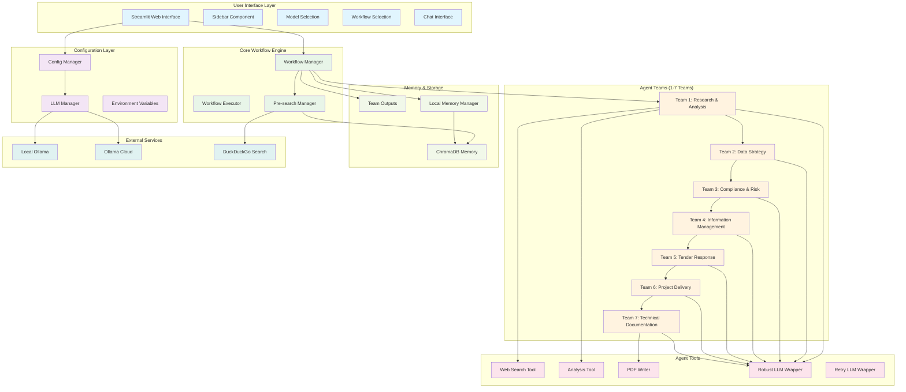

# CrewAI Multi-Agent Workflow System Architecture

This document provides an interactive architecture diagram and comprehensive overview of the CrewAI multi-agent workflow system.

> **Note**: If the Mermaid diagram below doesn't render in your markdown viewer, see the [Text-Based Architecture](docs/ARCHITECTURE_SIMPLE.md) for a complete text representation.

## System Overview

The CrewAI Multi-Agent Workflow System is a comprehensive platform that orchestrates multiple AI agent teams to perform complex business analysis, research, and documentation tasks. The system supports 1-7 team workflows with sequential execution and context passing between teams.

## Interactive Architecture Diagram



## Component Details

### 1. User Interface Layer
- **Streamlit Web Interface**: Main web application
- **Sidebar Component**: Navigation and controls
- **Model Selection**: Local vs Cloud model choice
- **Workflow Selection**: 1-7 team workflow options
- **Chat Interface**: User input and result display

### 2. Configuration Layer
- **Config Manager**: Application configuration and environment setup
- **LLM Manager**: Language model initialization and management
- **Environment Variables**: Secure API key and setting management

### 3. Core Workflow Engine
- **Workflow Manager**: Orchestrates multi-team workflows
- **Workflow Executor**: Executes individual workflows
- **Pre-search Manager**: Combines web search and memory search

### 4. Agent Teams (1-7 Teams)
- **Team 1**: Research & Analysis (Research Specialist, Data Analyst, Content Writer)
- **Team 2**: Data Strategy (Data Governance Specialist, DCAM Template Specialist, Tranch Guidance Specialist)
- **Team 3**: Compliance & Risk (Compliance Specialist, Risk Management Specialist, Audit & Governance Specialist)
- **Team 4**: Information Management (Information Governance Specialist, Metadata Management Specialist, Data Quality Specialist)
- **Team 5**: Tender Response (Tender Response Specialist, Proposal Writer, Compliance Expert)
- **Team 6**: Project Delivery (Data Engineer, Data Scientist, Data Architect, DevOps Engineer, Project Manager)
- **Team 7**: Technical Documentation (Data Modeling Specialist, Python Code Specialist, SQL Code Specialist, PySpark Code Specialist, Technical Writer)

### 5. Agent Tools
- **Web Search Tool**: DuckDuckGo integration for external information
- **Analysis Tool**: Data analysis and insight extraction
- **PDF Writer**: Academic and professional PDF generation
- **Robust LLM Wrapper**: Advanced LLM wrapper with retry logic
- **Retry LLM Wrapper**: Basic retry wrapper for LLM calls

### 6. Memory & Storage
- **ChromaDB Memory**: Vector database for conversation storage
- **Team Outputs**: Structured storage of workflow outputs
- **Local Memory Manager**: Memory management and retrieval

### 7. External Services
- **Local Ollama**: Local language model server
- **Ollama Cloud**: Cloud-based language model service
- **DuckDuckGo Search**: Web search service

## Data Flow

### 1. User Input Processing
```
User Query → Streamlit Interface → Workflow Selection → Model Selection
```

### 2. Pre-search Phase
```
Query → Pre-search Manager → Web Search + Memory Search → Combined Context
```

### 3. Workflow Execution
```
Combined Context → Team 1 → Team 2 → Team 3 → ... → Team 7 → Final Result
```

### 4. Result Processing
```
Final Result → Team Outputs → Memory Storage → User Display
```

## Workflow Types

### Single Team Workflow
```
Query → Pre-search → Research & Analysis → Result
```

### Two Team Workflow
```
Query → Pre-search → Research & Analysis → Data Strategy → Result
```

### Three Team Workflow
```
Query → Pre-search → Research & Analysis → Data Strategy → Compliance & Risk → Result
```

### Four Team Workflow
```
Query → Pre-search → Research & Analysis → Data Strategy → Compliance & Risk → Information Management → Result
```

### Five Team Workflow
```
Query → Pre-search → Research & Analysis → Data Strategy → Compliance & Risk → Information Management → Tender Response → Result
```

### Six Team Workflow
```
Query → Pre-search → Research & Analysis → Data Strategy → Compliance & Risk → Information Management → Tender Response → Project Delivery → Result
```

### Seven Team Workflow
```
Query → Pre-search → Research & Analysis → Data Strategy → Compliance & Risk → Information Management → Tender Response → Project Delivery → Technical Documentation → Result
```

## Key Features

### 1. Modular Architecture
- **Agent Teams**: Self-contained teams with specific roles
- **Workflow Types**: Flexible 1-7 team configurations
- **Tool Integration**: Reusable tools across teams
- **Memory System**: Persistent conversation storage

### 2. Intelligent Context Management
- **Pre-search**: Web and memory search before workflow execution
- **Context Passing**: Sequential context passing between teams
- **Memory Integration**: Past conversation context retrieval
- **Semantic Search**: Vector-based similarity search

### 3. Robust Error Handling
- **Retry Logic**: Exponential backoff for failed requests
- **Graceful Degradation**: Fallback mechanisms for failures
- **Error Recovery**: Automatic error recovery and retry
- **Progress Tracking**: Real-time progress monitoring

### 4. Performance Optimization
- **Rate Limiting**: Built-in request throttling
- **Caching**: Intelligent caching for repeated requests
- **Parallel Processing**: Concurrent team execution where possible
- **Memory Management**: Efficient memory usage and cleanup

## Security Features

### 1. API Key Management
- **Environment Variables**: Secure API key storage
- **Key Masking**: API keys masked in logs and UI
- **Validation**: API key format validation
- **Error Handling**: Graceful handling of invalid keys

### 2. Data Privacy
- **Local Storage**: All data stored locally
- **No External Tracking**: No external analytics or tracking
- **Memory Encryption**: ChromaDB encryption for sensitive data
- **Secure Communication**: HTTPS for external API calls

## Scalability Considerations

### 1. Horizontal Scaling
- **Team Addition**: Easy addition of new teams
- **Workflow Extension**: Simple workflow type extension
- **Tool Integration**: Modular tool system
- **Memory Scaling**: ChromaDB horizontal scaling

### 2. Performance Scaling
- **Rate Limiting**: Configurable rate limits
- **Caching**: Multi-level caching system
- **Memory Management**: Efficient memory usage
- **Database Optimization**: Optimized database queries

## Deployment Architecture

### 1. Local Deployment
```
User → Streamlit App → Local Ollama → ChromaDB → File System
```

### 2. Cloud Deployment
```
User → Streamlit App → Ollama Cloud → ChromaDB → Cloud Storage
```

### 3. Hybrid Deployment
```
User → Streamlit App → Local Ollama + Ollama Cloud → ChromaDB → File System
```

## Monitoring and Observability

### 1. Logging
- **Application Logs**: Detailed application logging
- **Error Logs**: Comprehensive error logging
- **Performance Logs**: Performance metrics logging
- **Audit Logs**: User action audit logging

### 2. Metrics
- **Workflow Metrics**: Workflow execution metrics
- **Memory Metrics**: Memory usage and performance
- **API Metrics**: External API usage metrics
- **User Metrics**: User interaction metrics

### 3. Health Checks
- **LLM Health**: Language model connectivity checks
- **Memory Health**: Database health monitoring
- **Tool Health**: Tool availability checks
- **System Health**: Overall system health monitoring

## Future Enhancements

### 1. Advanced Features
- **Multi-language Support**: Support for multiple languages
- **Custom Agent Types**: User-defined agent types
- **Workflow Templates**: Pre-built workflow templates
- **API Integration**: REST API for external integration

### 2. Performance Improvements
- **Async Processing**: Asynchronous workflow execution
- **Distributed Processing**: Distributed team execution
- **Advanced Caching**: Multi-level caching system
- **Database Optimization**: Advanced database optimization

### 3. User Experience
- **Real-time Updates**: Real-time progress updates
- **Interactive Results**: Interactive result visualization
- **Custom Dashboards**: User-customizable dashboards
- **Mobile Support**: Mobile-responsive interface

## Conclusion

The CrewAI Multi-Agent Workflow System provides a comprehensive, scalable, and robust platform for complex business analysis and documentation tasks. Its modular architecture, intelligent context management, and robust error handling make it suitable for enterprise-level applications while maintaining ease of use and deployment flexibility.

The system's ability to orchestrate multiple AI agent teams with sequential execution and context passing enables complex workflows that would be difficult to achieve with single-agent systems. The integration of web search, memory storage, and multiple output formats provides a complete solution for business intelligence and documentation needs.
