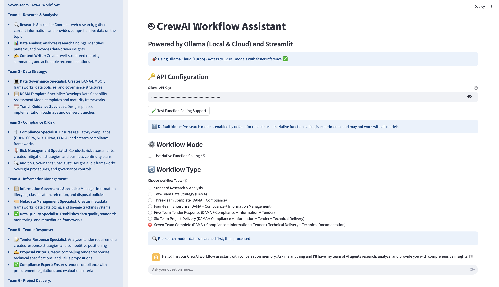

# Digital Twins for Management and Leadership - CrewAI Multi-Agent Workflow System

A comprehensive Streamlit application that orchestrates multiple AI agent teams using CrewAI with Ollama (local and cloud) for enterprise-level research, analysis, and document generation. This system implements the Digital Twin concept for management and leadership teams, providing AI-powered digital replicas of management systems and leadership teams with real-time insights, decision support, simulations, and executive coaching tools.



## 🚀 Features

### **Multi-Team Workflows (1-7 Teams)**
- **Single Team**: Research → Analysis → Writing
- **Two Teams**: Research → Data Strategy (DAMA)
- **Three Teams**: Research → Data Strategy → Compliance & Risk
- **Four Teams**: Research → Data Strategy → Compliance & Risk → Information Management
- **Five Teams**: + Tender Response
- **Six Teams**: + Project Delivery
- **Seven Teams**: + Technical Documentation

### **Advanced Capabilities**
- **Hybrid Model Support**: Local Ollama (llama3.1) and Ollama Cloud (Turbo) - oss20b model used for advanced capabilities
- **Real-time Web Search**: DuckDuckGo integration with enhanced visualization
- **Conversation Memory**: ChromaDB with local embeddings (no external API keys)
- **PDF Report Generation**: Professional templated reports with multiple layouts
- **Team Output Management**: Structured saving of all team outputs
- **Pre-search Functionality**: Web + memory search for comprehensive context
- **Modular Architecture**: Organized agent teams, workflows, and UI components
- **Function Calling Testing**: Test model capabilities before use
- **Environment Configuration**: Secure API key management

## Setup

### 1. Install Dependencies

```bash
pip install -r local_requirements.txt
```

### 2. Environment Configuration

Copy the example environment file and configure your settings:

```bash
cp .env.example .env
```

Edit `.env` with your configuration:

```env
# Ollama Configuration
OLLAMA_BASE_URL=http://localhost:11434
OLLAMA_LOCAL_MODEL=llama3.1

# Ollama Cloud (Turbo) settings
OLLAMA_CLOUD_BASE_URL=https://api.ollama.ai
OLLAMA_CLOUD_MODEL=gpt-oss:20b
OLLAMA_API_KEY=your_api_key_here

# Application settings
STREAMLIT_PORT=8501
STREAMLIT_ADDRESS=localhost

# Search settings
DUCKDUCKGO_MAX_RESULTS=5
SEARCH_RETRY_ATTEMPTS=3
SEARCH_DELAY_SECONDS=1

# Model settings
DEFAULT_TEMPERATURE=0.7
DEFAULT_MAX_TOKENS=20000
DEFAULT_TOP_P=0.9
```

### 3. Start Ollama (Local)

```bash
ollama serve
```

### 4. Pull Required Models

```bash
ollama pull llama3.1
```

### 5. Run the Application

```bash
streamlit run streamlit_app.py
```

## Usage

### **Basic Workflow**
1. **Choose Model**: Select between Local Ollama (llama3.1) or Ollama Cloud (Turbo)
2. **Enter API Key**: If using cloud, enter your Ollama API key
3. **Select Workflow**: Choose from 1-7 team workflows
4. **Test Function Calling**: Click the test button to verify capabilities
5. **Ask Questions**: The app will orchestrate multiple agent teams

### **Advanced Features**
- **Memory Search**: Past conversations are automatically searched for context
- **PDF Generation**: Download professional reports in multiple formats
- **Team Outputs**: All team outputs are saved to structured folders
- **Pre-search**: Web and memory search provides comprehensive context
- **Modular Teams**: Each team specializes in different aspects (research, data strategy, compliance, etc.)

### **Workflow Selection Guide**
- **1 Team**: Basic research and analysis
- **2 Teams**: Add data strategy and DAMA implementation
- **3 Teams**: Add compliance and risk management
- **4 Teams**: Add information management
- **5 Teams**: Add tender response capabilities
- **6 Teams**: Add project delivery teams
- **7 Teams**: Add technical documentation (complete solution)

## Models

### Local Models
- **llama3.1**: 8B parameters, ~8GB RAM required
- **phi3**: 3.8B parameters, ~4GB RAM required (legacy)

### Cloud Models (Ollama Turbo)
- **gpt-oss:20b**: 20B parameters, $20/month
- **gpt-oss:120b**: 120B parameters, $20/month
- **deepseek-v3.1:671b**: 671B parameters, $20/month

## Architecture

### **Modular Structure**
```
web_knowledge/
├── agent_teams/           # Specialized agent teams
│   ├── research_analysis/
│   ├── data_strategy/
│   ├── compliance_risk/
│   ├── information_management/
│   ├── tender_response/
│   ├── project_delivery/
│   └── technical_documentation/
├── workflows/             # Workflow execution functions
├── agent_tools/           # Tools and utilities
├── ui_components/         # Streamlit UI components
├── team_outputs/          # Generated outputs
├── memory_db/             # ChromaDB conversation memory
└── presearch/             # Search and context management
```

### **Agent Teams**

| Team | Agent | Role | Purpose |
|------|-------|------|---------|
| **Research & Analysis** | Research Specialist | Web research and information gathering | Conduct comprehensive web research to gather current, relevant information |
| | Data Analyst | Pattern analysis and insights | Analyze research findings to identify patterns, trends, and key insights |
| | Content Writer | Content creation and structuring | Create well-structured, engaging content based on research and analysis |
| **Data Strategy** | Data Governance Specialist | DAMA-DMBOK frameworks | Create comprehensive DAMA-DMBOK frameworks and data governance structures |
| | DCAM Template Specialist | Assessment models and maturity frameworks | Develop Data Capability Assessment Model templates and maturity frameworks |
| | Tranch Guidance Specialist | Implementation roadmaps | Design phased implementation roadmaps and delivery tranches |
| **Compliance & Risk** | Compliance Specialist | Regulatory compliance | Ensure comprehensive regulatory compliance across all data initiatives |
| | Risk Management Specialist | Risk assessment and mitigation | Conduct comprehensive risk assessments and develop mitigation strategies |
| | Audit & Governance Specialist | Audit frameworks and oversight | Design comprehensive audit frameworks and governance oversight mechanisms |
| **Information Management** | Information Governance Specialist | Information lifecycle management | Develop comprehensive information governance frameworks for data assets |
| | Metadata Management Specialist | Metadata frameworks and cataloging | Design and implement comprehensive metadata management frameworks |
| | Data Quality Specialist | Data quality management | Establish comprehensive data quality management frameworks |
| **Tender Response** | Tender Response Specialist | Tender analysis and strategy | Analyze tender requirements and create comprehensive response strategies |
| | Proposal Writer | Proposal creation and writing | Create compelling, well-structured tender responses with value propositions |
| | Tender Compliance Expert | Regulatory compliance for tenders | Ensure all tender responses meet regulatory requirements and standards |
| **Project Delivery** | Senior Data Engineer | Data pipelines and infrastructure | Design and implement robust data pipelines and ETL processes |
| | Lead Data Scientist | Analytics and ML models | Develop advanced analytics models and machine learning algorithms |
| | Principal Data Architect | Data architecture and integration | Design comprehensive data architectures and integration strategies |
| | Senior DevOps Engineer | CI/CD and infrastructure | Implement CI/CD pipelines and operational monitoring systems |
| | Technical Project Manager | Project coordination and delivery | Coordinate technical delivery and manage resources for successful implementation |
| **Technical Documentation** | Data Modeling Specialist | Data models and diagrams | Create comprehensive data models and entity relationship diagrams |
| | Python Code Specialist | Python development | Generate high-quality Python code, scripts, and data processing pipelines |
| | SQL Code Specialist | Database development | Create optimized SQL queries, database schemas, and data manipulation scripts |
| | PySpark Code Specialist | Big data processing | Develop PySpark code for big data processing and distributed computing |
| | Technical Writer | Documentation creation | Create comprehensive technical documentation and implementation guides |

## Configuration

All settings can be configured via environment variables in the `.env` file:

- `OLLAMA_BASE_URL`: Local Ollama server URL
- `OLLAMA_LOCAL_MODEL`: Local model to use
- `OLLAMA_CLOUD_BASE_URL`: Ollama Cloud API URL
- `OLLAMA_CLOUD_MODEL`: Cloud model to use
- `OLLAMA_API_KEY`: Your Ollama Cloud API key
- `DEFAULT_TEMPERATURE`: Model temperature (0.0-1.0)
- `DEFAULT_MAX_TOKENS`: Maximum tokens per response
- `DUCKDUCKGO_MAX_RESULTS`: Number of search results to fetch
- `MAX_MEMORY_RESULTS`: Number of memory search results

## Memory & Storage

### **Conversation Memory**
- **ChromaDB**: Local vector database with 384-dimensional embeddings
- **Model**: ONNXMiniLM_L6_V2 (all-MiniLM-L6-v2) - no external API keys needed
- **Storage**: `./memory_db/` directory with SQLite backend
- **Search**: Semantic similarity search across past conversations
- **Privacy**: All data stored locally, no external API calls

### **Team Outputs**
- **Location**: `./team_outputs/` directory
- **Format**: Markdown files with metadata
- **Structure**: Organized by workflow type and timestamp
- **Content**: Individual team outputs and combined results

### **PDF Generation**
- **Templates**: Professional report layouts
- **Formats**: Multiple template options available
- **Content**: Structured reports with tables, charts, and formatting
- **Download**: Direct download links in Streamlit interface

## Security

- The `.env` file is gitignored to protect your API keys
- Never commit API keys to version control
- Use `.env.example` as a template for configuration
- **Local Memory**: No external API calls for embeddings
- **Data Privacy**: All conversations stored locally

## Troubleshooting

1. **Local Ollama not working**: Ensure Ollama is running (`ollama serve`)
2. **Model not found**: Pull the required model (`ollama pull llama3.1`)
3. **API key issues**: Check your Ollama Cloud subscription and API key
4. **Function calling fails**: Use pre-search mode as fallback
5. **Memory issues**: Check `./memory_db/` directory permissions
6. **PDF generation fails**: Ensure all dependencies are installed
7. **Team outputs not saving**: Check `./team_outputs/` directory permissions


## 📚 Documentation

### **Comprehensive Technical Documentation**
- **[Technical Documentation Index](docs/INDEX.md)** - Complete documentation navigation
- **[System Architecture](ARCHITECTURE.md)** - Interactive architecture diagram and design
- **[Agent Teams](docs/agent_teams/README.md)** - Detailed agent team documentation
- **[Workflows](docs/workflows/README.md)** - Workflow execution documentation
- **[Agent Tools](docs/agent_tools/README.md)** - Tools and utilities documentation
- **[UI Components](docs/ui_components/README.md)** - Streamlit UI components
- **[Memory System](docs/memory_system/README.md)** - ChromaDB and embedding system
- **[Configuration](docs/configuration/README.md)** - Environment and security configuration
- **[Deployment](docs/deployment/README.md)** - Local and cloud deployment guides

### **Quick Reference**
- **[API Reference](docs/INDEX.md#api-reference)** - Complete API documentation
- **[Troubleshooting Guide](docs/INDEX.md#troubleshooting)** - Common issues and solutions
- **[Development Guide](docs/INDEX.md#development)** - Development and contribution guidelines

## Development

### **Adding New Agent Teams**
1. Create new directory in `agent_teams/`
2. Add `agents.py` and `tasks.py` files
3. Follow existing patterns for agent and task creation
4. Import in main application
5. See [Agent Teams Documentation](docs/agent_teams/README.md#extending-teams) for detailed guide

### **Adding New Workflows**
1. Create new file in `workflows/` directory
2. Follow existing function signature pattern
3. Import required agent and task creation functions
4. Add to `__init__.py` exports
5. See [Workflows Documentation](docs/workflows/README.md#extending-workflows) for detailed guide

### **Testing**
- Use `agent_test_functions/` for testing individual components
- Test workflows with different queries
- Verify memory and output functionality
- See [Testing Guide](docs/INDEX.md#testing) for comprehensive testing strategies

## License

This project is open source and available under the MIT License.

---

## Declaration of Competing Interest

I declare that I have no known competing financial interests or personal relationships that could have appeared to influence this proof of concept.
