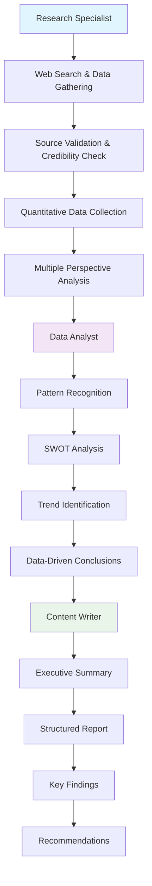
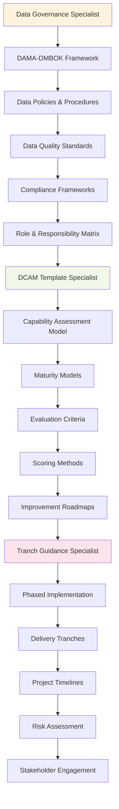
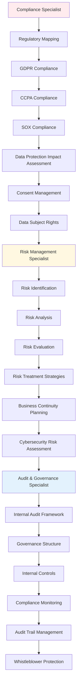
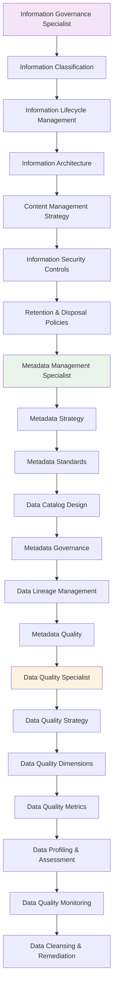
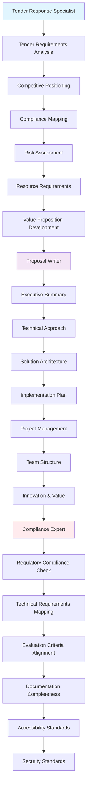
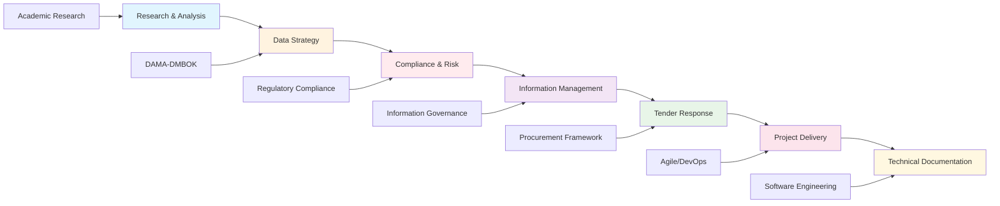

# Agent Teams Framework Mapping

This document provides a comprehensive mapping of each agent team to the frameworks, methodologies, and standards they implement in their task.py files. Each team is designed to follow specific industry frameworks and best practices.

## Overview

The Digital Twins Management System employs 7 specialized agent teams, each aligned with specific industry frameworks and methodologies:

1. **Research & Analysis Team** - Academic Research Framework
2. **Data Strategy Team** - DAMA-DMBOK Framework
3. **Compliance & Risk Team** - Regulatory Compliance Framework
4. **Information Management Team** - Information Governance Framework
5. **Tender Response Team** - Procurement Framework
6. **Project Delivery Team** - Agile/DevOps Framework
7. **Technical Documentation Team** - Software Engineering Framework

---

## 1. Research & Analysis Team

### Framework: Academic Research Methodology
**Standards**: Harvard Referencing, Academic Integrity, Evidence-Based Research

### Key Frameworks Implemented:
- **Harvard Referencing System**: Proper citation and source attribution
- **Academic Integrity Standards**: Fact-checking and verification
- **Evidence-Based Research**: Quantitative data and statistics
- **Multi-Perspective Analysis**: Multiple viewpoints and stakeholder analysis
- **SWOT Analysis**: Strengths, Weaknesses, Opportunities, Threats

---

## 2. Data Strategy Team

### Framework: DAMA-DMBOK (Data Management Body of Knowledge)
**Standards**: DAMA International, Data Governance Institute, DCAM

### Key Frameworks Implemented:
- **DAMA-DMBOK**: Data Management Body of Knowledge
- **DCAM**: Data Capability Assessment Model
- **Data Governance Institute Framework**: Governance structures
- **Maturity Models**: Capability assessment frameworks
- **Phased Implementation**: Tranch-based delivery approach

---

## 3. Compliance & Risk Team

### Framework: Regulatory Compliance & Risk Management
**Standards**: GDPR, CCPA, SOX, HIPAA, FERPA, ISO 31000, COSO ERM

### Key Frameworks Implemented:
- **GDPR**: General Data Protection Regulation
- **CCPA**: California Consumer Privacy Act
- **SOX**: Sarbanes-Oxley Act
- **HIPAA**: Health Insurance Portability and Accountability Act
- **FERPA**: Family Educational Rights and Privacy Act
- **ISO 31000**: Risk Management Standard
- **COSO ERM**: Enterprise Risk Management Framework

---

## 4. Information Management Team

### Framework: Information Governance & Data Management
**Standards**: ARMA, ISO 15489, Information Governance Maturity Model

### Key Frameworks Implemented:
- **ARMA**: Association of Records Managers and Administrators
- **ISO 15489**: Records Management Standard
- **Information Governance Maturity Model**: Governance assessment
- **Data Quality Dimensions**: Accuracy, Completeness, Consistency, Timeliness, Validity, Uniqueness
- **Metadata Standards**: Dublin Core, ISO 11179, Data Catalog standards

---

## 5. Tender Response Team

### Framework: Public Procurement & Proposal Management
**Standards**: UK Public Contracts Regulations, EU Procurement Directives, APMP

### Key Frameworks Implemented:
- **UK Public Contracts Regulations**: Public procurement compliance
- **EU Procurement Directives**: European procurement standards
- **APMP**: Association of Proposal Management Professionals
- **Accessibility Standards**: WCAG 2.1, Section 508
- **Security Standards**: ISO 27001, NIST Cybersecurity Framework

---

## 6. Project Delivery Team

### Framework: Agile/DevOps & Software Engineering
**Standards**: Agile Manifesto, DevOps, ITIL, PMBOK, SAFe

```mermaid
graph TD
    A[Data Engineer] --> B[Data Architecture Design]
    B --> C[ETL Pipeline Development]
    C --> D[Real-time Data Processing]
    D --> E[Data Quality Framework]
    E --> F[API Development]
    F --> G[Data Security]
    G --> H[Performance Optimization]
    
    I[Data Scientist] --> J[Analytics Framework]
    J --> K[Machine Learning Models]
    K --> L[Real-time Analytics]
    L --> M[Data Visualization]
    M --> N[Model Management]
    N --> O[Feature Engineering]
    O --> P[Model Validation]
    
    Q[Data Architect] --> R[System Architecture]
    R --> S[Data Models]
    S --> T[Integration Architecture]
    T --> U[Security Architecture]
    U --> V[Scalability Design]
    V --> W[Disaster Recovery]
    
    X[DevOps Engineer] --> Y[CI/CD Pipelines]
    Y --> Z[Infrastructure as Code]
    Z --> AA[Monitoring & Alerting]
    AA --> BB[Deployment Automation]
    BB --> CC[Configuration Management]
    
    DD[Project Manager] --> EE[Agile Methodology]
    EE --> FF[Sprint Planning]
    FF --> GG[Risk Management]
    GG --> HH[Quality Assurance]
    HH --> II[Stakeholder Management]
    
    H --> I
    P --> Q
    W --> X
    CC --> DD
    
    style A fill:#e8f5e8
    style I fill:#fff3e0
    style Q fill:#e3f2fd
    style X fill:#fce4ec
    style DD fill:#f3e5f5
```

### Key Frameworks Implemented:
- **Agile Manifesto**: Agile software development principles
- **DevOps**: Development and Operations integration
- **ITIL**: IT Infrastructure Library
- **PMBOK**: Project Management Body of Knowledge
- **SAFe**: Scaled Agile Framework
- **MLOps**: Machine Learning Operations
- **CI/CD**: Continuous Integration/Continuous Deployment

---

## 7. Technical Documentation Team

### Framework: Software Engineering & Technical Writing
**Standards**: IEEE 830, ISO/IEC 26515, Markdown, Mermaid, PEP 8

```mermaid
graph TD
    A[Data Modeling Specialist] --> B[Entity Relationship Diagrams]
    B --> C[Data Flow Diagrams]
    C --> D[System Architecture Diagrams]
    D --> E[Data Schema Definitions]
    E --> F[Mermaid Syntax]
    
    G[Python Code Specialist] --> H[Data Processing Pipelines]
    H --> I[Analytics & ML Code]
    I --> J[API Endpoints]
    J --> K[Error Handling & Logging]
    K --> L[PEP 8 Standards]
    L --> M[Unit Tests]
    
    N[SQL Code Specialist] --> O[Database Schema Creation]
    O --> P[Data Retrieval Queries]
    P --> Q[Stored Procedures]
    Q --> R[Data Migration Scripts]
    R --> S[Performance Optimization]
    
    T[PySpark Code Specialist] --> U[Distributed ETL Pipelines]
    U --> V[Spark MLlib Applications]
    V --> W[Real-time Streaming]
    W --> X[Batch Processing]
    X --> Y[Performance Optimization]
    
    Z[Technical Writer] --> AA[Implementation Guide]
    AA --> BB[API Documentation]
    BB --> CC[Deployment Guide]
    CC --> DD[Troubleshooting Manual]
    DD --> EE[Code Examples]
    EE --> FF[Architecture Overview]
    
    F --> G
    M --> N
    S --> T
    Y --> Z
    
    style A fill:#e1f5fe
    style G fill:#e8f5e8
    style N fill:#fff3e0
    style T fill:#f3e5f5
    style Z fill:#ffebee
```

### Key Frameworks Implemented:
- **IEEE 830**: Software Requirements Specifications
- **ISO/IEC 26515**: Systems and software engineering documentation
- **Markdown**: Documentation markup language
- **Mermaid**: Diagram and flowchart syntax
- **PEP 8**: Python style guide
- **SQL Standards**: ANSI SQL, database-specific standards
- **Apache Spark**: Big data processing framework

---

## Framework Integration Flow

---

## Standards Compliance Matrix

| Team | Primary Framework | Supporting Standards | Compliance Focus |
|------|------------------|-------------------|------------------|
| Research & Analysis | Academic Research | Harvard Referencing, Academic Integrity | Evidence-based research, source validation |
| Data Strategy | DAMA-DMBOK | DCAM, Data Governance Institute | Data governance, capability assessment |
| Compliance & Risk | Regulatory Compliance | GDPR, CCPA, SOX, HIPAA, ISO 31000 | Regulatory adherence, risk management |
| Information Management | Information Governance | ARMA, ISO 15489, Metadata Standards | Information lifecycle, data quality |
| Tender Response | Public Procurement | UK/EU Procurement Directives, APMP | Procurement compliance, proposal quality |
| Project Delivery | Agile/DevOps | ITIL, PMBOK, SAFe, MLOps | Agile delivery, DevOps practices |
| Technical Documentation | Software Engineering | IEEE 830, ISO/IEC 26515, PEP 8 | Technical accuracy, code quality |

---

## Quality Assurance Framework

Each team implements quality assurance measures aligned with their respective frameworks:

```mermaid
graph TD
    A[Quality Assurance] --> B[Research Validation]
    A --> C[Framework Compliance]
    A --> D[Standards Adherence]
    A --> E[Documentation Quality]
    A --> F[Code Quality]
    
    B --> B1[Source Verification]
    B --> B2[Fact Checking]
    B --> B3[Academic Integrity]
    
    C --> C1[DAMA-DMBOK Alignment]
    C --> C2[Regulatory Compliance]
    C --> C3[Agile Methodology]
    
    D --> D1[ISO Standards]
    D --> D2[Industry Best Practices]
    D --> D3[Security Standards]
    
    E --> E1[Technical Accuracy]
    E --> E2[Completeness]
    E --> E3[Accessibility]
    
    F --> F1[Code Standards]
    F --> F2[Testing Coverage]
    F --> F3[Performance Optimization]
    
    style A fill:#ffebee
    style B fill:#e1f5fe
    style C fill:#fff3e0
    style D fill:#f3e5f5
    style E fill:#e8f5e8
    style F fill:#fce4ec
```

---

## Conclusion

The Digital Twins Management System's agent teams are designed to follow industry-standard frameworks and methodologies, ensuring:

1. **Compliance**: Adherence to regulatory and industry standards
2. **Quality**: Implementation of best practices and quality assurance
3. **Consistency**: Standardized approaches across all teams
4. **Scalability**: Frameworks that support growth and evolution
5. **Interoperability**: Standards that enable integration and collaboration

Each team's framework implementation is documented in their respective task.py files, providing clear guidance on methodologies, standards, and expected outputs.
