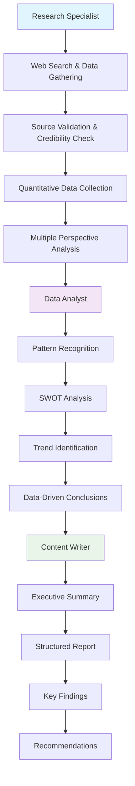
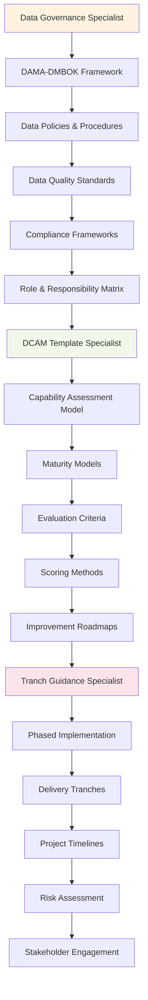
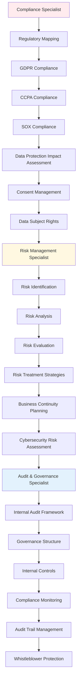
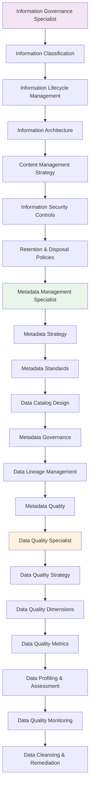
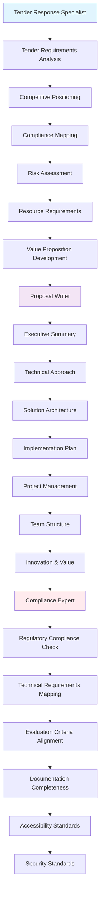
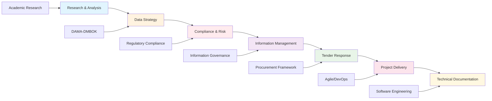
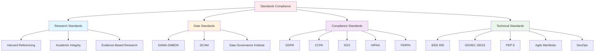

# Agent Teams Framework Mapping Diagrams

This document contains Mermaid diagrams that visualize the framework mapping for each agent team.

## 1. Research & Analysis Team Framework

**Framework**: Academic Research Methodology
**Standards**: Harvard Referencing, Academic Integrity, Evidence-Based Research

## 2. Data Strategy Team Framework

**Framework**: DAMA-DMBOK (Data Management Body of Knowledge)
**Standards**: DAMA International, Data Governance Institute, DCAM

## 3. Compliance & Risk Team Framework

**Framework**: Regulatory Compliance & Risk Management
**Standards**: GDPR, CCPA, SOX, HIPAA, FERPA, ISO 31000, COSO ERM

## 4. Information Management Team Framework

**Framework**: Information Governance & Data Management
**Standards**: ARMA, ISO 15489, Information Governance Maturity Model

## 5. Tender Response Team Framework

**Framework**: Public Procurement & Proposal Management
**Standards**: UK Public Contracts Regulations, EU Procurement Directives, APMP

## 6. Project Delivery Team Framework

```mermaid
graph TD
    A[Data Engineer] --> B[Data Architecture Design]
    B --> C[ETL Pipeline Development]
    C --> D[Real-time Data Processing]
    D --> E[Data Quality Framework]
    E --> F[API Development]
    F --> G[Data Security]
    G --> H[Performance Optimization]
    
    I[Data Scientist] --> J[Analytics Framework]
    J --> K[Machine Learning Models]
    K --> L[Real-time Analytics]
    L --> M[Data Visualization]
    M --> N[Model Management]
    N --> O[Feature Engineering]
    O --> P[Model Validation]
    
    Q[Data Architect] --> R[System Architecture]
    R --> S[Data Models]
    S --> T[Integration Architecture]
    T --> U[Security Architecture]
    U --> V[Scalability Design]
    V --> W[Disaster Recovery]
    
    X[DevOps Engineer] --> Y[CI/CD Pipelines]
    Y --> Z[Infrastructure as Code]
    Z --> AA[Monitoring & Alerting]
    AA --> BB[Deployment Automation]
    BB --> CC[Configuration Management]
    
    DD[Project Manager] --> EE[Agile Methodology]
    EE --> FF[Sprint Planning]
    FF --> GG[Risk Management]
    GG --> HH[Quality Assurance]
    HH --> II[Stakeholder Management]
    
    H --> I
    P --> Q
    W --> X
    CC --> DD
    
    style A fill:#e8f5e8
    style I fill:#fff3e0
    style Q fill:#e3f2fd
    style X fill:#fce4ec
    style DD fill:#f3e5f5
```

**Framework**: Agile/DevOps & Software Engineering
**Standards**: Agile Manifesto, DevOps, ITIL, PMBOK, SAFe

## 7. Technical Documentation Team Framework

```mermaid
graph TD
    A[Data Modeling Specialist] --> B[Entity Relationship Diagrams]
    B --> C[Data Flow Diagrams]
    C --> D[System Architecture Diagrams]
    D --> E[Data Schema Definitions]
    E --> F[Mermaid Syntax]
    
    G[Python Code Specialist] --> H[Data Processing Pipelines]
    H --> I[Analytics & ML Code]
    I --> J[API Endpoints]
    J --> K[Error Handling & Logging]
    K --> L[PEP 8 Standards]
    L --> M[Unit Tests]
    
    N[SQL Code Specialist] --> O[Database Schema Creation]
    O --> P[Data Retrieval Queries]
    P --> Q[Stored Procedures]
    Q --> R[Data Migration Scripts]
    R --> S[Performance Optimization]
    
    T[PySpark Code Specialist] --> U[Distributed ETL Pipelines]
    U --> V[Spark MLlib Applications]
    V --> W[Real-time Streaming]
    W --> X[Batch Processing]
    X --> Y[Performance Optimization]
    
    Z[Technical Writer] --> AA[Implementation Guide]
    AA --> BB[API Documentation]
    BB --> CC[Deployment Guide]
    CC --> DD[Troubleshooting Manual]
    DD --> EE[Code Examples]
    EE --> FF[Architecture Overview]
    
    F --> G
    M --> N
    S --> T
    Y --> Z
    
    style A fill:#e1f5fe
    style G fill:#e8f5e8
    style N fill:#fff3e0
    style T fill:#f3e5f5
    style Z fill:#ffebee
```

**Framework**: Software Engineering & Technical Writing
**Standards**: IEEE 830, ISO/IEC 26515, Markdown, Mermaid, PEP 8

## 8. Overall Framework Integration Flow

## 9. Quality Assurance Framework

```mermaid
graph TD
    A[Quality Assurance] --> B[Research Validation]
    A --> C[Framework Compliance]
    A --> D[Standards Adherence]
    A --> E[Documentation Quality]
    A --> F[Code Quality]
    
    B --> B1[Source Verification]
    B --> B2[Fact Checking]
    B --> B3[Academic Integrity]
    
    C --> C1[DAMA-DMBOK Alignment]
    C --> C2[Regulatory Compliance]
    C --> C3[Agile Methodology]
    
    D --> D1[ISO Standards]
    D --> D2[Industry Best Practices]
    D --> D3[Security Standards]
    
    E --> E1[Technical Accuracy]
    E --> E2[Completeness]
    E --> E3[Accessibility]
    
    F --> F1[Code Standards]
    F --> F2[Testing Coverage]
    F --> F3[Performance Optimization]
    
    style A fill:#ffebee
    style B fill:#e1f5fe
    style C fill:#fff3e0
    style D fill:#f3e5f5
    style E fill:#e8f5e8
    style F fill:#fce4ec
```

## 10. Standards Compliance Matrix

## Usage Instructions

These Mermaid diagrams can be rendered in:

1. **GitHub**: Native Mermaid support in markdown files
2. **GitLab**: Native Mermaid support in markdown files
3. **Mermaid Live Editor**: https://mermaid.live/
4. **VS Code**: With Mermaid extension
5. **Documentation Sites**: GitBook, Notion, etc.

To render these diagrams, copy the Mermaid code blocks and paste them into any Mermaid-compatible viewer or documentation platform.
