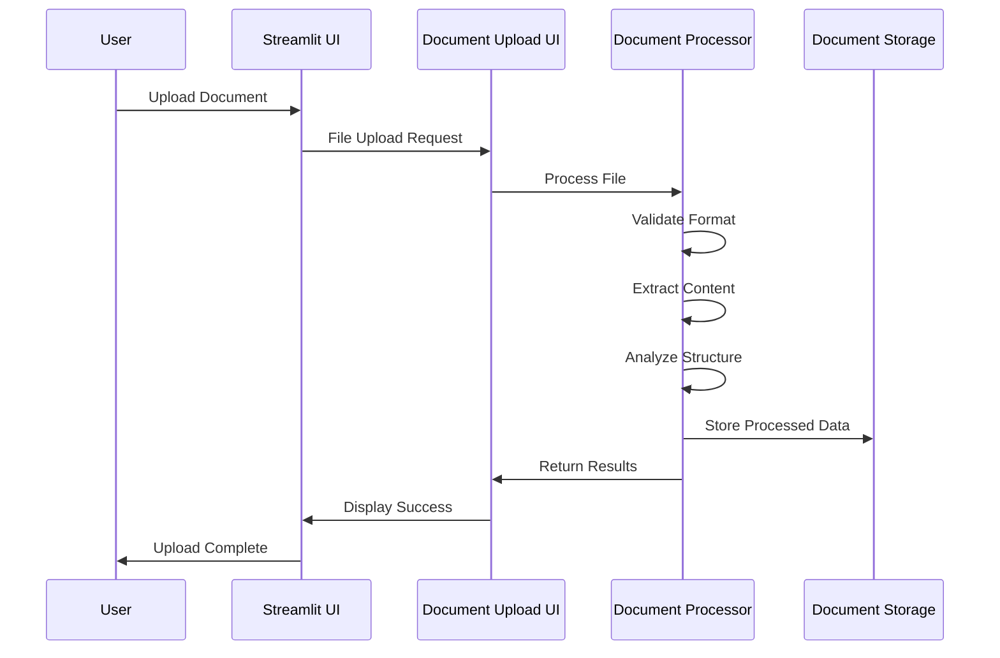
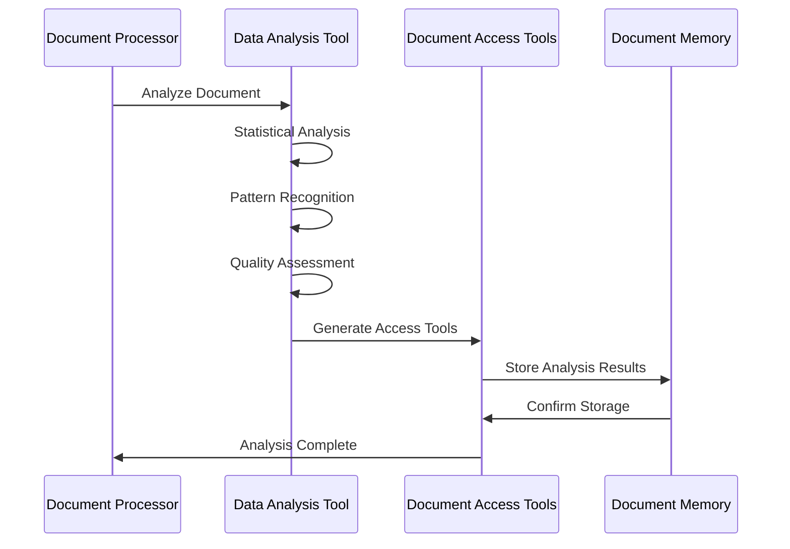
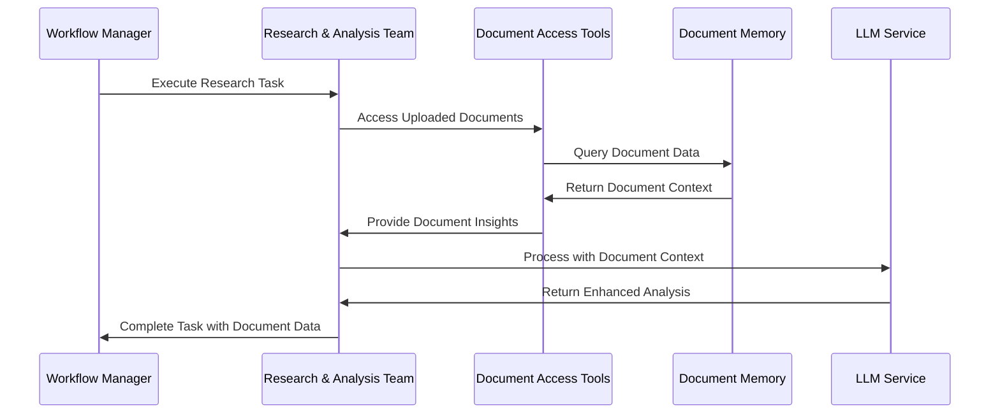

# Document Processing Data Flow Architecture

This document illustrates how document processing integrates with the Digital Twins Management System architecture, showing the complete data flow from ingestion to agent analysis.

## Architecture Overview

The document processing system seamlessly integrates with the existing CrewAI multi-agent workflow, adding a new data ingestion and processing layer that enhances the Digital Twin capabilities with real organizational data.

## Mermaid Diagram

```mermaid
graph TB
    %% User Interface Layer
    subgraph "User Interface Layer"
        UI[Streamlit Web Interface]
        SIDEBAR[Sidebar Component]
        MODEL[Model Selection]
        WORKFLOW[Workflow Selection]
        CHAT[Chat Interface]
        DOC_UPLOAD[Document Upload UI]
    end

    %% Configuration Layer
    subgraph "Configuration Layer"
        CONFIG[Config Manager]
        LLM_MGR[LLM Manager]
        ENV[Environment Variables]
    end

    %% Core Workflow Engine
    subgraph "Core Workflow Engine"
        WF_MGR[Workflow Manager]
        WF_EXEC[Workflow Executor]
        PRE_SEARCH[Pre-search Manager]
    end

    %% Document Processing System
    subgraph "Document Processing System"
        DOC_PROC[Document Processor]
        DATA_ANALYZER[Data Analysis Tool]
        DOC_ACCESS[Document Access Tools]
        DOC_STORAGE[Document Storage]
        DOC_INDEX[Document Index]
    end

    %% External Services
    subgraph "External Services"
        LOCAL_OLLAMA[Local Ollama]
        CLOUD_OLLAMA[Ollama Cloud]
        DDG_SEARCH[DuckDuckGo Search]
    end

    %% Memory & Storage
    subgraph "Memory & Storage"
        TEAM_OUTPUTS[Team Outputs]
        LOCAL_MEM[Local Memory Manager]
        CHROMA_DB[ChromaDB Memory]
        DOC_MEMORY[Document Memory]
    end

    %% Agent Teams
    subgraph "Agent Teams (1-7)"
        TEAM1[Team 1: Research & Analysis]
        TEAM2[Team 2: Data Strategy]
        TEAM3[Team 3: Compliance & Risk]
        TEAM4[Team 4: Information Management]
        TEAM5[Team 5: Tender Response]
        TEAM6[Team 6: Project Delivery]
        TEAM7[Team 7: Technical Documentation]
    end

    %% Agent Tools
    subgraph "Agent Tools"
        WEB_SEARCH[Web Search Tool]
        ANALYSIS[Analysis Tool]
        PDF_WRITER[PDF Writer]
        ROBUST_LLM[Robust LLM Wrapper]
        RETRY_LLM[Retry LLM Wrapper]
        DOC_TOOLS[Document Access Tools]
    end

    %% Data Flow Connections
    UI --> CONFIG
    UI --> WF_MGR
    SIDEBAR --> WF_MGR
    MODEL --> WF_MGR
    WORKFLOW --> WF_MGR
    CHAT --> WF_MGR
    DOC_UPLOAD --> DOC_PROC

    CONFIG --> LLM_MGR
    ENV --> LLM_MGR
    LLM_MGR --> LOCAL_OLLAMA
    LLM_MGR --> CLOUD_OLLAMA

    WF_MGR --> WF_EXEC
    WF_MGR --> PRE_SEARCH
    WF_MGR --> TEAM_OUTPUTS
    WF_MGR --> LOCAL_MEM
    WF_MGR --> TEAM1

    PRE_SEARCH --> DDG_SEARCH
    PRE_SEARCH --> CHROMA_DB

    %% Document Processing Flow
    DOC_UPLOAD --> DOC_PROC
    DOC_PROC --> DOC_STORAGE
    DOC_PROC --> DOC_INDEX
    DOC_PROC --> DATA_ANALYZER
    DATA_ANALYZER --> DOC_ACCESS
    DOC_ACCESS --> DOC_MEMORY
    DOC_MEMORY --> CHROMA_DB

    %% Agent Team Connections
    TEAM1 --> TEAM2
    TEAM2 --> TEAM3
    TEAM3 --> TEAM4
    TEAM4 --> TEAM5
    TEAM5 --> TEAM6
    TEAM6 --> TEAM7

    %% Agent Tools Connections
    TEAM1 --> WEB_SEARCH
    TEAM1 --> ANALYSIS
    TEAM1 --> PDF_WRITER
    TEAM1 --> ROBUST_LLM
    TEAM1 --> RETRY_LLM
    TEAM1 --> DOC_TOOLS

    TEAM2 --> WEB_SEARCH
    TEAM2 --> ANALYSIS
    TEAM2 --> PDF_WRITER
    TEAM2 --> ROBUST_LLM
    TEAM2 --> DOC_TOOLS

    TEAM3 --> WEB_SEARCH
    TEAM3 --> ANALYSIS
    TEAM3 --> PDF_WRITER
    TEAM3 --> ROBUST_LLM
    TEAM3 --> DOC_TOOLS

    TEAM4 --> WEB_SEARCH
    TEAM4 --> ANALYSIS
    TEAM4 --> PDF_WRITER
    TEAM4 --> ROBUST_LLM
    TEAM4 --> DOC_TOOLS

    TEAM5 --> WEB_SEARCH
    TEAM5 --> ANALYSIS
    TEAM5 --> PDF_WRITER
    TEAM5 --> ROBUST_LLM
    TEAM5 --> DOC_TOOLS

    TEAM6 --> WEB_SEARCH
    TEAM6 --> ANALYSIS
    TEAM6 --> PDF_WRITER
    TEAM6 --> ROBUST_LLM
    TEAM6 --> DOC_TOOLS

    TEAM7 --> WEB_SEARCH
    TEAM7 --> ANALYSIS
    TEAM7 --> PDF_WRITER
    TEAM7 --> ROBUST_LLM
    TEAM7 --> DOC_TOOLS

    %% Document Processing Integration
    DOC_ACCESS --> TEAM1
    DOC_ACCESS --> TEAM2
    DOC_ACCESS --> TEAM3
    DOC_ACCESS --> TEAM4
    DOC_ACCESS --> TEAM5
    DOC_ACCESS --> TEAM6
    DOC_ACCESS --> TEAM7

    %% Memory Connections
    LOCAL_MEM --> CHROMA_DB
    DOC_MEMORY --> CHROMA_DB
    TEAM_OUTPUTS --> LOCAL_MEM

    %% Styling
    classDef userInterface fill:#e1f5fe
    classDef configuration fill:#f3e5f5
    classDef workflow fill:#e8f5e8
    classDef documentProcessing fill:#fff3e0
    classDef external fill:#fce4ec
    classDef memory fill:#f1f8e9
    classDef agents fill:#e3f2fd
    classDef tools fill:#fff8e1

    class UI,SIDEBAR,MODEL,WORKFLOW,CHAT,DOC_UPLOAD userInterface
    class CONFIG,LLM_MGR,ENV configuration
    class WF_MGR,WF_EXEC,PRE_SEARCH workflow
    class DOC_PROC,DATA_ANALYZER,DOC_ACCESS,DOC_STORAGE,DOC_INDEX documentProcessing
    class LOCAL_OLLAMA,CLOUD_OLLAMA,DDG_SEARCH external
    class TEAM_OUTPUTS,LOCAL_MEM,CHROMA_DB,DOC_MEMORY memory
    class TEAM1,TEAM2,TEAM3,TEAM4,TEAM5,TEAM6,TEAM7 agents
    class WEB_SEARCH,ANALYSIS,PDF_WRITER,ROBUST_LLM,RETRY_LLM,DOC_TOOLS tools
```

## Document Processing Data Flow

### 1. Document Ingestion Phase

### 2. Document Analysis Phase

### 3. Agent Integration Phase

## Document Processing Components

### Document Processor
- **File Format Detection**: Automatically identifies 15+ file types
- **Content Extraction**: Extracts text, data, and metadata
- **Structure Analysis**: Analyzes document hierarchy and relationships
- **Quality Assessment**: Validates data completeness and accuracy

### Data Analysis Tool
- **Statistical Analysis**: Descriptive statistics and distributions
- **Pattern Recognition**: Identifies trends and anomalies
- **Correlation Analysis**: Finds relationships between variables
- **Text Analysis**: Processes unstructured content

### Document Access Tools
- **Natural Language Queries**: Query documents in plain English
- **Content Search**: Search within document content
- **Document Comparison**: Compare multiple documents
- **Insight Extraction**: Extract specific insights and patterns

## Integration Points

### 1. User Interface Integration
- **Document Upload UI**: Seamlessly integrated into Streamlit interface
- **File Type Support**: 15+ supported formats with drag-and-drop
- **Real-time Processing**: Live feedback during document processing
- **Preview Capabilities**: Preview documents before processing

### 2. Agent Team Integration
- **Universal Access**: All 7 agent teams can access document data
- **Context Enhancement**: Documents provide real organizational context
- **Tool Integration**: Document tools work alongside existing agent tools
- **Memory Integration**: Document data stored in ChromaDB for persistence

### 3. Workflow Integration
- **Pre-search Enhancement**: Documents complement web search results
- **Analysis Enhancement**: Real data improves analysis accuracy
- **Output Enhancement**: Generated reports include document insights
- **Decision Support**: Document data informs strategic recommendations

## Data Flow Benefits

### Enhanced Digital Twin Accuracy
- **Real Data Integration**: Use actual organizational data instead of placeholders
- **Historical Context**: Process past reports and historical data
- **Compliance Data**: Upload regulatory documents for compliance checking
- **Performance Metrics**: Analyze uploaded KPIs and performance data

### Improved Agent Capabilities
- **Contextual Analysis**: Agents have access to relevant organizational data
- **Informed Recommendations**: Based on real data rather than assumptions
- **Comprehensive Coverage**: Multiple data sources for complete analysis
- **Continuous Learning**: System learns from uploaded data patterns

### Streamlined Workflow
- **Single Interface**: Upload and process documents in one place
- **Automatic Processing**: Documents processed and indexed automatically
- **Agent Integration**: Seamless access for all agent teams
- **Output Integration**: Document insights included in final outputs

## Security and Privacy

### Data Protection
- **Local Storage**: All documents stored locally
- **Access Control**: Proper permissions and access controls
- **Data Encryption**: Sensitive data encrypted at rest
- **Audit Logging**: Track all document access and processing

### Privacy Compliance
- **Data Minimization**: Only process necessary data
- **Retention Policies**: Automatic cleanup of old data
- **User Consent**: Clear consent mechanisms for data processing
- **Data Anonymization**: Option to anonymize sensitive information

## Performance Considerations

### Processing Optimization
- **Parallel Processing**: Process multiple documents simultaneously
- **Caching**: Cache processed results for faster access
- **Lazy Loading**: Load document data on demand
- **Incremental Processing**: Process only changed documents

### Memory Management
- **Efficient Storage**: Optimize storage usage
- **Garbage Collection**: Regular cleanup of processed data
- **Memory Monitoring**: Track memory usage during processing
- **Resource Limits**: Set appropriate limits for document processing

This document processing integration transforms the Digital Twins Management System from a theoretical concept into a practical tool that can work with real organizational data, providing more accurate and valuable insights for management and leadership teams.
