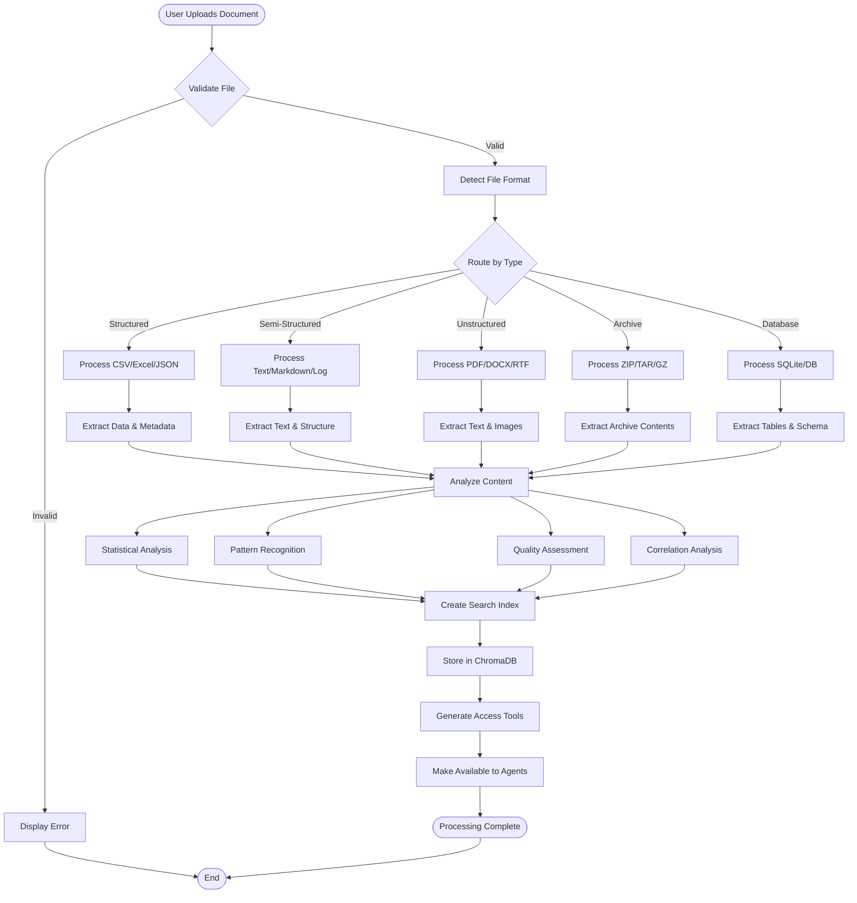
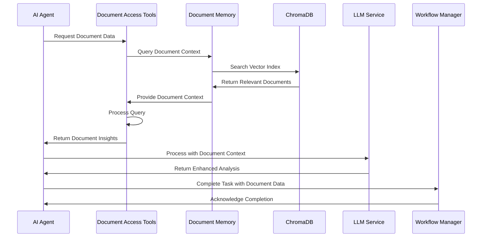
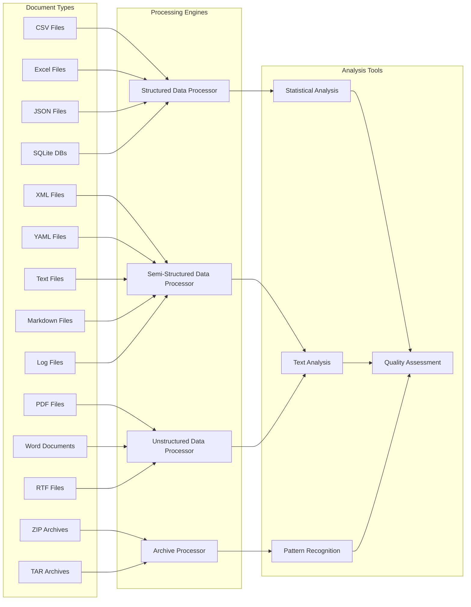
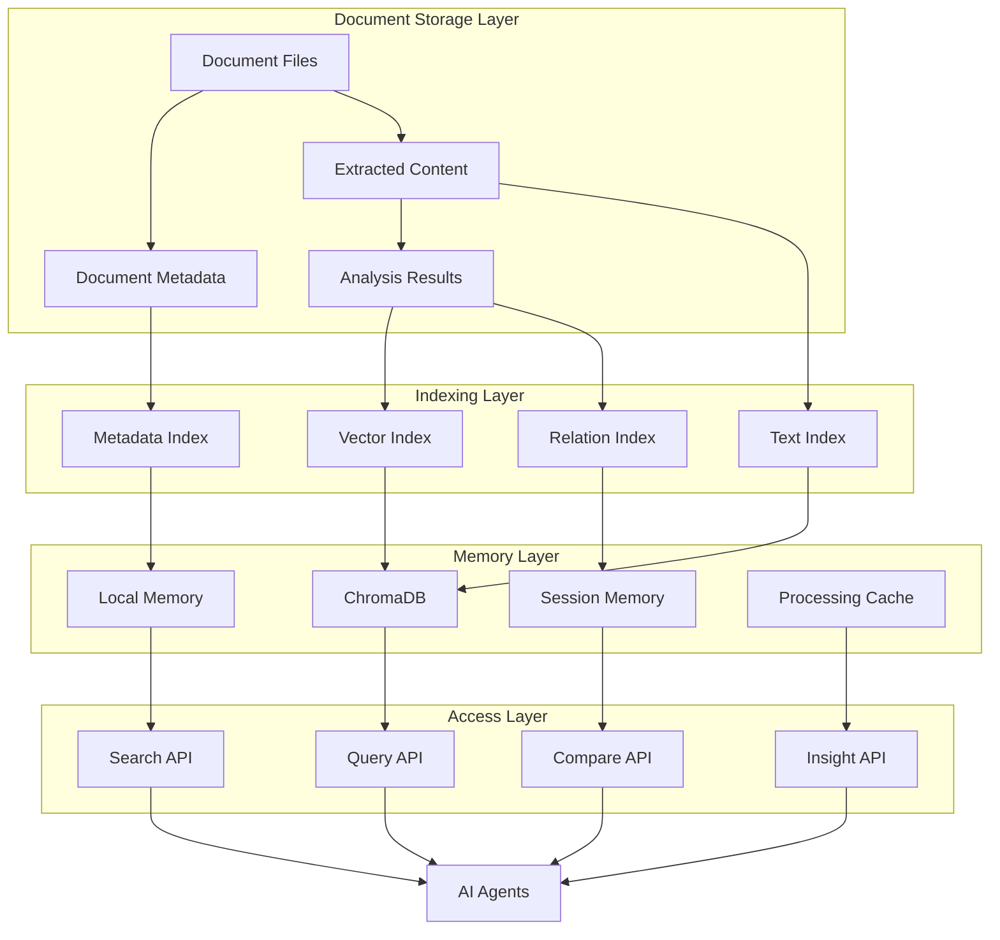

# Technical Document Processing Data Flow

This document provides detailed technical diagrams showing how document processing integrates with the Digital Twins Management System architecture.

## Complete System Architecture with Document Processing

```mermaid
graph TB
    %% User Interface Layer
    subgraph "User Interface Layer"
        UI[Streamlit Web Interface]
        DOC_UPLOAD[Document Upload UI]
        FILE_INPUT[File Input Component]
        DIR_INPUT[Directory Input Component]
        DB_INPUT[Database Input Component]
    end

    %% Document Processing Layer
    subgraph "Document Processing Layer"
        DOC_PROC[Document Processor]
        FORMAT_DETECT[Format Detection]
        CONTENT_EXTRACT[Content Extraction]
        STRUCTURE_ANALYZE[Structure Analysis]
        QUALITY_ASSESS[Quality Assessment]
    end

    %% Data Analysis Layer
    subgraph "Data Analysis Layer"
        DATA_ANALYZER[Data Analysis Tool]
        STATS_ANALYZER[Statistical Analyzer]
        PATTERN_ANALYZER[Pattern Analyzer]
        TEXT_ANALYZER[Text Analyzer]
        CORRELATION_ANALYZER[Correlation Analyzer]
    end

    %% Document Access Layer
    subgraph "Document Access Layer"
        DOC_ACCESS[Document Access Tools]
        QUERY_ENGINE[Query Engine]
        SEARCH_ENGINE[Search Engine]
        COMPARISON_ENGINE[Comparison Engine]
        INSIGHT_ENGINE[Insight Engine]
    end

    %% Memory & Storage Layer
    subgraph "Memory & Storage Layer"
        DOC_STORAGE[Document Storage]
        DOC_INDEX[Document Index]
        DOC_METADATA[Document Metadata]
        CHROMA_DB[ChromaDB Memory]
        VECTOR_INDEX[Vector Index]
    end

    %% Core Workflow Engine
    subgraph "Core Workflow Engine"
        WF_MGR[Workflow Manager]
        WF_EXEC[Workflow Executor]
        PRE_SEARCH[Pre-search Manager]
        TASK_ORCHESTRATOR[Task Orchestrator]
    end

    %% Agent Teams
    subgraph "Agent Teams"
        TEAM1[Research & Analysis]
        TEAM2[Data Strategy]
        TEAM3[Compliance & Risk]
        TEAM4[Information Management]
        TEAM5[Tender Response]
        TEAM6[Project Delivery]
        TEAM7[Technical Documentation]
    end

    %% External Services
    subgraph "External Services"
        LLM_SERVICE[LLM Service]
        WEB_SEARCH[Web Search]
        FILE_SYSTEM[File System]
    end

    %% Data Flow - Document Upload
    UI --> DOC_UPLOAD
    DOC_UPLOAD --> FILE_INPUT
    DOC_UPLOAD --> DIR_INPUT
    DOC_UPLOAD --> DB_INPUT

    %% Data Flow - Document Processing
    FILE_INPUT --> DOC_PROC
    DIR_INPUT --> DOC_PROC
    DB_INPUT --> DOC_PROC

    DOC_PROC --> FORMAT_DETECT
    DOC_PROC --> CONTENT_EXTRACT
    DOC_PROC --> STRUCTURE_ANALYZE
    DOC_PROC --> QUALITY_ASSESS

    %% Data Flow - Analysis
    DOC_PROC --> DATA_ANALYZER
    DATA_ANALYZER --> STATS_ANALYZER
    DATA_ANALYZER --> PATTERN_ANALYZER
    DATA_ANALYZER --> TEXT_ANALYZER
    DATA_ANALYZER --> CORRELATION_ANALYZER

    %% Data Flow - Access Tools
    DATA_ANALYZER --> DOC_ACCESS
    DOC_ACCESS --> QUERY_ENGINE
    DOC_ACCESS --> SEARCH_ENGINE
    DOC_ACCESS --> COMPARISON_ENGINE
    DOC_ACCESS --> INSIGHT_ENGINE

    %% Data Flow - Storage
    DOC_PROC --> DOC_STORAGE
    DOC_ACCESS --> DOC_INDEX
    DOC_ACCESS --> DOC_METADATA
    DOC_INDEX --> CHROMA_DB
    DOC_METADATA --> VECTOR_INDEX

    %% Data Flow - Workflow Integration
    WF_MGR --> WF_EXEC
    WF_MGR --> PRE_SEARCH
    WF_MGR --> TASK_ORCHESTRATOR

    %% Data Flow - Agent Integration
    TASK_ORCHESTRATOR --> TEAM1
    TEAM1 --> TEAM2
    TEAM2 --> TEAM3
    TEAM3 --> TEAM4
    TEAM4 --> TEAM5
    TEAM5 --> TEAM6
    TEAM6 --> TEAM7

    %% Data Flow - Document Access for Agents
    DOC_ACCESS --> TEAM1
    DOC_ACCESS --> TEAM2
    DOC_ACCESS --> TEAM3
    DOC_ACCESS --> TEAM4
    DOC_ACCESS --> TEAM5
    DOC_ACCESS --> TEAM6
    DOC_ACCESS --> TEAM7

    %% Data Flow - External Services
    TEAM1 --> LLM_SERVICE
    TEAM1 --> WEB_SEARCH
    PRE_SEARCH --> WEB_SEARCH
    DOC_PROC --> FILE_SYSTEM

    %% Styling
    classDef userInterface fill:#e1f5fe,stroke:#01579b,stroke-width:2px
    classDef documentProcessing fill:#fff3e0,stroke:#e65100,stroke-width:2px
    classDef dataAnalysis fill:#f3e5f5,stroke:#4a148c,stroke-width:2px
    classDef documentAccess fill:#e8f5e8,stroke:#1b5e20,stroke-width:2px
    classDef memoryStorage fill:#f1f8e9,stroke:#33691e,stroke-width:2px
    classDef workflow fill:#e3f2fd,stroke:#0d47a1,stroke-width:2px
    classDef agents fill:#fff8e1,stroke:#f57f17,stroke-width:2px
    classDef external fill:#fce4ec,stroke:#880e4f,stroke-width:2px

    class UI,DOC_UPLOAD,FILE_INPUT,DIR_INPUT,DB_INPUT userInterface
    class DOC_PROC,FORMAT_DETECT,CONTENT_EXTRACT,STRUCTURE_ANALYZE,QUALITY_ASSESS documentProcessing
    class DATA_ANALYZER,STATS_ANALYZER,PATTERN_ANALYZER,TEXT_ANALYZER,CORRELATION_ANALYZER dataAnalysis
    class DOC_ACCESS,QUERY_ENGINE,SEARCH_ENGINE,COMPARISON_ENGINE,INSIGHT_ENGINE documentAccess
    class DOC_STORAGE,DOC_INDEX,DOC_METADATA,CHROMA_DB,VECTOR_INDEX memoryStorage
    class WF_MGR,WF_EXEC,PRE_SEARCH,TASK_ORCHESTRATOR workflow
    class TEAM1,TEAM2,TEAM3,TEAM4,TEAM5,TEAM6,TEAM7 agents
    class LLM_SERVICE,WEB_SEARCH,FILE_SYSTEM external
```

## Document Processing Pipeline Detail

## Agent-Document Interaction Flow

## Document Types and Processing Paths

## Memory and Storage Architecture

## Performance and Scalability Considerations

```mermaid
graph TB
    subgraph "Performance Optimization"
        PARALLEL[Parallel Processing]
        CACHING[Intelligent Caching]
        LAZY_LOAD[Lazy Loading]
        INCREMENTAL[Incremental Processing]
    end

    subgraph "Memory Management"
        GARBAGE_COLLECT[Garbage Collection]
        MEMORY_MONITOR[Memory Monitoring]
        RESOURCE_LIMITS[Resource Limits]
        CLEANUP[Automatic Cleanup]
    end

    subgraph "Scalability Features"
        BATCH_PROCESS[Batch Processing]
        QUEUE_SYSTEM[Queue System]
        LOAD_BALANCE[Load Balancing]
        DISTRIBUTED[Distributed Processing]
    end

    PARALLEL --> CACHING
    CACHING --> LAZY_LOAD
    LAZY_LOAD --> INCREMENTAL

    GARBAGE_COLLECT --> MEMORY_MONITOR
    MEMORY_MONITOR --> RESOURCE_LIMITS
    RESOURCE_LIMITS --> CLEANUP

    BATCH_PROCESS --> QUEUE_SYSTEM
    QUEUE_SYSTEM --> LOAD_BALANCE
    LOAD_BALANCE --> DISTRIBUTED
```

This technical documentation provides a comprehensive view of how document processing integrates with the Digital Twins Management System, showing the complete data flow from document ingestion through agent analysis and output generation.
