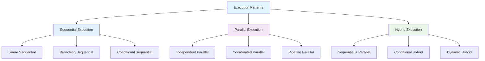
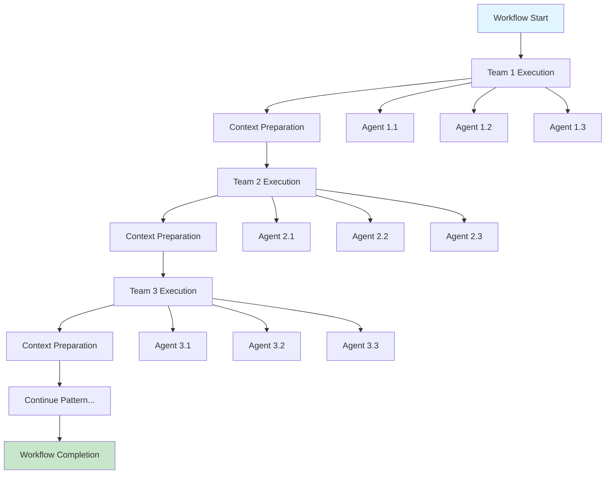
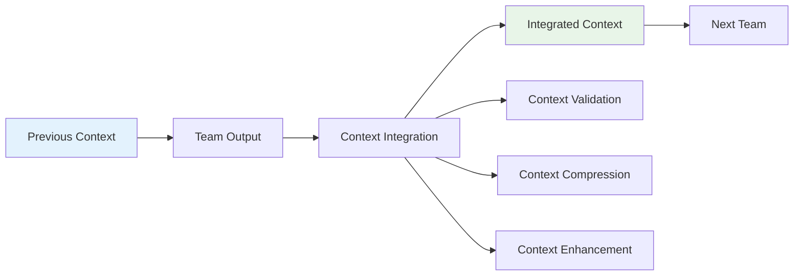
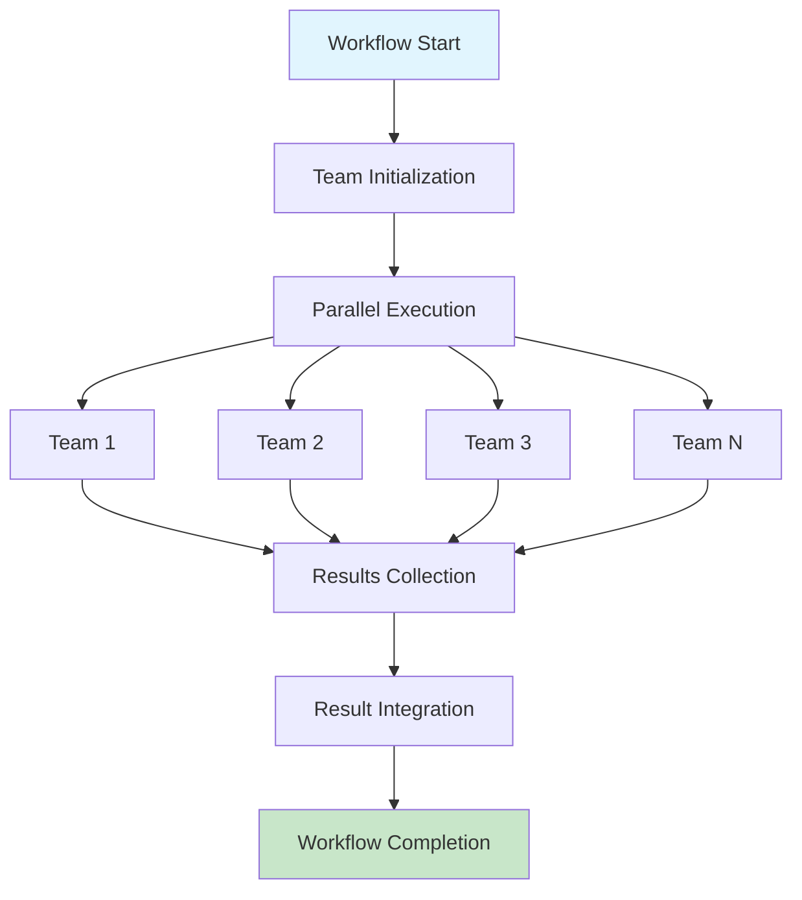
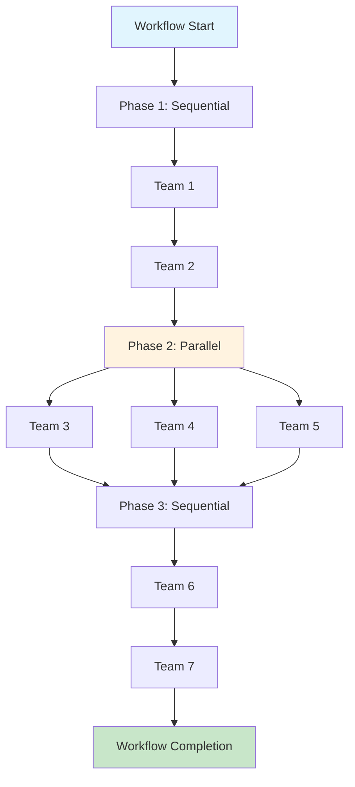
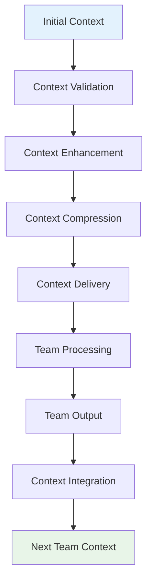
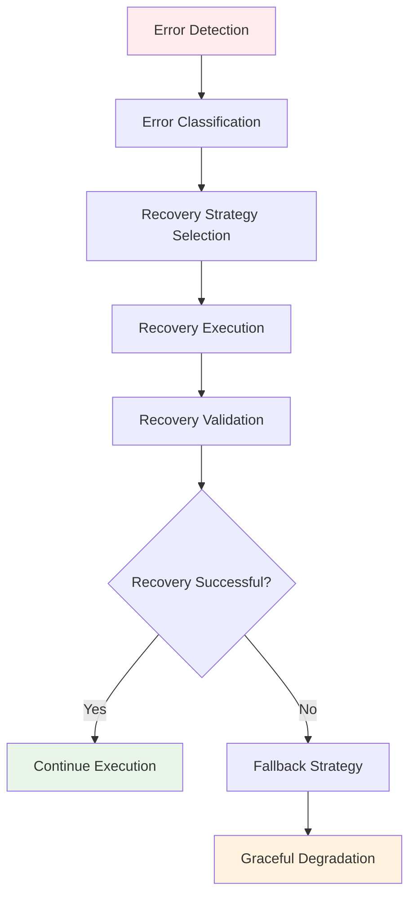
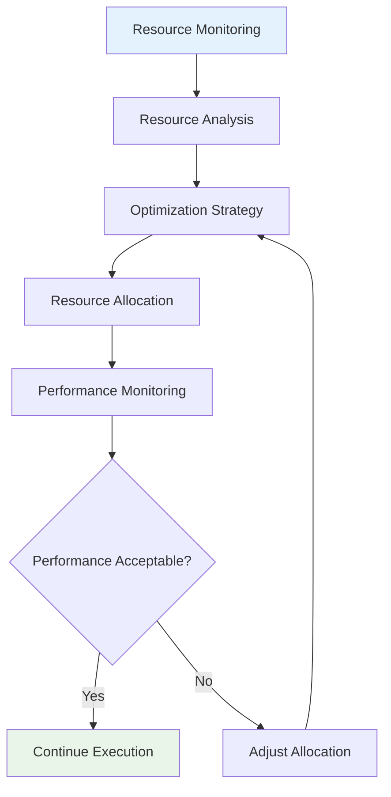
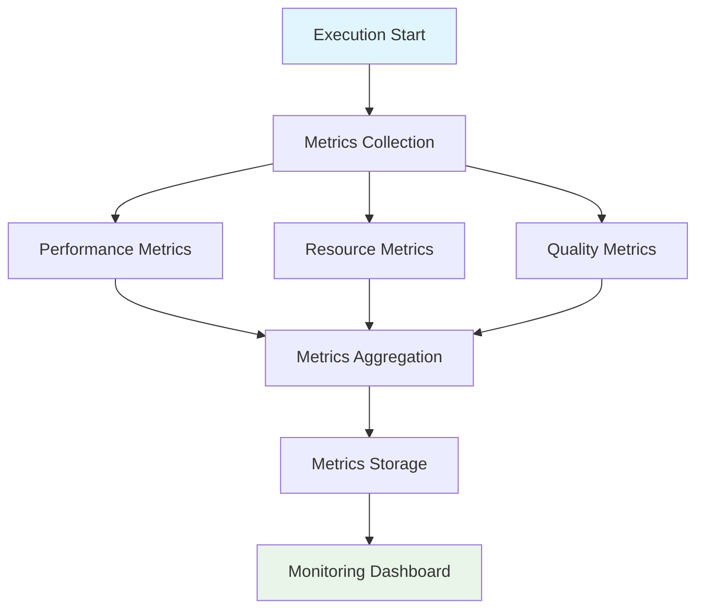

# Workflow Execution Patterns Documentation

## Document Information

| Field | Value |
|-------|-------|
| **Document Title** | Workflow Execution Patterns - Technical Specification |
| **Version** | 1.0 |
| **Date** | 2025-09-18 |
| **Classification** | Internal Use |
| **Author** | AI Development Team |
| **Reviewer** | Technical Architecture Team |
| **Approver** | Product Owner |

## Table of Contents

1. [Executive Summary](#executive-summary)
2. [Execution Pattern Overview](#execution-pattern-overview)
3. [Sequential Execution Pattern](#sequential-execution-pattern)
4. [Parallel Execution Pattern](#parallel-execution-pattern)
5. [Hybrid Execution Pattern](#hybrid-execution-pattern)
6. [Context Management Patterns](#context-management-patterns)
7. [Error Handling Patterns](#error-handling-patterns)
8. [Performance Optimization Patterns](#performance-optimization-patterns)
9. [Monitoring and Observability Patterns](#monitoring-and-observability-patterns)
10. [Testing Patterns](#testing-patterns)
11. [Appendices](#appendices)

## Executive Summary

The Workflow Execution Patterns documentation defines the standard patterns for executing multi-agent workflows in the CrewAI Multi-Agent Workflow System. These patterns ensure consistent, reliable, and efficient execution across all workflow types.

### Key Patterns
- **Sequential Execution**: Teams execute one after another with context passing
- **Parallel Execution**: Independent teams execute simultaneously
- **Hybrid Execution**: Combination of sequential and parallel execution
- **Context Management**: Intelligent context passing and management
- **Error Handling**: Robust error handling and recovery mechanisms

### Business Value
- Ensures consistent workflow execution across all team configurations
- Provides reliable error handling and recovery mechanisms
- Optimizes performance through intelligent execution patterns
- Enables scalable and maintainable workflow operations

## Execution Pattern Overview

### Pattern Categories



### Pattern Selection Criteria

| Pattern | Use Case | Complexity | Performance | Context Requirements |
|---------|----------|------------|-------------|---------------------|
| Sequential | Dependent teams, context passing | Low | Medium | High |
| Parallel | Independent teams, no dependencies | Medium | High | Low |
| Hybrid | Mixed dependencies, optimization | High | High | Medium |

## Sequential Execution Pattern

### Pattern Description
Sequential execution is the primary pattern used in multi-team workflows, where teams execute one after another with context passing between them.

### Process Architecture



### Implementation Pattern

```python
def execute_sequential_workflow(
    teams: List[Team],
    query: str,
    llm,
    conversation_history: List[Any]
) -> str:
    """
    Execute workflow using sequential pattern
    
    Args:
        teams: List of teams to execute
        query: User query
        llm: Language model instance
        conversation_history: Previous conversation context
        
    Returns:
        Final workflow result
    """
    current_context = query
    team_outputs = {}
    
    for i, team in enumerate(teams):
        try:
            # Execute team
            team_result = execute_team(
                team=team,
                query=query,
                context=current_context,
                llm=llm,
                conversation_history=conversation_history
            )
            
            # Store team output
            team_outputs[f"team_{i+1}"] = team_result
            
            # Prepare context for next team
            current_context = integrate_context(
                previous_context=current_context,
                team_output=team_result,
                team_name=team.name
            )
            
            # Add delay between teams
            time.sleep(TEAM_DELAY)
            
        except Exception as e:
            # Handle team execution error
            team_result = handle_team_error(team, e, current_context)
            team_outputs[f"team_{i+1}"] = team_result
            current_context = integrate_context(current_context, team_result, team.name)
    
    return current_context
```

### Context Integration Pattern



### Sequential Execution Benefits
- **Predictable Flow**: Clear execution order and dependencies
- **Context Preservation**: Full context available to each team
- **Error Isolation**: Errors in one team don't affect others
- **Debugging**: Easy to trace execution flow and identify issues

### Sequential Execution Limitations
- **Performance**: Slower than parallel execution
- **Resource Usage**: Higher resource usage due to sequential processing
- **Scalability**: Limited scalability for independent teams

## Parallel Execution Pattern

### Pattern Description
Parallel execution allows independent teams to execute simultaneously, improving performance and resource utilization.

### Process Architecture



### Implementation Pattern

```python
def execute_parallel_workflow(
    teams: List[Team],
    query: str,
    llm,
    conversation_history: List[Any]
) -> str:
    """
    Execute workflow using parallel pattern
    
    Args:
        teams: List of teams to execute in parallel
        query: User query
        llm: Language model instance
        conversation_history: Previous conversation context
        
    Returns:
        Integrated workflow result
    """
    try:
        # Initialize parallel execution
        with ThreadPoolExecutor(max_workers=len(teams)) as executor:
            # Submit all teams for parallel execution
            future_to_team = {
                executor.submit(
                    execute_team,
                    team=team,
                    query=query,
                    context=query,  # Use original query for parallel execution
                    llm=llm,
                    conversation_history=conversation_history
                ): team for team in teams
            }
            
            # Collect results
            team_outputs = {}
            for future in as_completed(future_to_team):
                team = future_to_team[future]
                try:
                    team_result = future.result()
                    team_outputs[team.name] = team_result
                except Exception as e:
                    # Handle individual team errors
                    team_result = handle_team_error(team, e, query)
                    team_outputs[team.name] = team_result
        
        # Integrate results
        integrated_result = integrate_parallel_results(team_outputs, query)
        return integrated_result
        
    except Exception as e:
        print(f"Error in parallel workflow execution: {e}")
        raise
```

### Parallel Execution Benefits
- **Performance**: Faster execution for independent teams
- **Resource Utilization**: Better CPU and memory utilization
- **Scalability**: Scales well with independent teams
- **Efficiency**: Reduces overall execution time

### Parallel Execution Limitations
- **Context Sharing**: Limited context sharing between teams
- **Dependencies**: Cannot handle team dependencies
- **Complexity**: More complex error handling and result integration
- **Resource Contention**: Potential resource conflicts

## Hybrid Execution Pattern

### Pattern Description
Hybrid execution combines sequential and parallel patterns to optimize performance while maintaining context dependencies.

### Process Architecture



### Implementation Pattern

```python
def execute_hybrid_workflow(
    workflow_config: WorkflowConfig,
    query: str,
    llm,
    conversation_history: List[Any]
) -> str:
    """
    Execute workflow using hybrid pattern
    
    Args:
        workflow_config: Workflow configuration with execution phases
        query: User query
        llm: Language model instance
        conversation_history: Previous conversation context
        
    Returns:
        Final workflow result
    """
    current_context = query
    team_outputs = {}
    
    for phase in workflow_config.phases:
        if phase.execution_type == "sequential":
            # Execute teams sequentially
            for team in phase.teams:
                team_result = execute_team(
                    team=team,
                    query=query,
                    context=current_context,
                    llm=llm,
                    conversation_history=conversation_history
                )
                team_outputs[team.name] = team_result
                current_context = integrate_context(current_context, team_result, team.name)
                
        elif phase.execution_type == "parallel":
            # Execute teams in parallel
            with ThreadPoolExecutor(max_workers=len(phase.teams)) as executor:
                future_to_team = {
                    executor.submit(
                        execute_team,
                        team=team,
                        query=query,
                        context=current_context,
                        llm=llm,
                        conversation_history=conversation_history
                    ): team for team in phase.teams
                }
                
                for future in as_completed(future_to_team):
                    team = future_to_team[future]
                    try:
                        team_result = future.result()
                        team_outputs[team.name] = team_result
                    except Exception as e:
                        team_result = handle_team_error(team, e, current_context)
                        team_outputs[team.name] = team_result
        
        # Integrate phase results
        current_context = integrate_phase_results(phase, team_outputs, current_context)
    
    return current_context
```

### Hybrid Execution Benefits
- **Optimized Performance**: Combines benefits of both patterns
- **Flexibility**: Adapts to different workflow requirements
- **Context Management**: Maintains context where needed
- **Scalability**: Scales efficiently with workflow complexity

### Hybrid Execution Limitations
- **Complexity**: More complex configuration and management
- **Debugging**: Harder to debug due to mixed patterns
- **Resource Management**: Requires careful resource allocation
- **Configuration**: Requires detailed workflow configuration

## Context Management Patterns

### Context Passing Pattern



### Context Compression Pattern

```python
def compress_context(context: str, max_size: int = 50000) -> str:
    """
    Compress context while preserving key information
    
    Args:
        context: Context to compress
        max_size: Maximum context size
        
    Returns:
        Compressed context
    """
    if len(context) <= max_size:
        return context
    
    # Extract key information
    key_sections = extract_key_sections(context)
    
    # Compress each section
    compressed_sections = []
    for section in key_sections:
        compressed_section = compress_section(section)
        compressed_sections.append(compressed_section)
    
    # Reconstruct context
    compressed_context = "\n\n".join(compressed_sections)
    
    return compressed_context
```

### Context Validation Pattern

```python
def validate_context(context: str) -> ContextValidationResult:
    """
    Validate context quality and completeness
    
    Args:
        context: Context to validate
        
    Returns:
        Context validation result
    """
    validation_result = ContextValidationResult()
    
    # Check context size
    if len(context) > MAX_CONTEXT_SIZE:
        validation_result.add_error("Context size exceeds maximum limit")
    
    # Check context completeness
    if not is_context_complete(context):
        validation_result.add_error("Context is incomplete")
    
    # Check context quality
    if not is_context_quality_good(context):
        validation_result.add_warning("Context quality is below threshold")
    
    return validation_result
```

## Error Handling Patterns

### Error Recovery Pattern



### Error Classification Pattern

```python
def classify_error(error: Exception, context: str) -> ErrorType:
    """
    Classify error for appropriate handling
    
    Args:
        error: Exception that occurred
        context: Current execution context
        
    Returns:
        Error type classification
    """
    error_message = str(error).lower()
    
    if "timeout" in error_message:
        return ErrorType.TIMEOUT
    elif "context" in error_message:
        return ErrorType.CONTEXT
    elif "agent" in error_message:
        return ErrorType.AGENT
    elif "resource" in error_message:
        return ErrorType.RESOURCE
    else:
        return ErrorType.UNKNOWN
```

### Recovery Strategy Pattern

```python
def execute_recovery_strategy(
    error_type: ErrorType,
    error: Exception,
    context: str,
    team: Team
) -> str:
    """
    Execute appropriate recovery strategy
    
    Args:
        error_type: Type of error
        error: Original error
        context: Current context
        team: Team that failed
        
    Returns:
        Recovery result or fallback response
    """
    if error_type == ErrorType.TIMEOUT:
        return execute_timeout_recovery(team, context)
    elif error_type == ErrorType.CONTEXT:
        return execute_context_recovery(team, context)
    elif error_type == ErrorType.AGENT:
        return execute_agent_recovery(team, context)
    elif error_type == ErrorType.RESOURCE:
        return execute_resource_recovery(team, context)
    else:
        return execute_generic_recovery(team, context, error)
```

## Performance Optimization Patterns

### Resource Optimization Pattern



### Caching Pattern

```python
def implement_caching_strategy(
    query: str,
    context: str,
    team: Team
) -> Optional[str]:
    """
    Implement caching strategy for team execution
    
    Args:
        query: User query
        context: Current context
        team: Team to execute
        
    Returns:
        Cached result if available, None otherwise
    """
    # Generate cache key
    cache_key = generate_cache_key(query, context, team.name)
    
    # Check cache
    cached_result = cache.get(cache_key)
    if cached_result:
        return cached_result
    
    # Execute team and cache result
    result = execute_team(team, query, context)
    cache.set(cache_key, result, ttl=3600)  # 1 hour TTL
    
    return result
```

### Load Balancing Pattern

```python
def balance_workload(
    teams: List[Team],
    available_resources: ResourceInfo
) -> List[Team]:
    """
    Balance workload across available resources
    
    Args:
        teams: Teams to execute
        available_resources: Available system resources
        
    Returns:
        Balanced team execution plan
    """
    # Calculate team resource requirements
    team_requirements = calculate_team_requirements(teams)
    
    # Balance workload
    balanced_plan = []
    current_load = 0
    
    for team in teams:
        if current_load + team_requirements[team.name] <= available_resources.cpu_limit:
            balanced_plan.append(team)
            current_load += team_requirements[team.name]
        else:
            # Schedule for next execution cycle
            schedule_for_next_cycle(team)
    
    return balanced_plan
```

## Monitoring and Observability Patterns

### Metrics Collection Pattern



### Logging Pattern

```python
def implement_logging_strategy(
    workflow_id: str,
    team_name: str,
    execution_context: dict
) -> None:
    """
    Implement comprehensive logging strategy
    
    Args:
        workflow_id: Unique workflow identifier
        team_name: Name of team being executed
        execution_context: Current execution context
    """
    logger.info(f"Starting execution for team {team_name} in workflow {workflow_id}")
    
    # Log execution details
    logger.debug(f"Execution context: {execution_context}")
    
    # Log performance metrics
    logger.info(f"Resource usage: {get_resource_usage()}")
    
    # Log execution result
    logger.info(f"Team {team_name} execution completed successfully")
```

### Alerting Pattern

```python
def implement_alerting_strategy(
    metrics: dict,
    thresholds: dict
) -> List[Alert]:
    """
    Implement alerting strategy based on metrics and thresholds
    
    Args:
        metrics: Current performance metrics
        thresholds: Alert thresholds
        
    Returns:
        List of triggered alerts
    """
    alerts = []
    
    # Check performance thresholds
    if metrics['execution_time'] > thresholds['max_execution_time']:
        alerts.append(Alert(
            type=AlertType.PERFORMANCE,
            message=f"Execution time {metrics['execution_time']} exceeds threshold {thresholds['max_execution_time']}",
            severity=AlertSeverity.WARNING
        ))
    
    # Check resource thresholds
    if metrics['cpu_usage'] > thresholds['max_cpu_usage']:
        alerts.append(Alert(
            type=AlertType.RESOURCE,
            message=f"CPU usage {metrics['cpu_usage']} exceeds threshold {thresholds['max_cpu_usage']}",
            severity=AlertSeverity.CRITICAL
        ))
    
    return alerts
```

## Testing Patterns

### Unit Testing Pattern

```python
def test_execution_pattern(pattern_type: str, teams: List[Team]) -> bool:
    """
    Test execution pattern with given teams
    
    Args:
        pattern_type: Type of execution pattern
        teams: Teams to test
        
    Returns:
        True if test passes, False otherwise
    """
    try:
        if pattern_type == "sequential":
            result = execute_sequential_workflow(teams, "test query", llm, [])
        elif pattern_type == "parallel":
            result = execute_parallel_workflow(teams, "test query", llm, [])
        elif pattern_type == "hybrid":
            result = execute_hybrid_workflow(workflow_config, "test query", llm, [])
        
        # Validate result
        assert result is not None
        assert len(result) > 0
        
        return True
        
    except Exception as e:
        print(f"Test failed for {pattern_type}: {e}")
        return False
```

### Integration Testing Pattern

```python
def test_pattern_integration(
    patterns: List[str],
    teams: List[Team]
) -> IntegrationTestResult:
    """
    Test integration between different execution patterns
    
    Args:
        patterns: List of patterns to test
        teams: Teams to test
        
    Returns:
        Integration test result
    """
    test_result = IntegrationTestResult()
    
    for pattern in patterns:
        try:
            # Test individual pattern
            pattern_result = test_execution_pattern(pattern, teams)
            test_result.add_pattern_result(pattern, pattern_result)
            
            # Test pattern with other patterns
            for other_pattern in patterns:
                if pattern != other_pattern:
                    integration_result = test_pattern_integration_specific(
                        pattern, other_pattern, teams
                    )
                    test_result.add_integration_result(
                        f"{pattern}_with_{other_pattern}", integration_result
                    )
                    
        except Exception as e:
            test_result.add_error(pattern, str(e))
    
    return test_result
```

### Performance Testing Pattern

```python
def test_pattern_performance(
    pattern_type: str,
    teams: List[Team],
    iterations: int = 10
) -> PerformanceTestResult:
    """
    Test performance of execution pattern
    
    Args:
        pattern_type: Type of execution pattern
        teams: Teams to test
        iterations: Number of test iterations
        
    Returns:
        Performance test result
    """
    execution_times = []
    resource_usage = []
    
    for i in range(iterations):
        start_time = time.time()
        start_resources = get_resource_usage()
        
        # Execute pattern
        result = execute_pattern(pattern_type, teams, "performance test query", llm, [])
        
        end_time = time.time()
        end_resources = get_resource_usage()
        
        execution_times.append(end_time - start_time)
        resource_usage.append({
            'cpu': end_resources.cpu - start_resources.cpu,
            'memory': end_resources.memory - start_resources.memory
        })
    
    return PerformanceTestResult(
        pattern_type=pattern_type,
        execution_times=execution_times,
        resource_usage=resource_usage,
        average_execution_time=sum(execution_times) / len(execution_times)
    )
```

## Appendices

### Appendix A: Pattern Configuration

#### Sequential Pattern Configuration
```python
SEQUENTIAL_CONFIG = {
    "team_delay": 10,           # Delay between teams
    "context_validation": True, # Validate context between teams
    "error_handling": "continue", # Continue on team errors
    "timeout_per_team": 300,    # Timeout per team
    "retry_attempts": 3         # Retry failed teams
}
```

#### Parallel Pattern Configuration
```python
PARALLEL_CONFIG = {
    "max_workers": 4,           # Maximum parallel workers
    "timeout_per_team": 300,    # Timeout per team
    "error_handling": "fail_fast", # Fail fast on errors
    "resource_limits": {        # Resource limits per team
        "cpu": 0.5,
        "memory": 512
    }
}
```

#### Hybrid Pattern Configuration
```python
HYBRID_CONFIG = {
    "phases": [
        {
            "name": "sequential_phase",
            "execution_type": "sequential",
            "teams": ["team1", "team2"]
        },
        {
            "name": "parallel_phase", 
            "execution_type": "parallel",
            "teams": ["team3", "team4", "team5"]
        },
        {
            "name": "final_phase",
            "execution_type": "sequential",
            "teams": ["team6", "team7"]
        }
    ]
}
```

### Appendix B: Error Codes

| Code | Description | Severity | Action |
|------|-------------|----------|---------|
| EP001 | Pattern execution failed | High | Check pattern configuration |
| EP002 | Team execution failed | High | Check team configuration |
| EP003 | Context passing failed | Medium | Check context mechanisms |
| EP004 | Resource allocation failed | High | Check system resources |
| EP005 | Pattern timeout | High | Increase timeout or optimize |
| EP006 | Pattern configuration error | High | Check pattern configuration |
| EP007 | Team dependency error | High | Check team dependencies |
| EP008 | Context validation failed | Medium | Check context validation |

### Appendix C: Performance Benchmarks

#### Sequential Pattern Benchmarks
- **Execution Time**: 3-10 minutes (depending on team count)
- **Resource Usage**: 50-80% CPU, 500-1000 MB memory
- **Context Size**: 10-50 KB per team
- **Success Rate**: 95-98%

#### Parallel Pattern Benchmarks
- **Execution Time**: 1-3 minutes (depending on team count)
- **Resource Usage**: 80-95% CPU, 800-1500 MB memory
- **Context Size**: 5-20 KB per team
- **Success Rate**: 90-95%

#### Hybrid Pattern Benchmarks
- **Execution Time**: 2-6 minutes (depending on configuration)
- **Resource Usage**: 60-85% CPU, 600-1200 MB memory
- **Context Size**: 8-35 KB per team
- **Success Rate**: 92-97%

### Appendix D: Quality Standards

#### Pattern Quality Criteria
- **Reliability**: Consistent execution across different scenarios
- **Performance**: Execution within expected timeframes
- **Resource Efficiency**: Optimal resource utilization
- **Error Handling**: Robust error handling and recovery
- **Maintainability**: Easy to maintain and extend

#### Execution Quality Standards
- **Consistency**: Consistent behavior across executions
- **Predictability**: Predictable execution flow and outcomes
- **Scalability**: Scales with team count and complexity
- **Observability**: Comprehensive monitoring and logging
- **Testability**: Easy to test and validate

---

**Document Control**
- **Last Updated**: 2025-09-18
- **Next Review**: 2025-12-18
- **Version History**: 1.0 (Initial Release)
- **Distribution**: Internal Use Only
