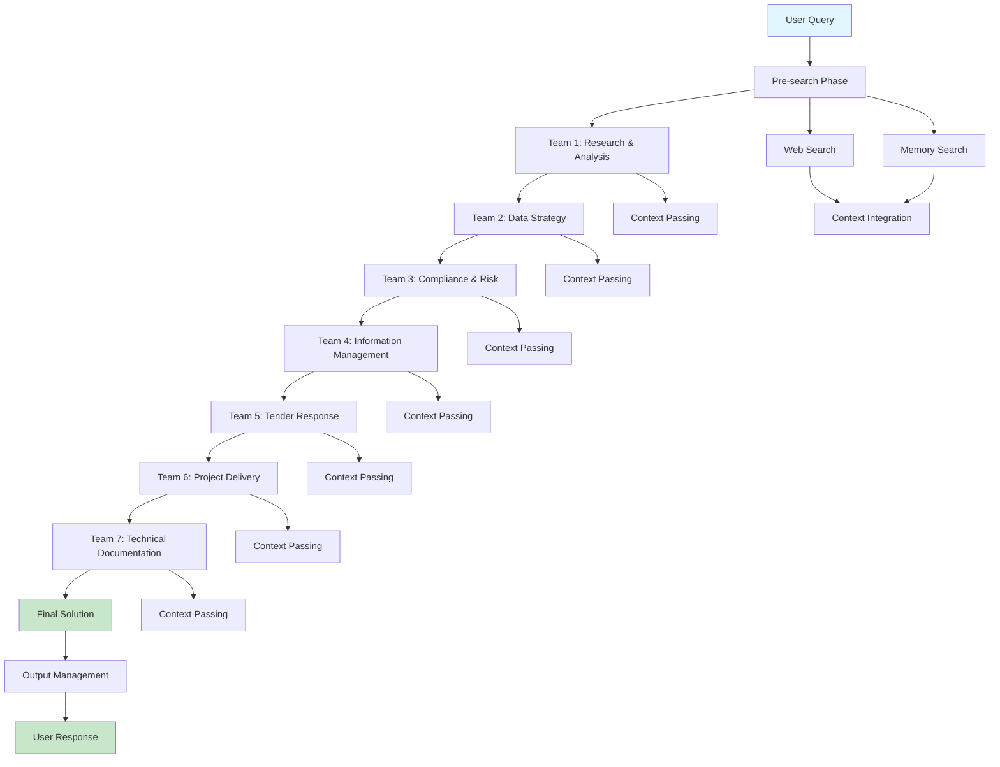
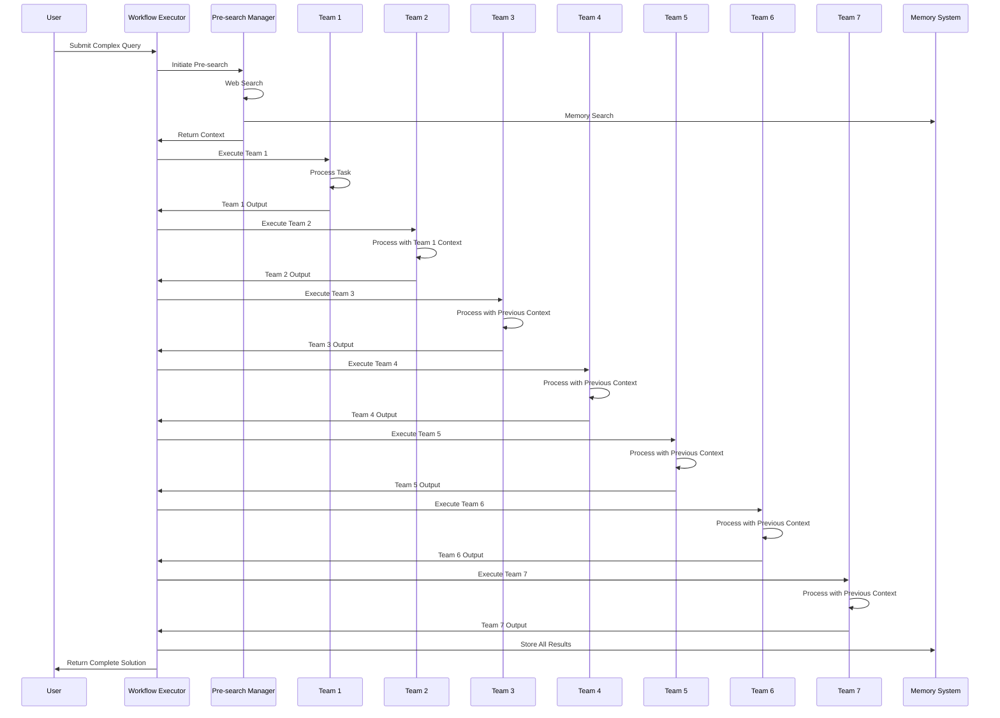
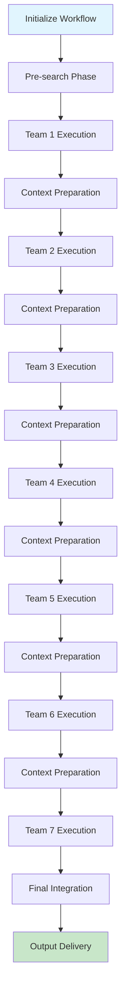
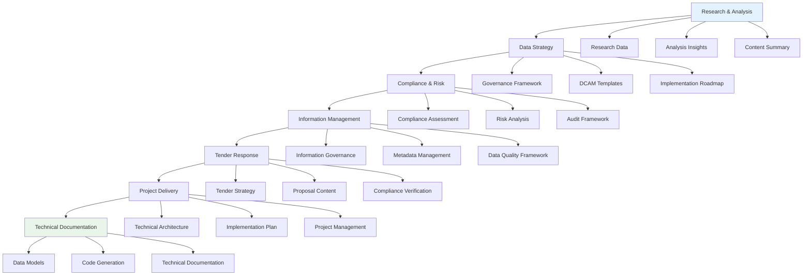
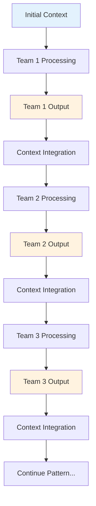
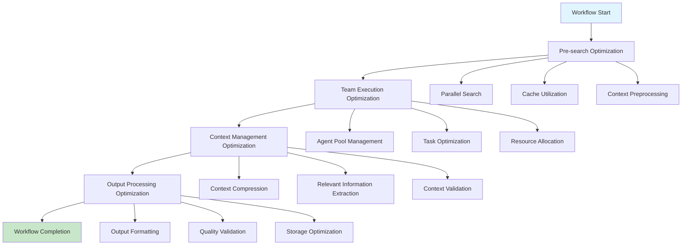

# Multi-Team Workflow Documentation

## Document Information

| Field | Value |
|-------|-------|
| **Document Title** | Multi-Team Workflow - Technical Specification |
| **Version** | 1.0 |
| **Date** | 2025-09-18 |
| **Classification** | Internal Use |
| **Author** | AI Development Team |
| **Reviewer** | Technical Architecture Team |
| **Approver** | Product Owner |

## Table of Contents

1. [Executive Summary](#executive-summary)
2. [Workflow Overview](#workflow-overview)
3. [Process Architecture](#process-architecture)
4. [Team Orchestration](#team-orchestration)
5. [Technical Implementation](#technical-implementation)
6. [Context Management](#context-management)
7. [Performance Optimization](#performance-optimization)
8. [Error Handling](#error-handling)
9. [Testing and Validation](#testing-and-validation)
10. [Troubleshooting](#troubleshooting)
11. [Appendices](#appendices)

## Executive Summary

The Multi-Team Workflow system orchestrates 2-7 specialized agent teams in sequential execution to deliver comprehensive business solutions. This workflow enables complex analysis, strategy development, compliance planning, and technical implementation through coordinated team collaboration.

### Key Capabilities
- **Sequential Team Execution**: Coordinated execution of multiple specialized teams
- **Context Passing**: Intelligent context transfer between teams
- **Comprehensive Solutions**: End-to-end business solution delivery
- **Scalable Architecture**: Support for 2-7 team configurations

### Business Value
- Delivers comprehensive business solutions in 3-10 minutes
- Enables complex multi-stage analysis and planning
- Provides specialized expertise across multiple domains
- Supports scalable enterprise operations

## Workflow Overview

### Purpose
Multi-team workflows are designed for complex business tasks that require specialized expertise across multiple domains, including research, strategy, compliance, implementation, and documentation.

### Scope
- **Input**: Complex business query or requirement
- **Processing**: Sequential execution of 2-7 specialized teams
- **Output**: Comprehensive business solution with implementation details
- **Duration**: 3-10 minutes depending on team count

### Workflow Types

#### Two Team Workflow
- **Teams**: Research & Analysis → Data Strategy
- **Duration**: 3-4 minutes
- **Use Cases**: Data strategy development, DAMA implementation

#### Three Team Workflow
- **Teams**: Research & Analysis → Data Strategy → Compliance & Risk
- **Duration**: 4-5 minutes
- **Use Cases**: Compliance planning, risk assessment

#### Four Team Workflow
- **Teams**: Research & Analysis → Data Strategy → Compliance & Risk → Information Management
- **Duration**: 5-6 minutes
- **Use Cases**: Comprehensive data management, information governance

#### Five Team Workflow
- **Teams**: Research & Analysis → Data Strategy → Compliance & Risk → Information Management → Tender Response
- **Duration**: 2.5-3 minutes
- **Use Cases**: Tender responses, proposal writing

#### Six Team Workflow
- **Teams**: Research & Analysis → Data Strategy → Compliance & Risk → Information Management → Tender Response → Project Delivery
- **Duration**: 3-5 minutes
- **Use Cases**: Project delivery, technical implementation

#### Seven Team Workflow
- **Teams**: Research & Analysis → Data Strategy → Compliance & Risk → Information Management → Tender Response → Project Delivery → Technical Documentation
- **Duration**: 5-10 minutes
- **Use Cases**: Comprehensive solutions, complete project delivery

## Process Architecture

### High-Level Process Flow



### Detailed Process Flow



### Context Flow Architecture


## Team Orchestration

### Team Execution Pattern



### Team Dependencies



## Technical Implementation

### Workflow Execution Pattern

```python
def run_multi_team_workflow(
    query: str,
    llm,
    conversation_history: Optional[List[Any]] = None,
    team_count: int = 7
) -> str:
    """
    Execute multi-team workflow with specified number of teams
    
    Args:
        query: User query or business requirement
        llm: Language model instance
        conversation_history: Previous conversation context
        team_count: Number of teams to execute (2-7)
        
    Returns:
        Comprehensive business solution
    """
    try:
        start_time = time.time()
        
        # 1. Pre-search phase
        presearch_results = perform_workflow_presearch(query, conversation_history)
        current_context = presearch_results.get('combined_context', '')
        
        # 2. Initialize team outputs storage
        team_outputs = {}
        
        # 3. Execute teams sequentially
        if team_count >= 1:
            team1_result = execute_team1(query, current_context, llm, conversation_history)
            team_outputs['research_analysis'] = team1_result
            current_context = f"{current_context}\n\nTeam 1 Output:\n{team1_result}"
            
        if team_count >= 2:
            team2_result = execute_team2(query, current_context, llm, conversation_history)
            team_outputs['data_strategy'] = team2_result
            current_context = f"{current_context}\n\nTeam 2 Output:\n{team2_result}"
            
        if team_count >= 3:
            team3_result = execute_team3(query, current_context, llm, conversation_history)
            team_outputs['compliance_risk'] = team3_result
            current_context = f"{current_context}\n\nTeam 3 Output:\n{team3_result}"
            
        if team_count >= 4:
            team4_result = execute_team4(query, current_context, llm, conversation_history)
            team_outputs['information_management'] = team4_result
            current_context = f"{current_context}\n\nTeam 4 Output:\n{team4_result}"
            
        if team_count >= 5:
            team5_result = execute_team5(query, current_context, llm, conversation_history)
            team_outputs['tender_response'] = team5_result
            current_context = f"{current_context}\n\nTeam 5 Output:\n{team5_result}"
            
        if team_count >= 6:
            team6_result = execute_team6(query, current_context, llm, conversation_history)
            team_outputs['project_delivery'] = team6_result
            current_context = f"{current_context}\n\nTeam 6 Output:\n{team6_result}"
            
        if team_count >= 7:
            team7_result = execute_team7(query, current_context, llm, conversation_history)
            team_outputs['technical_documentation'] = team7_result
            current_context = f"{current_context}\n\nTeam 7 Output:\n{team7_result}"
        
        # 4. Store results
        execution_time = time.time() - start_time
        save_team_outputs(
            workflow_type=f"{team_count}_team",
            query=query,
            team_outputs=team_outputs,
            metadata={"execution_time": execution_time}
        )
        
        return current_context
        
    except Exception as e:
        print(f"Error in multi-team workflow: {e}")
        raise
```

### Team Execution Functions

```python
def execute_team1(query: str, context: str, llm, conversation_history: List[Any]) -> str:
    """Execute Research & Analysis team"""
    try:
        agents = create_research_analysis_agents_with_context(llm, conversation_history)
        tasks = create_research_analysis_tasks_with_data(
            agents['researcher'], agents['analyst'], agents['writer'],
            query, context, conversation_history
        )
        
        crew = Crew(
            agents=list(agents.values()),
            tasks=tasks,
            process=Process.sequential,
            memory=False,
            max_rpm=5
        )
        
        result = crew.kickoff()
        time.sleep(10)  # Delay between teams
        return result
        
    except Exception as e:
        print(f"Error in Team 1 execution: {e}")
        raise

def execute_team2(query: str, context: str, llm, conversation_history: List[Any]) -> str:
    """Execute Data Strategy team"""
    try:
        agents = create_data_strategy_agents_with_context(llm, conversation_history)
        tasks = create_data_strategy_tasks_with_data(
            agents['data_governance_specialist'],
            agents['dcam_template_specialist'],
            agents['tranch_guidance_specialist'],
            query, context, conversation_history
        )
        
        crew = Crew(
            agents=list(agents.values()),
            tasks=tasks,
            process=Process.sequential,
            memory=False,
            max_rpm=5
        )
        
        result = crew.kickoff()
        time.sleep(10)  # Delay between teams
        return result
        
    except Exception as e:
        print(f"Error in Team 2 execution: {e}")
        raise

# Similar patterns for teams 3-7...
```

## Context Management

### Context Passing Strategy



### Context Integration Pattern

```python
def integrate_team_context(
    previous_context: str,
    team_output: str,
    team_name: str
) -> str:
    """
    Integrate team output into context for next team
    
    Args:
        previous_context: Context from previous teams
        team_output: Output from current team
        team_name: Name of current team
        
    Returns:
        Integrated context for next team
    """
    integrated_context = f"""
    {previous_context}
    
    === {team_name} Output ===
    {team_output}
    
    === End {team_name} Output ===
    """
    
    return integrated_context
```

### Context Validation

```python
def validate_context(context: str) -> bool:
    """
    Validate context quality and completeness
    
    Args:
        context: Context to validate
        
    Returns:
        True if context is valid, False otherwise
    """
    if not context or len(context.strip()) == 0:
        return False
    
    if len(context) < 100:  # Minimum context length
        return False
    
    # Check for key context elements
    required_elements = ['query', 'output', 'analysis']
    for element in required_elements:
        if element not in context.lower():
            return False
    
    return True
```

## Performance Optimization

### Execution Optimization



### Resource Management

```python
class WorkflowResourceManager:
    """Manage workflow resources and optimization"""
    
    def __init__(self):
        self.agent_pools = {}
        self.context_cache = {}
        self.performance_metrics = {}
    
    def optimize_team_execution(self, team_name: str, context: str) -> dict:
        """Optimize team execution based on context and performance"""
        optimization_config = {
            "max_iterations": 3,
            "max_rpm": 5,
            "execution_timeout": 300,
            "context_compression": True,
            "parallel_processing": False
        }
        
        # Adjust based on context complexity
        if len(context) > 10000:
            optimization_config["context_compression"] = True
            optimization_config["max_iterations"] = 2
        
        return optimization_config
    
    def manage_context_size(self, context: str, max_size: int = 50000) -> str:
        """Manage context size to prevent overflow"""
        if len(context) <= max_size:
            return context
        
        # Compress context while preserving key information
        compressed_context = self.compress_context(context, max_size)
        return compressed_context
```

### Performance Monitoring

```python
def monitor_workflow_performance(workflow_type: str, execution_time: float) -> dict:
    """Monitor and track workflow performance"""
    performance_metrics = {
        "workflow_type": workflow_type,
        "execution_time": execution_time,
        "timestamp": time.time(),
        "status": "completed" if execution_time < 600 else "slow"
    }
    
    # Log performance metrics
    log_performance_metrics(performance_metrics)
    
    # Alert if performance is below threshold
    if execution_time > 600:  # 10 minutes
        alert_slow_execution(workflow_type, execution_time)
    
    return performance_metrics
```

## Error Handling

### Error Categories

#### 1. Team Execution Errors
- **Agent Initialization Failures**: Configuration issues, resource constraints
- **Task Execution Errors**: Agent-specific failures, timeout issues
- **Context Passing Problems**: Data format issues, missing dependencies

#### 2. Context Management Errors
- **Context Overflow**: Context size exceeds limits
- **Context Corruption**: Invalid or corrupted context data
- **Context Loss**: Context not properly passed between teams

#### 3. Workflow Orchestration Errors
- **Team Dependencies**: Missing or invalid team dependencies
- **Execution Order**: Teams executed in wrong order
- **Resource Constraints**: Insufficient resources for execution

### Error Handling Strategies

```python
def handle_workflow_errors(error: Exception, team_name: str, context: str) -> str:
    """
    Handle workflow-specific errors with appropriate fallbacks
    
    Args:
        error: Exception that occurred
        team_name: Name of team where error occurred
        context: Current context
        
    Returns:
        Error message or fallback response
    """
    if "timeout" in str(error).lower():
        return f"Team {team_name} execution timed out. Using simplified approach."
    elif "context" in str(error).lower():
        return f"Context error in {team_name}. Using basic context."
    elif "agent" in str(error).lower():
        return f"Agent error in {team_name}. Retrying with simplified tasks."
    else:
        return f"Workflow error in {team_name}: {str(error)}"
```

### Recovery Mechanisms

```python
def recover_from_team_failure(
    team_name: str,
    error: Exception,
    context: str,
    llm
) -> str:
    """Recover from team execution failure"""
    try:
        # Try simplified execution
        simplified_result = execute_team_simplified(team_name, context, llm)
        return simplified_result
    except Exception as recovery_error:
        # Use fallback response
        return f"Team {team_name} failed: {str(error)}. Recovery failed: {str(recovery_error)}"
```

## Testing and Validation

### Unit Testing

```python
def test_multi_team_workflow():
    """Test multi-team workflow execution"""
    # Test 2-team workflow
    result = run_multi_team_workflow("Test query", llm, [], team_count=2)
    assert result is not None
    assert "research" in result.lower()
    assert "strategy" in result.lower()
    
    # Test 7-team workflow
    result = run_multi_team_workflow("Complex query", llm, [], team_count=7)
    assert result is not None
    assert len(result) > 1000

def test_context_passing():
    """Test context passing between teams"""
    context1 = "Initial context"
    team1_output = "Team 1 output"
    integrated_context = integrate_team_context(context1, team1_output, "Team 1")
    
    assert "Team 1 output" in integrated_context
    assert "Team 1 Output" in integrated_context
```

### Integration Testing

```python
def test_workflow_integration():
    """Test workflow integration with all components"""
    # Test with memory system
    result = run_multi_team_workflow("Query with context", llm, conversation_history, team_count=3)
    assert result is not None
    
    # Test with different team counts
    for team_count in range(2, 8):
        result = run_multi_team_workflow("Test query", llm, [], team_count=team_count)
        assert result is not None
```

### Performance Testing

```python
def test_workflow_performance():
    """Test workflow performance and timing"""
    start_time = time.time()
    result = run_multi_team_workflow("Performance test", llm, [], team_count=7)
    execution_time = time.time() - start_time
    
    assert execution_time <= 600  # 10 minutes max
    assert result is not None
```

## Troubleshooting

### Common Issues

#### 1. Context Overflow
**Symptoms**: Context becomes too large for processing
**Causes**: Accumulated outputs from multiple teams
**Solutions**:
- Implement context compression
- Use context summarization
- Limit context size per team

#### 2. Team Execution Failures
**Symptoms**: Individual teams fail during execution
**Causes**: Agent configuration issues, resource constraints
**Solutions**:
- Verify agent configurations
- Check system resources
- Implement retry mechanisms

#### 3. Context Loss
**Symptoms**: Teams lose context between executions
**Causes**: Context passing implementation issues
**Solutions**:
- Verify context passing mechanisms
- Implement context validation
- Use context persistence

### Debugging Procedures

1. **Check Team Execution**: Verify each team executes successfully
2. **Validate Context**: Ensure context is properly passed between teams
3. **Monitor Resources**: Check system resources and performance
4. **Review Logs**: Analyze error logs and execution traces
5. **Test Components**: Test individual teams and context passing

## Appendices

### Appendix A: Workflow Configuration

#### Team Execution Configuration
```python
TEAM_CONFIG = {
    "max_execution_time": 300,  # 5 minutes per team
    "max_rpm": 5,               # Rate limiting
    "team_delay": 10,           # Delay between teams
    "context_max_size": 50000,  # Maximum context size
    "retry_attempts": 3,        # Retry failed teams
    "timeout_buffer": 30        # Timeout buffer
}
```

#### Context Management Configuration
```python
CONTEXT_CONFIG = {
    "compression_enabled": True,
    "max_context_size": 50000,
    "context_validation": True,
    "context_persistence": True,
    "context_optimization": True
}
```

### Appendix B: Error Codes

| Code | Description | Severity | Action |
|------|-------------|----------|---------|
| MT001 | Team execution failed | High | Check team configuration |
| MT002 | Context overflow | Medium | Implement context compression |
| MT003 | Context corruption | High | Validate context data |
| MT004 | Team dependency error | High | Check team dependencies |
| MT005 | Workflow timeout | High | Increase timeout or optimize |
| MT006 | Resource constraint | High | Check system resources |
| MT007 | Context passing failed | Medium | Check context mechanisms |
| MT008 | Team initialization failed | High | Check agent configuration |

### Appendix C: Performance Benchmarks

#### Execution Time Benchmarks
- **2-Team Workflow**: 3-4 minutes
- **3-Team Workflow**: 4-5 minutes
- **4-Team Workflow**: 5-6 minutes
- **5-Team Workflow**: 2.5-3 minutes
- **6-Team Workflow**: 3-5 minutes
- **7-Team Workflow**: 5-10 minutes

#### Resource Usage Benchmarks
- **CPU Usage**: 50-80% average
- **Memory Usage**: 500-1000 MB average
- **Network Usage**: 50-200 MB per workflow
- **Storage Usage**: 10-50 MB per output

### Appendix D: Quality Standards

#### Workflow Quality Criteria
- **Completeness**: All required teams execute successfully
- **Context Accuracy**: Context properly passed between teams
- **Output Quality**: High-quality outputs from all teams
- **Integration**: Teams work together cohesively
- **Performance**: Execution within expected timeframes

#### Team Output Standards
- **Relevance**: Output directly addresses team objectives
- **Quality**: Professional and accurate content
- **Completeness**: All required sections present
- **Consistency**: Consistent with overall workflow objectives
- **Usability**: Output usable by subsequent teams

---

**Document Control**
- **Last Updated**: 2025-09-18
- **Next Review**: 2025-12-18
- **Version History**: 1.0 (Initial Release)
- **Distribution**: Internal Use Only
