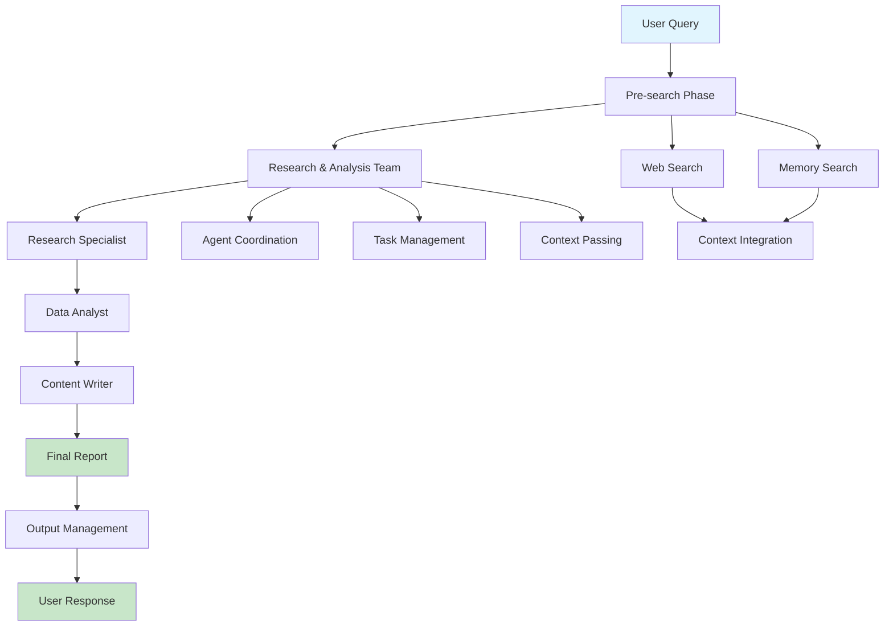
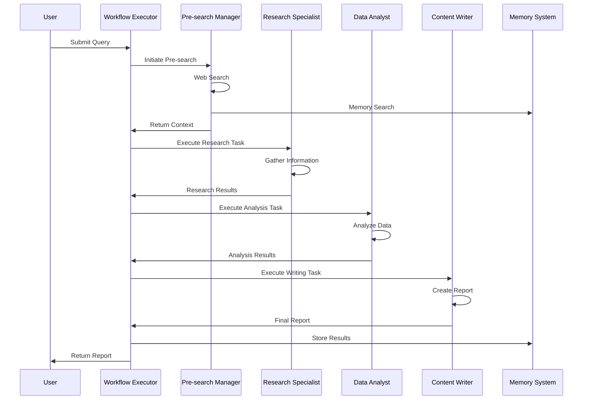
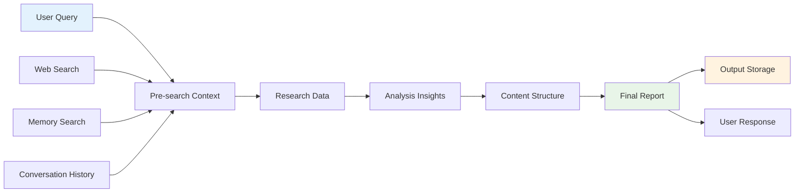

# Single Team Workflow Documentation

## Document Information

| Field | Value |
|-------|-------|
| **Document Title** | Single Team Workflow - Technical Specification |
| **Version** | 1.0 |
| **Date** | 2025-09-18 |
| **Classification** | Internal Use |
| **Author** | AI Development Team |
| **Reviewer** | Technical Architecture Team |
| **Approver** | Product Owner |

## Table of Contents

1. [Executive Summary](#executive-summary)
2. [Workflow Overview](#workflow-overview)
3. [Process Architecture](#process-architecture)
4. [Technical Implementation](#technical-implementation)
5. [Agent Team Details](#agent-team-details)
6. [Execution Flow](#execution-flow)
7. [Performance Metrics](#performance-metrics)
8. [Error Handling](#error-handling)
9. [Testing and Validation](#testing-and-validation)
10. [Troubleshooting](#troubleshooting)
11. [Appendices](#appendices)

## Executive Summary

The Single Team Workflow is the foundational workflow in the CrewAI Multi-Agent Workflow System, designed for basic research and analysis tasks. This workflow orchestrates the Research & Analysis team to deliver comprehensive research reports and analytical insights.

### Key Capabilities
- **Research Execution**: Comprehensive web research and data gathering
- **Data Analysis**: Pattern identification and trend analysis
- **Content Creation**: Professional report generation
- **Context Management**: Intelligent context passing and memory integration

### Business Value
- Provides rapid research and analysis capabilities
- Delivers professional-quality reports in 2-3 minutes
- Supports decision-making with data-driven insights
- Enables scalable research operations

## Workflow Overview

### Purpose
The Single Team Workflow is designed for straightforward research and analysis tasks that require comprehensive information gathering, data analysis, and professional report generation.

### Scope
- **Input**: User query or research question
- **Processing**: Research, analysis, and content creation
- **Output**: Comprehensive research report with insights and recommendations
- **Duration**: 2-3 minutes average execution time

### Use Cases
- Market research and competitive analysis
- Industry trend analysis and reporting
- Academic research and literature reviews
- Business intelligence and strategic analysis
- Content creation and documentation

## Process Architecture

### High-Level Process Flow



### Detailed Process Flow



### Data Flow Architecture



## Technical Implementation

### Workflow Function
```python
def run_crew_workflow(
    query: str, 
    llm, 
    conversation_history: Optional[List[Any]] = None
) -> str:
    """
    Execute single team workflow with Research & Analysis team
    
    Args:
        query: User query or research question
        llm: Language model instance
        conversation_history: Previous conversation context
        
    Returns:
        Comprehensive research report
    """
    try:
        # 1. Pre-search phase
        presearch_results = perform_workflow_presearch(query, conversation_history)
        
        # 2. Create Research & Analysis team
        research_agents = create_research_analysis_agents_with_context(
            llm, conversation_history, use_tools=True
        )
        
        # 3. Create tasks with pre-search data
        research_tasks = create_research_analysis_tasks_with_data(
            research_agents['researcher'],
            research_agents['analyst'], 
            research_agents['writer'],
            query,
            presearch_results.get('combined_context', ''),
            conversation_history
        )
        
        # 4. Execute team
        research_crew = Crew(
            agents=list(research_agents.values()),
            tasks=research_tasks,
            process=Process.sequential,
            memory=False,
            max_rpm=5
        )
        
        result = research_crew.kickoff()
        
        # 5. Store results
        save_team_outputs(
            workflow_type="single_team",
            query=query,
            team_outputs={"research_analysis": result},
            metadata={"execution_time": time.time() - start_time}
        )
        
        return result
        
    except Exception as e:
        print(f"Error in single team workflow: {e}")
        raise
```

### Pre-search Implementation
```python
def perform_workflow_presearch(
    query: str, 
    conversation_history: Optional[List[Any]] = None
) -> Dict[str, Any]:
    """
    Perform pre-search to gather comprehensive context
    
    Args:
        query: User query
        conversation_history: Previous conversation context
        
    Returns:
        Dictionary containing search results and context
    """
    try:
        # Web search
        web_results = search_web(query)
        
        # Memory search
        memory_results = search_memory(query, conversation_history)
        
        # Combine results
        combined_context = f"""
        Query: {query}
        
        Web Search Results:
        {web_results}
        
        Memory Search Results:
        {memory_results}
        """
        
        return {
            "query": query,
            "web_results": web_results,
            "memory_results": memory_results,
            "combined_context": combined_context
        }
        
    except Exception as e:
        print(f"Error in pre-search: {e}")
        return {"query": query, "combined_context": query}
```

## Agent Team Details

### Research & Analysis Team

#### Team Composition
- **Research Specialist**: Information gathering and data collection
- **Data Analyst**: Pattern analysis and insight generation
- **Content Writer**: Report creation and content synthesis

#### Agent Specifications
```python
# Research Specialist
research_specialist = Agent(
    role="Research Specialist",
    goal="Conduct comprehensive research and gather relevant information",
    backstory="Expert researcher with extensive experience in information gathering",
    tools=[search_tool, read_file_tool],
    max_iter=3,
    max_rpm=5,
    execution_timeout=300,
    memory=False,
    allow_delegation=False
)

# Data Analyst
data_analyst = Agent(
    role="Data Analyst", 
    goal="Analyze research data and identify key insights",
    backstory="Skilled analyst with expertise in data interpretation",
    tools=[read_file_tool],
    max_iter=3,
    max_rpm=5,
    execution_timeout=300,
    memory=False,
    allow_delegation=False
)

# Content Writer
content_writer = Agent(
    role="Content Writer",
    goal="Create comprehensive, professional reports",
    backstory="Professional writer with expertise in technical documentation",
    tools=[write_file_tool],
    max_iter=3,
    max_rpm=5,
    execution_timeout=300,
    memory=False,
    allow_delegation=False
)
```

#### Task Definitions
```python
# Research Task
research_task = Task(
    description="Conduct comprehensive research on the given topic",
    expected_output="Detailed research findings with sources and data",
    agent=research_specialist,
    context=[query, presearch_context]
)

# Analysis Task
analysis_task = Task(
    description="Analyze research findings and identify key insights",
    expected_output="Structured analysis with patterns and trends",
    agent=data_analyst,
    context=[research_task]
)

# Writing Task
writing_task = Task(
    description="Create comprehensive report based on research and analysis",
    expected_output="Professional report with executive summary and recommendations",
    agent=content_writer,
    context=[research_task, analysis_task]
)
```

## Execution Flow

### Phase 1: Initialization
1. **Query Validation**: Validate user query format and content
2. **Context Preparation**: Initialize conversation history and context
3. **Resource Allocation**: Allocate system resources for execution
4. **Pre-search Setup**: Initialize search tools and memory systems

### Phase 2: Pre-search Execution
1. **Web Search**: Execute DuckDuckGo search for current information
2. **Memory Search**: Query ChromaDB for relevant past conversations
3. **Context Integration**: Combine search results with user query
4. **Context Validation**: Validate and clean integrated context

### Phase 3: Team Execution
1. **Agent Initialization**: Create and configure agent instances
2. **Task Creation**: Generate tasks with proper context and dependencies
3. **Crew Assembly**: Assemble agents and tasks into CrewAI crew
4. **Sequential Execution**: Execute agents in sequential order
5. **Context Passing**: Pass outputs between agents as context

### Phase 4: Output Processing
1. **Result Validation**: Validate team output quality and completeness
2. **Format Standardization**: Standardize output format and structure
3. **Quality Assurance**: Perform quality checks on final output
4. **Output Storage**: Store results in team output system

### Phase 5: Response Delivery
1. **Response Formatting**: Format final response for user consumption
2. **Metadata Addition**: Add execution metadata and timestamps
3. **User Delivery**: Deliver final response to user interface
4. **Cleanup**: Clean up temporary resources and context

## Performance Metrics

### Key Performance Indicators (KPIs)

| Metric | Target | Measurement |
|--------|--------|-------------|
| Execution Time | ≤3 minutes | Average workflow completion time |
| Success Rate | ≥95% | Successful workflow completions |
| Output Quality | ≥90% | High-quality output generation |
| Context Accuracy | ≥85% | Accurate context integration |
| Resource Usage | ≤80% | System resource utilization |

### Performance Monitoring
- **Real-time Tracking**: Monitor execution progress and performance
- **Resource Monitoring**: Track CPU, memory, and network usage
- **Quality Metrics**: Measure output quality and accuracy
- **Error Tracking**: Monitor and log errors and exceptions

### Optimization Strategies
- **Caching**: Implement intelligent caching for repeated queries
- **Parallel Processing**: Optimize agent execution where possible
- **Resource Management**: Efficient memory and CPU usage
- **Context Optimization**: Streamline context passing and processing

## Error Handling

### Error Categories

#### 1. Pre-search Errors
- **Web Search Failures**: Network issues, API rate limits
- **Memory Search Issues**: Database connectivity, query failures
- **Context Integration Problems**: Data format issues, parsing errors

#### 2. Agent Execution Errors
- **Agent Initialization Failures**: Configuration issues, resource constraints
- **Task Execution Errors**: Agent-specific failures, timeout issues
- **Context Passing Problems**: Data format issues, missing dependencies

#### 3. Output Processing Errors
- **Result Validation Failures**: Quality checks, format validation
- **Storage Issues**: Database connectivity, file system problems
- **Response Formatting Errors**: Output formatting, metadata issues

### Error Handling Strategies
```python
def handle_workflow_errors(error: Exception, context: str) -> str:
    """
    Handle workflow-specific errors with appropriate fallbacks
    
    Args:
        error: Exception that occurred
        context: Context where error occurred
        
    Returns:
        Error message or fallback response
    """
    if "presearch" in str(error).lower():
        return "Pre-search failed. Using basic context for execution."
    elif "agent" in str(error).lower():
        return "Agent execution failed. Retrying with simplified tasks."
    elif "output" in str(error).lower():
        return "Output processing failed. Returning raw results."
    else:
        return f"Workflow error: {str(error)}"
```

### Recovery Mechanisms
- **Automatic Retry**: Retry failed operations with exponential backoff
- **Fallback Strategies**: Use simplified approaches when complex operations fail
- **Graceful Degradation**: Provide partial results when full execution fails
- **Error Reporting**: Comprehensive error logging and reporting

## Testing and Validation

### Unit Testing
```python
def test_single_team_workflow():
    """Test single team workflow execution"""
    # Test with simple query
    result = run_crew_workflow("Test query", llm, [])
    assert result is not None
    assert len(result) > 0
    
    # Test with complex query
    result = run_crew_workflow("Complex research question", llm, [])
    assert result is not None
    assert "analysis" in result.lower()
```

### Integration Testing
```python
def test_workflow_integration():
    """Test workflow integration with other components"""
    # Test with memory system
    result = run_crew_workflow("Query with context", llm, conversation_history)
    assert result is not None
    
    # Test with different LLM configurations
    result = run_crew_workflow("Test query", different_llm, [])
    assert result is not None
```

### Performance Testing
```python
def test_workflow_performance():
    """Test workflow performance and timing"""
    start_time = time.time()
    result = run_crew_workflow("Performance test query", llm, [])
    execution_time = time.time() - start_time
    
    assert execution_time <= 180  # 3 minutes max
    assert result is not None
```

### Validation Criteria
- **Output Completeness**: All required sections present
- **Content Quality**: Professional writing and analysis
- **Source Attribution**: Proper source citations and references
- **Format Consistency**: Consistent formatting and structure
- **Accuracy**: Factual accuracy and logical consistency

## Troubleshooting

### Common Issues

#### 1. Empty or Incomplete Outputs
**Symptoms**: Workflow completes but returns empty or incomplete results
**Causes**:
- LLM configuration issues
- Agent task failures
- Context passing problems

**Solutions**:
- Verify LLM configuration and API keys
- Check agent task definitions and dependencies
- Validate context passing between agents
- Review error logs for specific failures

#### 2. Timeout Errors
**Symptoms**: Workflow execution times out before completion
**Causes**:
- Complex queries requiring extensive processing
- Resource constraints
- Network connectivity issues

**Solutions**:
- Increase timeout limits for complex queries
- Optimize agent task complexity
- Check system resources and availability
- Implement query complexity detection

#### 3. Context Loss
**Symptoms**: Agents lose context between tasks
**Causes**:
- Context passing implementation issues
- Memory system failures
- Agent configuration problems

**Solutions**:
- Verify context passing mechanisms
- Check memory system connectivity
- Review agent configuration and dependencies
- Implement context validation checks

#### 4. Quality Issues
**Symptoms**: Output quality is below expected standards
**Causes**:
- Inadequate agent instructions
- Poor context quality
- LLM configuration issues

**Solutions**:
- Improve agent instructions and backstories
- Enhance context quality and relevance
- Optimize LLM parameters and prompts
- Implement quality validation checks

### Debugging Procedures

1. **Check Logs**: Review error logs and execution traces
2. **Validate Inputs**: Ensure query and context are properly formatted
3. **Test Components**: Test individual agents and tasks separately
4. **Monitor Resources**: Check system resources and performance
5. **Verify Configuration**: Ensure all configurations are correct

### Support Escalation

1. **Level 1**: Basic workflow execution issues
2. **Level 2**: Agent-specific problems
3. **Level 3**: Complex integration challenges
4. **Level 4**: System architecture issues

## Appendices

### Appendix A: Configuration Parameters

#### Workflow Configuration
```python
WORKFLOW_CONFIG = {
    "max_execution_time": 300,  # 5 minutes
    "max_rpm": 5,               # Rate limiting
    "team_delay": 10,           # Delay between teams
    "retry_attempts": 3,        # Retry failed operations
    "timeout_buffer": 30        # Timeout buffer in seconds
}
```

#### Agent Configuration
```python
AGENT_CONFIG = {
    "max_iterations": 3,
    "max_rpm": 5,
    "execution_timeout": 300,
    "memory_enabled": False,
    "delegation_enabled": False
}
```

### Appendix B: Error Codes

| Code | Description | Severity | Action |
|------|-------------|----------|---------|
| ST001 | Pre-search failure | Medium | Check search tools |
| ST002 | Agent initialization failed | High | Check agent configuration |
| ST003 | Task execution failed | High | Check task definitions |
| ST004 | Context passing failed | Medium | Check context mechanisms |
| ST005 | Output processing failed | Medium | Check output validation |
| ST006 | Workflow timeout | High | Increase timeout or optimize |
| ST007 | Resource constraint | High | Check system resources |
| ST008 | Quality validation failed | Medium | Check output quality |

### Appendix C: Performance Benchmarks

#### Execution Time Benchmarks
- **Simple Queries**: 60-90 seconds
- **Medium Queries**: 90-150 seconds
- **Complex Queries**: 150-180 seconds
- **Maximum Timeout**: 300 seconds

#### Resource Usage Benchmarks
- **CPU Usage**: 40-60% average
- **Memory Usage**: 200-400 MB average
- **Network Usage**: 10-50 MB per query
- **Storage Usage**: 1-5 MB per output

### Appendix D: Quality Standards

#### Output Quality Criteria
- **Completeness**: All required sections present
- **Accuracy**: Factual accuracy and logical consistency
- **Clarity**: Clear and understandable language
- **Professionalism**: Professional tone and formatting
- **Relevance**: Directly addresses user query

#### Content Structure Standards
- **Executive Summary**: Clear overview of findings
- **Introduction**: Context and scope definition
- **Main Content**: Detailed analysis and insights
- **Conclusions**: Key findings and recommendations
- **References**: Proper source citations

---

**Document Control**
- **Last Updated**: 2025-09-18
- **Next Review**: 2025-12-18
- **Version History**: 1.0 (Initial Release)
- **Distribution**: Internal Use Only
