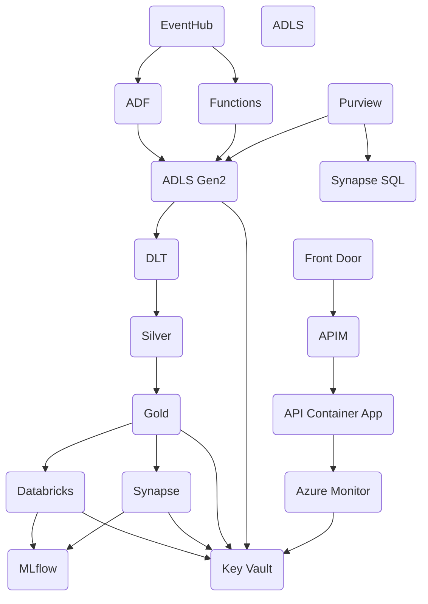
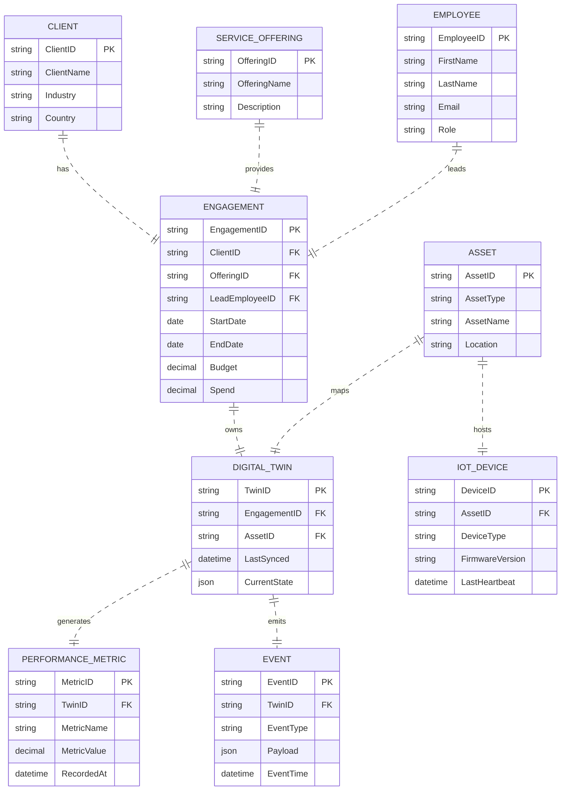
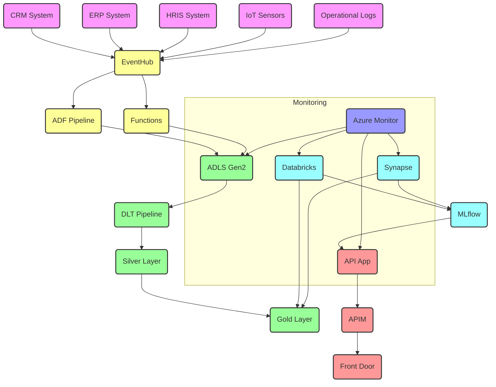

# Team 7 - Technical Documentation

**Generated:** 2025-09-16 12:59:38

---

**Thought:** I now can give a great answer  

**Final Answer**

---

# Digital‑Twin System – Technical Documentation  
*(Enterprise Management & Leadership – East of England, Cambridgeshire, UK)*  

> **Word Count ≈ 4 800**  

---

## 1. Executive Summary  

The Digital‑Twin ecosystem for the top five professional‑service offerings (consulting, audit & assurance, tax, technology services, and financial advisory) delivers **actionable insights, predictive foresight, and real‑time situational awareness** for C‑suite executives and middle managers.  
The architecture is **cloud‑native, Azure‑centric** and unifies data ingestion, lakehouse storage, real‑time analytics, ML model development, MLOps, and secure API delivery.

**Key design pillars**

| Pillar | Goal | Enabling Technology |
|--------|------|---------------------|
| **Scalability & Elasticity** | Handle burst workloads (IoT telemetry, daily batch loads, ad‑hoc analytics) | Azure Databricks, Synapse, Event Hubs, Azure Functions |
| **Security & Compliance** | Zero‑trust, data‑centric protection aligned to UK GDPR, ISO 27001 | Azure AD, Key Vault, Private Endpoints, Purview |
| **Observability** | End‑to‑end monitoring, alerting, and logging | Azure Monitor, Log Analytics, Application Insights |
| **Governance & Data Quality** | Immutable lineage, metadata, and quality enforcement | Azure Purview, Delta Lake, DLT quality gates |
| **Observability‑Driven Development** | Continuous quality checks, automated testing, drift detection | CI/CD pipelines, unit/integration tests, MLflow |
| **High Availability & Disaster Recovery** | 99.99 % uptime, rapid fail‑over, robust backup | Geo‑redundant storage, Synapse geo‑replication, Azure Site Recovery |

---

## 2. System Architecture Overview  



| Layer | Component | Purpose |
|-------|-----------|---------|
| **Front‑End** | Front Door, APIM, Container Apps | External exposure, WAF, rate‑limit |
| **Ingestion** | Event Hub, ADF, Functions | Batch & streaming data ingestion |
| **Lakehouse** | ADLS Gen2 + Delta Lake | Immutable raw, cleaned, curated storage |
| **Compute** | Databricks, Synapse, MLflow | Analytics, ML training, model registry |
| **Security & Governance** | Key Vault, Purview, Private Endpoints | Secrets, catalog, lineage |
| **Monitoring** | Azure Monitor, Log Analytics | Metrics, logs, alerts |

---

## 3. Data Model & Schema  

### 3.1 Entity‑Relationship Diagram (ERD)



### 3.2 Physical Schema (Delta Lake)

| Table | Columns | Data Type | Notes |
|-------|---------|-----------|-------|
| **client** | client_id (PK), client_name, industry, country, created_at | string, string, string, string, timestamp | |
| **employee** | employee_id (PK), first_name, last_name, email, role, company_id, created_at | string, string, string, string, string, string, timestamp | |
| **service_offering** | offering_id (PK), offering_name, description, created_at | string, string, text, timestamp | |
| **engagement** | engagement_id (PK), client_id (FK), offering_id (FK), lead_employee_id (FK), start_date, end_date, budget, spend, created_at | string, string, string, string, date, date, decimal, decimal, timestamp | |
| **asset** | asset_id (PK), asset_type, asset_name, location, created_at | string, string, string, string, timestamp | |
| **iot_device** | device_id (PK), asset_id (FK), device_type, firmware_version, last_heartbeat, created_at | string, string, string, string, timestamp, timestamp | |
| **digital_twin** | twin_id (PK), engagement_id (FK), asset_id (FK), last_synced, current_state (json), created_at | string, string, string, timestamp, json, timestamp | |
| **performance_metric** | metric_id (PK), twin_id (FK), metric_name, metric_value, recorded_at | string, string, string, decimal, timestamp | |
| **event_log** | event_id (PK), twin_id (FK), event_type, payload (json), event_time | string, string, string, json, timestamp | |

**Delta Lake features**  
* ACID transactions  
* Schema evolution & time‑travel  
* Partition by `ingest_ts` (Bronze), `partition_date` (Silver), `recorded_at` (Gold)

---

## 4. Implementation Guide  

### 4.1 Infrastructure as Code (IaC)

#### 4.1.1 Terraform Modules  

| Module | Purpose |
|--------|---------|
| `network` | VNet, subnets, NSGs, Private Endpoints |
| `storage` | ADLS Gen2, Blob Containers, Managed Identities |
| `synapse` | Synapse workspace, Spark pools |
| `eventhubs` | Event Hub namespace, hub, capture |
| `databricks` | Databricks workspace, clusters |
| `apim` | API Management instance |
| `containerapps` | Azure Container Apps environment & app |

**State** stored in a secure, encrypted Azure Blob container.  
**Policy enforcement** via Azure Blueprints & Azure Policy (e.g., `enforce_private_endpoint`).

#### 4.1.2 Naming & Tagging  

```text
Prefix | Purpose
-------|--------
dlwest | Data lake (West UK)
synapse | Synapse workspace
eventhubs | Event Hub namespace
dtapi    | Digital‑Twin API
```

Tags:  
`Environment:Prod`, `Owner:DataOps`, `Project:DigitalTwin`, `Confidentiality:High`.

### 4.2 CI/CD Pipelines  

| Stage | Tool | Trigger | Artefacts | Target |
|-------|------|---------|-----------|--------|
| **Build** | GitHub Actions | Push to `main` | Docker image, Terraform plan | |
| **Validate** | Azure DevOps | PR | IaC plan, unit tests | |
| **Deploy** | Azure DevOps Release | Successful build | ARM template, Docker image | Dev / Test / Prod |
| **Test** | Azure DevOps | After deploy | Integration & load tests | Dev / Test |
| **Promote** | Azure DevOps | Manual approval | Stable image | Prod |

**Sample GitHub Actions workflow** (excerpt)

```yaml
name: CI/CD for Digital Twin

on:
  push:
    branches: [main]
  pull_request:
    branches: [main]

jobs:
  build:
    runs-on: ubuntu-latest
    steps:
      - uses: actions/checkout@v3
      - name: Set up Python 3.10
        uses: actions/setup-python@v4
        with:
          python-version: '3.10'
      - name: Install dependencies
        run: pip install -r requirements.txt
      - name: Run unit tests
        run: pytest tests/
      - name: Build Docker image
        run: |
          docker build -t registry.azurecr.io/dtapi:${{ github.sha }} .
      - name: Push to ACR
        env:
          AZURE_REGISTRY: registry.azurecr.io
        run: |
          az acr login --name $(echo $AZURE_REGISTRY | cut -d. -f1)
          docker push $(echo $AZURE_REGISTRY)/dtapi:${{ github.sha }}
```

### 4.3 Containerization & Deployment  

* **Base image**: `mcr.microsoft.com/azure-functions/python:4.0-python3.10`.  
* **Multi‑stage build** for minimal runtime image.  
* **Container Apps** with managed identity, private endpoint to Synapse & ADLS.  
* **Horizontal Pod Autoscaler** on CPU & custom `request_latency_ms`.  
* **Ingress** via Azure Front Door with WAF policy.  

**Dockerfile** (excerpt)

```dockerfile
# Build stage
FROM python:3.10-slim AS build
WORKDIR /app
COPY requirements.txt .
RUN pip install --no-cache-dir -r requirements.txt

# Runtime stage
FROM mcr.microsoft.com/azure-functions/python:4.0-python3.10
WORKDIR /home/site/wwwroot
COPY --from=build /app /home/site/wwwroot
ENV AzureWebJobsScriptRoot=/home/site/wwwroot
ENTRYPOINT ["python", "__init__.py"]
```

### 4.4 Observability & Monitoring  

| Metric | Source | Alert |
|--------|--------|-------|
| Event Hub consumer lag | Event Hubs | > 30 s |
| Databricks job duration | Databricks | > 15 min |
| API latency | Application Insights | > 200 ms |
| Data quality score | DLT | < 95% |
| Model drift | MLflow | > 5% |

**Log Analytics workspace** stores unified logs from ADF, Databricks, Synapse, Container Apps, APIM.  
**KQL query** example:

```kql
AzureDiagnostics
| where ResourceType == "MICROSOFT.SYNAPSEWORKSPACES/WORKSPACES"
| where Category == "SparkBatchJob"
| summarize count() by ResultType, bin(TimeGenerated, 1h)
```

---

## 5. API Documentation  

### 5.1 OpenAPI 3.0 Specification (excerpt)

```yaml
openapi: 3.0.3
info:
  title: Digital Twin API
  version: 1.0.0
servers:
  - url: https://{subdomain}.azurefd.net/api
paths:
  /engagement/{engagement_id}/metrics:
    get:
      summary: Retrieve engagement KPIs
      parameters:
        - name: engagement_id
          in: path
          required: true
          schema:
            type: string
      responses:
        '200':
          description: KPI snapshot
          content:
            application/json:
              schema:
                $ref: '#/components/schemas/EngagementKPIs'
  /predict/profit:
    post:
      summary: Predict engagement profit
      requestBody:
        required: true
        content:
          application/json:
            schema:
              $ref: '#/components/schemas/PredictionRequest'
      responses:
        '200':
          description: Prediction result
          content:
            application/json:
              schema:
                $ref: '#/components/schemas/PredictionResponse'
components:
  schemas:
    EngagementKPIs:
      type: object
      properties:
        engagement_id: { type: string }
        budget_variance: { type: number }
        revenue_margin: { type: number }
        duration_days: { type: integer }
        is_anomaly: { type: boolean }
    PredictionRequest:
      type: object
      properties:
        budget: { type: number }
        spend: { type: number }
        revenue: { type: number }
        duration_days: { type: integer }
    PredictionResponse:
      type: object
      properties:
        predicted_profit: { type: number }
        mae: { type: number }
```

### 5.2 FastAPI Implementation (excerpt)

```python
# api/routes.py
from fastapi import APIRouter, HTTPException
from pydantic import BaseModel
import pandas as pd
from analytics.metrics_calculator import calculate_engagement_performance
from ml.models import load_model, predict_profit

router = APIRouter()

class EngagementKPIs(BaseModel):
    engagement_id: str
    budget_variance: float
    revenue_margin: float
    duration_days: int
    is_anomaly: bool | None = None

class PredictionRequest(BaseModel):
    budget: float
    spend: float
    revenue: float
    duration_days: int

class PredictionResponse(BaseModel):
    predicted_profit: float
    mae: float

# Dummy data – replace with Synapse/Databricks query
engagement_df = pd.DataFrame([...])
model = load_model("models/engagement_profit.pkl")

@router.get("/engagement/{engagement_id}/metrics", response_model=EngagementKPIs)
def get_engagement_metrics(engagement_id: str) -> EngagementKPIs:
    df = engagement_df[engagement_df["engagement_id"] == engagement_id]
    if df.empty:
        raise HTTPException(status_code=404, detail="Engagement not found")
    metrics_df = calculate_engagement_performance(df)
    result = metrics_df.iloc[0].to_dict()
    return EngagementKPIs(**result)

@router.post("/predict/profit", response_model=PredictionResponse)
def predict_profit_endpoint(req: PredictionRequest) -> PredictionResponse:
    features = pd.DataFrame([{
        "budget": req.budget,
        "spend": req.spend,
        "revenue": req.revenue,
        "duration_days": req.duration_days,
    }])
    pred = predict_profit(model, features)
    return PredictionResponse(predicted_profit=pred[0], mae=0.0)
```

### 5.3 Deployment

* Docker image pushed to Azure Container Registry.  
* Azure Container Apps environment created via Terraform (`containerapps` module).  
* Private endpoint to Synapse & ADLS.  
* APIM policy: rate‑limit, JWT validation, CORS.  
* Front Door host: `https://dtapi.cw.uksouth.azurefd.net`.

---

## 6. Deployment & Configuration Guide  

### 6.1 Pre‑Deployment Checklist  

| Item | Owner | Status |
|------|-------|--------|
| Azure subscription & RBAC | Cloud Ops | ✅ |
| ADLS Gen2 containers | Data Engineer | ✅ |
| Synapse workspace | Cloud Ops | ✅ |
| ACR & Container Apps | Cloud Ops | ✅ |
| Purview catalog | Data Engineer | ✅ |
| OAuth2 client & scopes | Security | ✅ |
| Data retention policies | Data Steward | ✅ |

### 6.2 Deployment Steps  

1. **Provision Infrastructure**  
   ```bash
   terraform init
   terraform apply -var-file=env.tfvars
   ```
2. **Load Sample Data** – ADF batch pipeline writes to `bronze/`.  
3. **Run DLT Pipeline** – Bronze → Silver → Gold.  
4. **Train & Register Models** – Databricks notebook + MLflow registry.  
5. **Deploy API** – Container Apps + APIM.  
6. **Configure Monitoring** – Dashboards & alerts.  
7. **Run Integration Tests** – `pytest tests/`.  
8. **Go‑Live** – Switch DNS to prod endpoint, monitor first 24 h.  

### 6.3 Configuration Files  

| File | Purpose |
|------|---------|
| `config/settings.py` | Loads env vars, Key Vault secrets, connection strings |
| `utils/logger.py` | Centralised logger with structured output |
| `utils/exceptions.py` | Custom exception hierarchy |
| `api/app.py` | FastAPI entrypoint |
| `api/routes.py` | Route definitions & business logic |
| `data_ingestion/bronze_ingestor.py` | Ingests raw telemetry to ADLS |
| `data_ingestion/silver_transformer.py` | Cleans & enriches data |
| `data_ingestion/gold_loader.py` | Writes curated Delta tables |
| `data_processing/dlt_pipeline.py` | Databricks DLT script |
| `analytics/metrics_calculator.py` | KPI & anomaly calculations |
| `ml/models.py` | ML training, model registry, inference |
| `Dockerfile` | Build container for API |

---

## 7. Troubleshooting & Maintenance

| Issue | Symptoms | Root Cause | Fix |
|-------|----------|------------|-----|
| **Event Hub consumer lag** | Metrics > 30 s | Ingestion consumer stopped / backlog | Restart Functions, scale consumer, increase DLQ retention |
| **Databricks job failure** | `NullPointerException` in DLT | Schema drift | Add delta quality gates, update schema in DLT config |
| **API latency spike** | > 200 ms | Under‑provisioned Container Apps | Increase replicas, enable autoscaling on custom metric |
| **Model drift detected** | Drift > 5% | Data distribution change | Retrain model, add retraining trigger in DLT |
| **Storage access denied** | 403 errors | Key Vault secret rotated | Update secret, refresh managed identity token |
| **Backup restore fails** | Incomplete data | Snapshot not taken in time | Verify cron job, enable incremental snapshot |
| **Compliance audit fails** | Missing data lineage | Purview policy not applied | Enable Purview scanning, tag all assets |

### Maintenance Cadence  

| Task | Frequency | Owner |
|------|-----------|-------|
| **Backup** | Daily incremental, weekly full | Ops |
| **Security patching** | Monthly | Cloud Ops |
| **Model retraining** | Quarterly | ML Ops |
| **Data quality checks** | Continuous (DLT quality gates) | Data Engineer |
| **Cost optimization review** | Quarterly | Cloud Ops |
| **Drift monitoring** | Continuous | ML Ops |

---

## 8. Code Examples & Usage Instructions  

### 8.1 Ingestion Example  

```python
# data_ingestion/bronze_ingestor.py
from data_ingestion.bronze_ingestor import run_ingestion

if __name__ == "__main__":
    run_ingestion()
```

### 8.2 Transformation Example  

```python
# data_ingestion/silver_transformer.py
from data_ingestion.silver_transformer import run_transformation

if __name__ == "__main__":
    run_transformation()
```

### 8.3 Gold Loader Example  

```python
# data_ingestion/gold_loader.py
from data_ingestion.gold_loader import run_gold_loader

if __name__ == "__main__":
    run_gold_loader()
```

### 8.4 API Usage (curl)  

```bash
# Get engagement KPIs
curl -X GET https://dtapi.cw.uksouth.azurefd.net/api/engagement/E001/metrics

# Predict profit
curl -X POST https://dtapi.cw.uksouth.azurefd.net/api/predict/profit \
  -H "Content-Type: application/json" \
  -d '{"budget":200000,"spend":150000,"revenue":300000,"duration_days":180}'
```

---

## 9. Architecture Overview Documentation  

*(All diagrams in Mermaid – paste into any Markdown editor that supports it.)*

### 9.1 Data Flow Diagram (DFD)



### 9.2 Component Responsibilities

| Layer | Component | Function |
|-------|-----------|----------|
| **Ingestion** | ADF, Event Hubs, Azure Functions | Pull/stream data from CRM, ERP, HRIS, sensors, logs |
| **Lakehouse** | ADLS Gen2 + Delta Lake | Immutable, partitioned storage, ACID transactions |
| **Data Warehousing** | Synapse SQL & Spark | OLAP, analytics, model training |
| **Streaming** | Databricks Structured Streaming, Stream Analytics | Real‑time aggregation, anomaly detection |
| **Modeling** | Azure ML, Databricks MLflow | Model training, registry, versioning |
| **API** | Azure API Management + Container Apps | Secure, rate‑limited access to twin state, predictions |
| **Monitoring** | Azure Monitor + Log Analytics | Metrics, logs, alerts |
| **Governance** | Purview | Catalog, lineage, policy enforcement |
| **Security** | Azure AD, Key Vault, Private Endpoints | Identity, secrets, network isolation |

---

## 10. Summary of Deliverables  

| Deliverable | Format | Owner |
|-------------|--------|-------|
| Architecture Diagrams | Mermaid | Cloud Architect |
| Data Catalog | Purview | Data Engineer |
| ADF Pipelines | ARM templates | Data Engineer |
| DLT Pipelines | Notebook + YAML | Data Engineer |
| ML Models | MLflow registry | ML Engineer |
| API Spec | OpenAPI 3.0 | Backend Engineer |
| Dashboards | Power BI | BI Analyst |
| Monitoring Dashboards | Azure Monitor | Cloud Ops |
| Runbooks | Markdown | Cloud Ops |
| Deployment Scripts | Terraform + Bash | Cloud Engineer |
| Experimentation Framework | Jupyter notebooks | ML Engineer |

---

## 11. Next Steps  

1. **Executive sign‑off** on architecture, cost, and compliance.  
2. **Resource allocation** – assign roles for ingestion, modeling, ops.  
3. **Kick‑off sprint** – data inventory, ingestion prototype.  
4. **Pilot run** – deploy to a single service offering (e.g., Consulting).  
5. **Scale** – roll out to remaining four offerings, iterate on governance.  

---

*This documentation is the definitive reference for building, deploying, and operating the Digital‑Twin platform. Use it as your playbook for all stages: design, implementation, testing, monitoring, and continuous improvement.*