# Team 7 - Technical Documentation

**Generated:** 2025-09-16 16:09:35

---

**Smart‑City Digital‑Twin – Technical Documentation**  
*(Version 1.0 – 2025‑09‑16)*  

---  

# 1. Executive Summary  

The Smart‑City Digital‑Twin is a cloud‑native data‑product that ingests heterogeneous telemetry (traffic cameras, environmental sensors, public‑transport APIs, citizen feeds, IoT devices) into a unified, continuously evolving model.  The platform powers real‑time dashboards, predictive analytics, and self‑optimising city operations.  

The architecture is built on Azure services, follows an Agile project‑management framework, and is fully‑owned by a cross‑functional team.  The following documentation covers every layer of the stack – from data ingestion to API exposure – and provides implementation, deployment, testing, monitoring, and maintenance guidance.

---

## 1.1 High‑Level Architecture

```mermaid
graph TD
    %% Data sources
    TC[Traffic Cameras] --> EventHub
    WS[Weather Stations] --> EventHub
    ES[Environmental Sensors] --> EventHub
    PTAPI[Public Transport APIs] --> EventHub
    CF[Citizen Feed] --> EventHub

    %% Ingestion
    EventHub --> ADLSRaw[ADLS Gen2 – Raw Lake]
    ADLSRaw --> Databricks[Databricks ELT]
    Databricks --> ADLSProd[ADLS Gen2 – Processed Lake]

    %% Analytics
    ADLSProd --> Synapse[Synapse Analytics]
    Synapse --> PowerBI[Power BI Service]
    Synapse --> API[API Management]

    %% ML
    Databricks --> AzureML[Azure ML]
    AzureML --> ModelStore[Azure Blob – Models]

    %% Observability
    ADLSProd --> Purview[Purview Catalog]
    API --> Monitor[Azure Monitor]
    Databricks --> Sentinel[Azure Sentinel]
    Purview --> Monitor
    KeyVault[Key Vault] --> Monitor
    KeyVault --> Sentinel

    %% Front‑end
    PowerBI --> WebPortal[Public Web Portal]
    API --> WebPortal
```



**Key takeaways**

| Layer | Services | Purpose |
|-------|----------|---------|
| **Ingestion** | Event Hub / IoT Hub | Real‑time telemetry |
| **Raw Lake** | ADLS Gen2 | Immutable parquet files |
| **Processing** | Databricks + Delta Lake | Clean, enrich, index |
| **Processed Lake** | ADLS Gen2 | Delta tables (query‑optimized) |
| **Warehouse** | Synapse Analytics | OLAP, materialised views |
| **Analytics** | Power BI | Dashboards, KPI visualisation |
| **APIs** | API Management + Azure Functions | Secure, throttled REST/GraphQL |
| **ML** | Azure ML | Model training, inference |
| **Governance** | Purview, Key Vault | Data catalog, secrets |
| **Observability** | Azure Monitor, Sentinel, Prometheus | Metrics, logs, SIEM |
| **Front‑end** | Power BI, Web Portal | Citizen‑facing dashboards |

---

# 2. Data Model

## 2.1 Conceptual ERD


## 2.2 Logical Data Model (attributes & constraints)

```mermaid
erDiagram
    CITYAREA {
        string CityAreaID PK
        string Name
        string Region
        geometry Geometry
        datetime CreatedAt
    }
    INTERSECTION {
        string IntersectionID PK
        string CityAreaID FK
        string Name
        geometry Geometry
        datetime CreatedAt
    }
    ROADSEGMENT {
        string RoadSegmentID PK
        string CityAreaID FK
        string Name
        geometry Geometry
        int LengthMeters
        datetime CreatedAt
    }
    TRAFFICCAMERA {
        string CameraID PK
        string CityAreaID FK
        string Location
        string Model
        string Status
        datetime InstalledAt
    }
    WEATHERSTATION {
        string StationID PK
        string CityAreaID FK
        string Location
        string Model
        string Status
        datetime InstalledAt
    }
    ENVIRONMENTALSENSOR {
        string SensorID PK
        string CityAreaID FK
        string Location
        string SensorType
        string Status
        datetime InstalledAt
    }
    PUBLICTRANSPORTAPI {
        string APIID PK
        string CityAreaID FK
        string ServiceName
        string Endpoint
        string Status
        datetime LastSync
    }
    CITIZENFEED {
        string FeedID PK
        string CityAreaID FK
        string Source
        string Status
        datetime LastSync
    }
    TRAFFICEVENT {
        string EventID PK
        string CameraID FK
        string IntersectionID FK
        string RoadSegmentID FK
        string VehicleID FK
        string EventType
        float Speed
        datetime Timestamp
    }
    PUBLICTRANSPORTEVENT {
        string EventID PK
        string APIID FK
        string IntersectionID FK
        string RoadSegmentID FK
        string VehicleID FK
        string EventType
        datetime Timestamp
    }
    ENVIRONMENTALEVENT {
        string EventID PK
        string StationID FK
        string SensorID FK
        string Metric
        float Value
        datetime Timestamp
    }
    CITIZENFEEDBACK {
        string FeedbackID PK
        string CitizenID FK
        string FeedID FK
        string Content
        datetime SubmittedAt
    }
    VEHICLE {
        string VehicleID PK
        string LicensePlate
        string VehicleType
        datetime RegisteredAt
    }
    PUBLICTRANSPORTVEHICLE {
        string VehicleID PK
        string RouteID
        string VehicleType
        datetime RegisteredAt
    }
    CITIZEN {
        string CitizenID PK
        string FirstName
        string LastName
        string Email
        datetime RegisteredAt
    }
```



## 2.3 Physical Data Model – Table Design & Storage

| Table | Storage | Partition Key | Clustered Index | Remarks |
|-------|---------|---------------|-----------------|---------|
| `city_area` | Delta Lake (ADLS Gen2) | `city_area_id` | PK | Partition by region |
| `intersection` | Delta Lake | `city_area_id` | PK | – |
| `road_segment` | Delta Lake | `city_area_id` | PK | – |
| `traffic_camera` | Delta Lake | `city_area_id` | PK | – |
| `weather_station` | Delta Lake | `city_area_id` | PK | – |
| `environmental_sensor` | Delta Lake | `city_area_id` | PK | – |
| `public_transport_api` | Delta Lake | `city_area_id` | PK | – |
| `citizen_feed` | Delta Lake | `city_area_id` | PK | – |
| `vehicle` | Delta Lake | `vehicle_type` | PK | – |
| `public_transport_vehicle` | Delta Lake | `vehicle_type` | PK | – |
| `citizen` | Delta Lake | `registration_year` | PK | – |
| `traffic_event` | Delta Lake | `event_date` | PK | Partitioned by ingestion date |
| `public_transport_event` | Delta Lake | `event_date` | PK | – |
| `environmental_event` | Delta Lake | `event_date` | PK | – |
| `citizen_feedback` | Delta Lake | `submitted_date` | PK | – |

**DDL (Synapse / Delta Lake)**

```sql
CREATE TABLE city_area (
    city_area_id STRING PRIMARY KEY,
    name STRING,
    region STRING,
    geometry GEOGRAPHY,
    created_at TIMESTAMP
)
USING DELTA
PARTITIONED BY (region);
```

*Repeat for all entities, adjusting datatype as required.*

---

# 3. Ingestion Layer

## 3.1 Event Hub Streams

| Source | Event Hub Topic | Partition Count | Throughput Units |
|--------|-----------------|-----------------|------------------|
| Traffic Cameras | `traffic-cameras` | 20 | 200 |
| Weather Stations | `weather-stations` | 5 | 50 |
| Environmental Sensors | `environmental-sensors` | 10 | 100 |
| Public Transport APIs | `public-transport` | 8 | 80 |
| Citizen Feed | `citizen-feed` | 4 | 40 |

## 3.2 Databricks ELT Pipeline

```python
# ingest_and_process.py (Databricks notebook)
from pyspark.sql import SparkSession
from pyspark.sql.functions import col, to_timestamp, date_format

spark = SparkSession.builder.appName("SmartCityETL").getOrCreate()

# 1. Read raw parquet
raw_df = spark.read.parquet(
    f"abfss://{raw_container}@{storage_account}.dfs.core.windows.net/events/{date}"
)

# 2. Schema enforcement
raw_df = raw_df.selectExpr(
    "event_id",
    "camera_id",
    "intersection_id",
    "road_segment_id",
    "vehicle_id",
    "event_type",
    "speed",
    "timestamp",
    "ingest_ts"
)

# 3. Enrichment
enriched_df = raw_df.withColumn(
    "date", date_format(col("timestamp"), "yyyy-MM-dd")
)

# 4. Write to Delta
enriched_df.write.format("delta").mode("overwrite").partitionBy("date")\
    .save(f"abfss://{processed_container}@{storage_account}.dfs.core.windows.net/traffic_events")
```

## 3.3 Configuration – Bicep

```bicep
param storageAccount string
param eventHubNamespace string
param eventHubName string
param location string = resourceGroup().location

resource eventHub 'Microsoft.EventHub/namespaces/eventhubs@2023-01-01' = {
  name: '${eventHubNamespace}/${eventHubName}'
  location: location
  sku: {
    name: 'Standard'
    tier: 'Standard'
  }
  properties: {
    messagingUnits: 20
    isAutoInflateEnabled: true
    maxMessageSizeInKilobytes: 1024
  }
}
```

---

# 4. Analytics Layer

## 4.1 Synapse Data Warehouse

- **DWUs**: 4000 (dedicated) for peak query load  
- **Materialised Views**: daily traffic summary, congestion heatmaps  
- **Column‑store Indexes**: automatically enabled in Synapse  

**Sample view**

```sql
CREATE MATERIALIZED VIEW mv_daily_traffic AS
SELECT
    DATE(timestamp) AS day,
    intersection_id,
    COUNT(*) AS event_cnt,
    AVG(speed) AS avg_speed,
    MAX(speed) AS max_speed,
    MIN(speed) AS min_speed
FROM traffic_event
GROUP BY DATE(timestamp), intersection_id;
```

## 4.2 Power BI Dashboard

- **Datasource**: Synapse linked service  
- **DAX measures**:
  ```DAX
  AvgSpeed = AVERAGE(traffic_event[speed])
  CongestionRate = DIVIDE([EventCnt], [VehicleCnt])
  ```
- **Visuals**: Map, KPI cards, line charts (speed over time)

---

# 5. Machine‑Learning Layer

## 5.1 Feature Engineering

```python
# features.py
def create_features(df: pd.DataFrame) -> Tuple[pd.DataFrame, pd.Series]:
    X = df.drop(columns=['speed_kmh', 'event_id', 'ingest_ts', 'date'])
    y = df['speed_kmh']
    ct = ColumnTransformer([
        ('cat', OneHotEncoder(handle_unknown='ignore'), ['camera_id', 'intersection_id', 'road_segment_id', 'vehicle_id', 'event_type']),
        ('num', 'passthrough', ['timestamp'])
    ])
    X_trans = ct.fit_transform(X)
    feature_names = ct.get_feature_names_out()
    return pd.DataFrame(X_trans, columns=feature_names), y
```

## 5.2 Model Training & MLOps

```python
# train.py
model, metrics = train_model(df)
joblib.dump(model, "/mnt/models/traffic_speed.pkl")
```

- **Azure ML**: Register model, create inference endpoint.  
- **CI/CD**: GitHub Actions build pipeline runs `train.py` on schedule.

---

# 6. API Layer

## 6.1 FastAPI Endpoints

```python
# main.py
@app.get("/traffic/summary")
def get_summary(date: date = Query(None)):
    df = spark.read.format("delta").load(path).toPandas()
    day_df = df[df["date"] == str(date)]
    stats = {
        "count": len(day_df),
        "mean_speed_kmh": day_df["speed_kmh"].mean(),
        "median_speed_kmh": day_df["speed_kmh"].median(),
    }
    return stats

@app.post("/traffic/predict")
def predict(payload: TrafficEvent):
    df = pd.DataFrame([payload.dict()])
    X, _ = create_features(df)
    pred = app.state.model.predict(X)[0]
    return {"predicted_speed_kmh": pred}
```

## 6.2 API Management Policies

```xml
<policies>
  <inbound>
    <base />
    <rate-limit-by-key calls="1000" renewal-period="60" counter-key="@(client.ip)" />
    <validate-jwt header-name="Authorization" failed-validation-httpcode="401" failed-validation-error-message="Unauthorized" />
  </inbound>
  <outbound>
    <base />
  </outbound>
</policies>
```

## 6.3 OpenAPI Spec (Swagger)

```yaml
openapi: 3.0.1
paths:
  /traffic/summary:
    get:
      summary: Daily traffic summary
      parameters:
        - in: query
          name: date
          schema:
            type: string
            format: date
      responses:
        '200':
          description: OK
          content:
            application/json:
              schema:
                type: object
                properties:
                  count:
                    type: integer
                  mean_speed_kmh:
                    type: number
                  median_speed_kmh:
                    type: number
```

---

# 7. Deployment & Configuration

## 7.1 Infrastructure as Code – Bicep

```bicep
param storageAccount string
param eventHubNamespace string
param keyVaultName string

resource storage 'Microsoft.Storage/storageAccounts@2023-01-01' existing = {
  name: storageAccount
}

resource eventHub 'Microsoft.EventHub/namespaces@2023-01-01' = {
  name: eventHubNamespace
  location: resourceGroup().location
  sku: {
    name: 'Standard'
    tier: 'Standard'
  }
}

resource kv 'Microsoft.KeyVault/vaults@2023-05-01' = {
  name: keyVaultName
  location: resourceGroup().location
  properties: {
    tenantId: subscription().tenantId
    accessPolicies: [
      {
        tenantId: subscription().tenantId
        objectId: subscription().subscriptionId
        permissions: {
          secrets: ['get', 'list']
        }
      }
    ]
  }
}
```

## 7.2 CI/CD – GitHub Actions

```yaml
name: Deploy SmartCity

on:
  push:
    branches: [ main ]

jobs:
  build:
    runs-on: ubuntu-latest
    steps:
      - uses: actions/checkout@v4
      - name: Set up Python
        uses: actions/setup-python@v5
        with:
          python-version: '3.10'
      - name: Install dependencies
        run: pip install -r requirements.txt
      - name: Run tests
        run: pytest
      - name: Build container
        run: docker build -t smartcity/api:${{ github.sha }} .
      - name: Push to ACR
        run: |
          az acr login --name smartcityacr
          docker push smartcityacr.azurecr.io/smartcity/api:${{ github.sha }}

  deploy:
    needs: build
    runs-on: ubuntu-latest
    steps:
      - uses: Azure/login@v2
        with:
          creds: ${{ secrets.AZURE_CREDENTIALS }}
      - name: Deploy Bicep
        run: |
          az deployment group create \
            --resource-group smartcity-rg \
            --template-file infra/main.bicep
```

## 7.3 Runtime Configuration

| Variable | Default | Description |
|----------|---------|-------------|
| `LOG_LEVEL` | `INFO` | Logging verbosity |
| `EVENTHUB_NAMESPACE` | `smartcity-eh` | Event Hub namespace |
| `STORAGE_ACCOUNT` | `smartcitystorage` | ADLS Gen2 account |
| `MODEL_PATH` | `/mnt/models/traffic_speed.pkl` | Path to ML model |
| `KEY_VAULT_NAME` | `smartcity-kv` | Key Vault name |

Store secrets in Azure Key Vault and pull them via `Managed Identities`.

---

# 8. Observability & Security

## 8.1 Monitoring

| Tool | Purpose | Metrics |
|------|---------|---------|
| Azure Monitor | Application metrics, alerts | CPU, memory, request latency, error rate |
| Prometheus + Grafana | Custom metrics, dashboards | Kafka lag, Databricks job duration |
| Azure Sentinel | SIEM, threat detection | Failed logins, anomalous traffic patterns |
| Purview | Data lineage, catalog | Table freshness, schema drift |

## 8.2 Security

| Layer | Controls |
|-------|----------|
| **Network** | VNet + NSG, private endpoints for Event Hub, ADLS, Synapse |
| **Identity** | Managed Identities, RBAC, Key Vault access policies |
| **Data** | Transparent encryption at rest (Azure Storage), TLS 1.2+ for transit, GDPR/CCPA compliance |
| **API** | OAuth 2.0, rate limiting, IP whitelisting, OWASP API security best practices |
| **Audit** | Azure Activity Log, Purview audit, Log Analytics |

---

# 9. Testing & Quality Assurance

| Test Type | Tool | Frequency | Owner |
|-----------|------|-----------|-------|
| Unit | PyTest / Jest | Commit | QA |
| Integration | Databricks notebooks, Postman | Sprint | QA |
| Data Quality | Great Expectations | Nightly | QA |
| Performance | k6, JMeter | Sprint | QA |
| Security | OWASP ZAP, Azure Security Center | Sprint | Security Lead |
| Regression | CI pipeline | Every build | QA |

All tests are automatically triggered by GitHub Actions.

---

# 10. Troubleshooting & Maintenance

## 10.1 Common Issues

| Symptom | Likely Cause | Fix |
|---------|--------------|-----|
| Ingestion stalls | Event Hub throughput units exhausted | Increase TU, add partitions |
| Delta Lake corruption | Interrupted writes | Run `CHECKPOINT` and `VACUUM` |
| API latency > 5 ms | Over‑requesting / cold start | Enable autoscale, cache responses |
| Model predictions wrong | Feature drift | Re‑train model, update `vw_traffic_features` |
| Data missing | Partitioning mis‑aligned | Verify `partitionBy('date')` |
| Security alerts | Unmanaged identity mis‑configured | Check RBAC assignments |

## 10.2 Runbooks

| Runbook | Trigger | Steps |
|---------|---------|-------|
| Event Hub back‑pressure | `EventProcessorCount` > 80% | Increase partitions, check consumer lag |
| Delta Lake compaction | High file count > 2000 | Run `OPTIMIZE` + `VACUUM` |
| API performance degradation | Latency > 100 ms | Scale API tier, review policies |
| Security breach | Sentinel alert | Isolate affected resources, rotate keys |

All runbooks are stored in the `ops/runbooks/` folder and are version‑controlled.

---

# 11. Maintenance & Lifecycle

| Activity | Frequency | Owner |
|----------|-----------|-------|
| Cost monitoring | Daily | Finance Analyst |
| Security review | Monthly | Security Lead |
| API versioning | As needed | API Engineer |
| Data retention purge | Quarterly | Data Engineer |
| Model retraining | Monthly | Data Scientist |
| Infrastructure drift check | Weekly | DevOps |
| Documentation review | Quarterly | Technical Writer |

---

# 12. Glossary

| Term | Definition |
|------|------------|
| **Delta Lake** | ACID‑compliant storage layer on ADLS Gen2 |
| **DWU** | Data Warehouse Unit – Synapse compute |
| **Event Hub** | Scalable event ingestion service |
| **Key Vault** | Azure secret manager |
| **KPI** | Key Performance Indicator |
| **ML‑Ops** | Integrated MLOps pipeline |
| **Purge** | Deletion of obsolete data |
| **Synapse** | Unified analytics service (SQL + Spark) |
| **VNet** | Virtual Network for isolation |

---

# 13. References & Resources

- Azure **Documentation** – https://learn.microsoft.com/azure  
- Azure **Event Hub** – https://learn.microsoft.com/azure/event-hubs  
- Azure **Databricks** – https://learn.microsoft.com/azure/databricks  
- Azure **Synapse Analytics** – https://learn.microsoft.com/azure/synapse-analytics  
- Azure **Purview** – https://learn.microsoft.com/azure/purview  
- Azure **Sentinel** – https://learn.microsoft.com/azure/sentinel  
- FastAPI – https://fastapi.tiangolo.com/  
- Bicep – https://learn.microsoft.com/azure/azure-resource-manager/bicep  

---  

## Appendix A – Sample IaC (Bicep)

```bicep
param storageAccount string
param eventHubNamespace string
param keyVaultName string

resource storage 'Microsoft.Storage/storageAccounts@2023-01-01' existing = {
  name: storageAccount
}

resource eventHub 'Microsoft.EventHub/namespaces@2023-01-01' = {
  name: eventHubNamespace
  location: resourceGroup().location
  sku: {
    name: 'Standard'
    tier: 'Standard'
  }
}

resource kv 'Microsoft.KeyVault/vaults@2023-05-01' = {
  name: keyVaultName
  location: resourceGroup().location
  properties: {
    tenantId: subscription().tenantId
    accessPolicies: [
      {
        tenantId: subscription().tenantId
        objectId: subscription().subscriptionId
        permissions: {
          secrets: ['get', 'list']
        }
      }
    ]
  }
}
```

---  

## Appendix B – Sample Runbook (PowerShell)

```powershell
# Runbook: EventHubCompaction.ps1
param(
    [string]$EventHubNamespace,
    [string]$EventHubName
)

$consumerGroup = "$Default"
$client = [Microsoft.Azure.EventHubs.EventHubClient]::CreateFromConnectionString("$EventHubNamespace;EventHubName=$EventHubName;SharedAccessKeyName=RootManageSharedAccessKey;SharedAccessKey=xxxx")
$metadata = $client.GetRuntimeInformationAsync().Result
Write-Output "Partitions: $($metadata.PartitionIds.Count)"
```

---  

*This document is intended to be a living artifact.  All changes are tracked in GitHub, and the associated Confluence space contains meeting minutes, risk registers, and ADRs.*  

---  

**Happy building!** 🚀