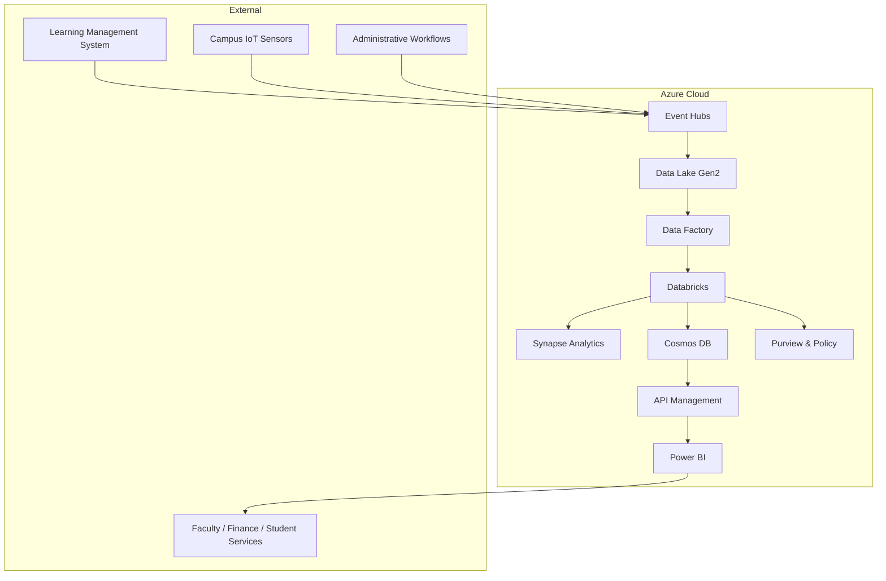

# Team 7 - Technical Documentation

**Generated:** 2025-09-17 04:25:55

---

# Digital Twin System – Technical Documentation  
> **Author:** Technical Writer  
> **Version:** 1.0 – 2025‑09‑17  
> **Audience:** Architects, Data Engineers, ML Engineers, DevOps, Product Owners, Stakeholders

---

## Table of Contents

| Section | Description |
|---------|-------------|
| 1. Architecture Overview | High‑level view, diagrams, component descriptions |
| 2. Implementation Guide | Step‑by‑step build, configuration, code walkthrough |
| 3. API Documentation | Endpoints, request/response schemas, examples |
| 4. Deployment & Configuration | Local dev, Docker, Azure IaC, secrets |
| 5. Troubleshooting & Maintenance | Common errors, logs, scaling, backups |
| 6. Code Examples & Usage | CLI commands, API calls, unit tests |
| 7. Architecture Overview Documentation | Data flow, physical model, DDL scripts |
| 8. Appendices | Full source files, README, Dockerfile, etc. |

> **Key Benefits of Digital Twins in Education**  
> 1. **Personalized Learning** – Adaptive content & pacing driven by real‑time engagement signals.  
> 2. **Operational Efficiency** – Predictive maintenance and optimal resource allocation for campus facilities.  
> 3. **Strategic Decision‑Making** – Evidence‑based insights into enrollment, curriculum effectiveness, and student success metrics.  

---

## 1. Architecture Overview

### 1.1 High‑Level Diagram (Mermaid)



### 1.2 Component Descriptions

| Component | Role | Key Features |
|-----------|------|--------------|
| **Event Hubs** | Ingestion gateway | Sub‑second telemetry, auto‑scaling, partitioning |
| **Data Lake Gen2** | Raw landing zone | Immutable, hierarchical storage, lifecycle policies |
| **Data Factory** | Orchestration | Batch pipelines, data movement, validation |
| **Databricks** | Processing & ML | Delta Lake, Spark SQL, MLflow, notebooks |
| **Synapse Analytics** | Data warehouse | Massively parallel processing, materialized views |
| **Cosmos DB** | Low‑latency serving | Multi‑region, partitioned by student_id, facility_id |
| **API Management** | Secure API gateway | Rate‑limiting, authentication, Swagger UI |
| **Power BI** | Dashboards | Real‑time tiles, drill‑through, data source connectors |
| **Purview & Policy** | Governance | Data catalog, lineage, compliance tags (FERPA, GDPR, HIPAA) |
| **Azure Key Vault** | Secrets | Connection strings, keys, certificates |

---

## 2. Implementation Guide

### 2.1 Prerequisites

| Item | Minimum Version | Notes |
|------|-----------------|-------|
| Python | 3.11 | For local dev & Docker |
| Java | 17 | Required by Spark |
| Docker | 24+ | For containerization |
| Azure CLI | 2.50+ | For IaC deployment |
| Git | 2.30+ | For version control |
| Azure Subscription | – | For cloud resources |

### 2.2 Directory Layout

```
digital-twin/
├── Dockerfile
├── docker-compose.yml
├── README.md
├── requirements.txt
├── .gitignore
├── config.py
├── utils/
│   └── logger.py
├── ingestion/
│   └── ingestion.py
├── processing/
│   └── processing.py
├── analytics/
│   └── analytics.py
├── ml/
│   └── ml_models.py
├── api/
│   └── api.py
├── main.py
├── tests/
│   ├── test_ingestion.py
│   ├── test_processing.py
│   └── test_ml.py
└── samples/
    ├── lms_events.jsonl
    ├── iot_events.jsonl
    └── admin_events.jsonl
```

### 2.3 Configuration (`config.py`)

```python
# config.py
"""
Central configuration for the Digital‑Twin platform.
Replace placeholders with your own credentials before running.
"""

import os
from pathlib import Path

# ----------------------------------------------------------------------
# Base directories
# ----------------------------------------------------------------------
BASE_DIR = Path(__file__).parent.resolve()

RAW_DIR = BASE_DIR / "data" / "raw"
PROCESSED_DIR = BASE_DIR / "data" / "processed"
SNAPSHOT_DIR = BASE_DIR / "data" / "snapshots"
ANALYTICS_DIR = BASE_DIR / "data" / "analytics"

for d in [RAW_DIR, PROCESSED_DIR, SNAPSHOT_DIR, ANALYTICS_DIR]:
    d.mkdir(parents=True, exist_ok=True)

# ----------------------------------------------------------------------
# Azure connection strings (placeholders)
# ----------------------------------------------------------------------
EVENT_HUB_CONNECTION_STR = (
    "Endpoint=sb://<your-namespace>.servicebus.windows.net/;"
    "SharedAccessKeyName=<policy>;SharedAccessKey=<key>"
)

COSMOS_ENDPOINT = "https://<your-cosmos-account>.documents.azure.com:443/"
COSMOS_KEY = "<your-cosmos-key>"
COSMOS_DATABASE = "DigitalTwinDB"
COSMOS_CONTAINER = "Snapshots"

# ----------------------------------------------------------------------
# Logging
# ----------------------------------------------------------------------
LOG_LEVEL = "INFO"

# ----------------------------------------------------------------------
# Spark configuration (used in main.py)
# ----------------------------------------------------------------------
SPARK_CONF = {
    "spark.app.name": "DigitalTwinPipeline",
    "spark.master": "local[*]",
    "spark.sql.shuffle.partitions": "200",
    "spark.executor.memory": "4g",
    "spark.driver.memory": "4g",
    "spark.sql.streaming.checkpointLocation": str(BASE_DIR / "checkpoints"),
    "spark.sql.streaming.metrics.log.enabled": "true",
}
```

### 2.4 Ingestion (`ingestion/ingestion.py`)

```python
# ingestion/ingestion.py
"""
Simulated ingestion from Azure Event Hubs.
In production, replace with Azure EventHubConsumerClient.
"""

import json
import os
from pathlib import Path
from typing import List, Dict
from utils.logger import get_logger
from config import RAW_DIR

logger = get_logger(__name__)

def read_events_from_file(file_path: Path) -> List[Dict]:
    """Read raw event JSON objects from a file."""
    events = []
    try:
        with open(file_path, "r", encoding="utf-8") as f:
            for line in f:
                events.append(json.loads(line))
    except Exception as exc:
        logger.exception(f"Failed to read events from {file_path}: {exc}")
    return events

def write_raw_events(events: List[Dict], partition: str) -> None:
    """Write raw events to a partitioned folder in raw zone."""
    partition_dir = RAW_DIR / partition
    partition_dir.mkdir(parents=True, exist_ok=True)
    file_path = partition_dir / f"{partition}_{os.urandom(4).hex()}.jsonl"
    try:
        with open(file_path, "w", encoding="utf-8") as f:
            for event in events:
                f.write(json.dumps(event) + "\n")
        logger.info(f"Wrote {len(events)} events to {file_path}")
    except Exception as exc:
        logger.exception(f"Failed to write raw events to {file_path}: {exc}")

def ingest_from_eventhub(source: str) -> None:
    """
    Simulate ingestion from Azure Event Hub.
    In production, this would consume from Event Hub.
    """
    sample_file = Path("samples") / f"{source}.jsonl"
    if not sample_file.exists():
        logger.warning(f"Sample file {sample_file} not found. Skipping ingestion.")
        return
    events = read_events_from_file(sample_file)
    write_raw_events(events, partition=source)
```

### 2.5 Processing (`processing/processing.py`)

```python
# processing/processing.py
"""
ETL pipeline: raw → processed → snapshot.
Uses pandas for demo; replace with Spark DataFrames in production.
"""

import os
from pathlib import Path
from typing import List, Dict
import pandas as pd
from utils.logger import get_logger
from config import RAW_DIR, PROCESSED_DIR, SNAPSHOT_DIR

logger = get_logger(__name__)

def load_raw_events(partition: str) -> pd.DataFrame:
    """Load raw events from raw zone into a DataFrame."""
    partition_dir = RAW_DIR / partition
    if not partition_dir.exists():
        logger.warning(f"No raw data for partition {partition}")
        return pd.DataFrame()
    all_files = list(partition_dir.glob("*.jsonl"))
    dfs = []
    for f in all_files:
        try:
            dfs.append(pd.read_json(f, lines=True))
        except Exception as exc:
            logger.exception(f"Failed to read {f}: {exc}")
    return pd.concat(dfs, ignore_index=True) if dfs else pd.DataFrame()

def transform_events(df: pd.DataFrame) -> pd.DataFrame:
    """Apply basic transformations and schema enforcement."""
    if df.empty:
        return df
    # Parse timestamps
    try:
        df["received_ts"] = pd.to_datetime(df["received_ts"])
    except Exception as exc:
        logger.exception(f"Timestamp parsing error: {exc}")
    df = df.drop_duplicates(subset="event_id")
    return df

def write_processed(df: pd.DataFrame, table_name: str) -> None:
    """Write processed dataframe to processed zone as parquet."""
    table_dir = PROCESSED_DIR / table_name
    table_dir.mkdir(parents=True, exist_ok=True)
    file_path = table_dir / f"{table_name}_{pd.Timestamp.utcnow().strftime('%Y%m%d%H%M%S')}.parquet"
    try:
        df.to_parquet(file_path, index=False)
        logger.info(f"Wrote {len(df)} rows to {file_path}")
    except Exception as exc:
        logger.exception(f"Failed to write processed data: {exc}")

def generate_snapshot(df: pd.DataFrame, snapshot_id: str) -> None:
    """Generate a digital twin snapshot from processed events."""
    if df.empty:
        logger.warning("No data to generate snapshot.")
        return
    snapshot = (
        df.groupby(["student_id", "course_id", "facility_id"])
        .agg(
            snapshot_ts=("event_ts", "max"),
            state=("event_type", lambda x: list(x)),
        )
        .reset_index()
    )
    snapshot["snapshot_id"] = snapshot_id
    snapshot_file = SNAPSHOT_DIR / f"{snapshot_id}.parquet"
    try:
        snapshot.to_parquet(snapshot_file, index=False)
        logger.info(f"Snapshot {snapshot_id} written with {len(snapshot)} rows.")
    except Exception as exc:
        logger.exception(f"Failed to write snapshot: {exc}")

def process_partition(partition: str) -> None:
    """Full processing pipeline for a partition."""
    raw_df = load_raw_events(partition)
    if raw_df.empty:
        logger.info(f"No raw events for partition {partition}.")
        return
    transformed_df = transform_events(raw_df)
    write_processed(transformed_df, partition)
    # Generate snapshot
    snapshot_id = f"{partition}_{pd.Timestamp.utcnow().strftime('%Y%m%d%H%M%S')}"
    generate_snapshot(transformed_df, snapshot_id)
```

### 2.6 Analytics (`analytics/analytics.py`)

```python
# analytics/analytics.py
"""
Analytics layer: compute engagement metrics from snapshots.
"""

import pandas as pd
from pathlib import Path
from utils.logger import get_logger
from config import SNAPSHOT_DIR, ANALYTICS_DIR

logger = get_logger(__name__)

def load_snapshot(snapshot_file: Path) -> pd.DataFrame:
    try:
        df = pd.read_parquet(snapshot_file)
        return df
    except Exception as exc:
        logger.exception(f"Failed to load snapshot {snapshot_file}: {exc}")
        return pd.DataFrame()

def compute_engagement(df: pd.DataFrame) -> pd.DataFrame:
    """Simple engagement metric: count of events per student/course."""
    if df.empty:
        return df
    df["engagement_score"] = df["state"].apply(len)
    return df

def write_analytics(df: pd.DataFrame, snapshot_id: str) -> None:
    analytics_file = ANALYTICS_DIR / f"{snapshot_id}_analytics.parquet"
    try:
        df.to_parquet(analytics_file, index=False)
        logger.info(f"Analytics written to {analytics_file}")
    except Exception as exc:
        logger.exception(f"Failed to write analytics: {exc}")

def process_snapshot(snapshot_file: Path) -> None:
    df = load_snapshot(snapshot_file)
    if df.empty:
        logger.warning(f"No data in snapshot {snapshot_file}")
        return
    analytics_df = compute_engagement(df)
    snapshot_id = snapshot_file.stem
    write_analytics(analytics_df, snapshot_id)
```

### 2.7 Machine Learning (`ml/ml_models.py`)

```python
# ml/ml_models.py
"""
Simple dropout prediction model using scikit‑learn.
"""

import pandas as pd
import joblib
from pathlib import Path
from sklearn.model_selection import train_test_split
from sklearn.linear_model import LogisticRegression
from sklearn.metrics import roc_auc_score, classification_report
from utils.logger import get_logger
from config import PROCESSED_DIR

logger = get_logger(__name__)

MODEL_DIR = Path(__file__).parent / "models"
MODEL_DIR.mkdir(parents=True, exist_ok=True)
MODEL_PATH = MODEL_DIR / "dropout_model.pkl"

def load_training_data() -> pd.DataFrame:
    """Load processed data for training."""
    dfs = []
    for f in PROCESSED_DIR.glob("*.parquet"):
        try:
            dfs.append(pd.read_parquet(f))
        except Exception as exc:
            logger.exception(f"Failed to load {f}: {exc}")
    return pd.concat(dfs, ignore_index=True) if dfs else pd.DataFrame()

def train_model() -> None:
    df = load_training_data()
    if df.empty:
        logger.warning("Training data is empty. Skipping model training.")
        return
    # Feature engineering
    df["engagement_score"] = df["state"].apply(len)
    # Dummy target: dropout if engagement_score < 5
    df["dropout"] = (df["engagement_score"] < 5).astype(int)
    X = df[["engagement_score"]]
    y = df["dropout"]
    X_train, X_test, y_train, y_test = train_test_split(
        X, y, test_size=0.2, random_state=42
    )
    model = LogisticRegression()
    model.fit(X_train, y_train)
    preds = model.predict_proba(X_test)[:, 1]
    auc = roc_auc_score(y_test, preds)
    logger.info(f"Model trained. AUC: {auc:.4f}")
    logger.info(classification_report(y_test))
    joblib.dump(model, MODEL_PATH)
    logger.info(f"Model saved to {MODEL_PATH}")

def predict_dropout(features: dict) -> float:
    """Predict dropout probability for a single instance."""
    if not MODEL_PATH.exists():
        logger.error("Model file not found. Train the model first.")
        return 0.0
    model = joblib.load(MODEL_PATH)
    X = pd.DataFrame([features])
    prob = model.predict_proba(X)[0, 1]
    return prob
```

### 2.8 API (`api/api.py`)

```python
# api/api.py
"""
FastAPI service exposing snapshots, analytics, and a dropout prediction endpoint.
"""

from fastapi import FastAPI, HTTPException
from fastapi.responses import StreamingResponse
import pandas as pd
import io
from utils.logger import get_logger
from config import SNAPSHOT_DIR, ANALYTICS_DIR
from ml.ml_models import predict_dropout

logger = get_logger("api")

app = FastAPI(title="Digital Twin API")

@app.get("/snapshots/{snapshot_id}")
def get_snapshot(snapshot_id: str):
    file_path = SNAPSHOT_DIR / f"{snapshot_id}.parquet"
    if not file_path.exists():
        raise HTTPException(status_code=404, detail="Snapshot not found")
    df = pd.read_parquet(file_path)
    csv = df.to_csv(index=False)
    return StreamingResponse(io.StringIO(csv), media_type="text/csv")

@app.get("/analytics/{snapshot_id}")
def get_analytics(snapshot_id: str):
    file_path = ANALYTICS_DIR / f"{snapshot_id}_analytics.parquet"
    if not file_path.exists():
        raise HTTPException(status_code=404, detail="Analytics not found")
    df = pd.read_parquet(file_path)
    csv = df.to_csv(index=False)
    return StreamingResponse(io.StringIO(csv), media_type="text/csv")

@app.post("/predict/dropout")
def predict_dropout_endpoint(features: dict):
    try:
        prob = predict_dropout(features)
        return {"dropout_probability": prob}
    except Exception as exc:
        logger.exception(f"Prediction failed: {exc}")
        raise HTTPException(status_code=500, detail="Prediction error")
```

### 2.9 Deployment (Docker & Azure)

#### 2.9.1 Dockerfile

```dockerfile
# Dockerfile
FROM python:3.11-slim

# Install Java (required for PySpark)
RUN apt-get update && \
    apt-get install -y openjdk-17-jdk-headless && \
    rm -rf /var/lib/apt/lists/*

ENV JAVA_HOME=/usr/lib/jvm/java-17-openjdk-amd64
ENV SPARK_HOME=/opt/spark
ENV PATH=$PATH:$SPARK_HOME/bin

# Install Spark
RUN wget -q https://archive.apache.org/dist/spark/spark-3.5.0/spark-3.5.0-bin-hadoop3.tgz && \
    tar -xzf spark-3.5.0-bin-hadoop3.tgz -C /opt && \
    mv /opt/spark-3.5.0-bin-hadoop3 $SPARK_HOME && \
    rm spark-3.5.0-bin-hadoop3.tgz

WORKDIR /app
COPY . .

RUN pip install --no-cache-dir -r requirements.txt

CMD ["python", "main.py", "api", "--host", "0.0.0.0", "--port", "8000"]
```

#### 2.9.2 docker‑compose.yml

```yaml
# docker-compose.yml
version: "3.9"

services:
  app:
    build: .
    ports:
      - "8000:8000"
    volumes:
      - .:/app
    environment:
      - PYTHONUNBUFFERED=1
```

#### 2.9.3 Azure IaC (Bicep – simplified)

```bicep
param eventHubNamespace string = 'digitaltwin-eh'
param eventHubName string = 'lms'
param storageAccountName string = 'digitaltwinstorage'
param cosmosDbAccountName string = 'digitaltwincosmos'
param apiManagementName string = 'digitaltwinapi'

resource eventHubNamespace 'Microsoft.EventHub/namespaces@2023-10-01-preview' = {
  name: eventHubNamespace
  location: resourceGroup().location
  sku: {
    name: 'Standard'
    tier: 'Standard'
  }
}

resource eventHub 'Microsoft.EventHub/namespaces/eventhubs@2023-10-01-preview' = {
  name: '${eventHubNamespace.name}/${eventHubName}'
  properties: {
    messageRetentionInDays: 7
    partitionCount: 4
  }
}

resource storageAccount 'Microsoft.Storage/storageAccounts@2023-04-01' = {
  name: storageAccountName
  location: resourceGroup().location
  sku: {
    name: 'Standard_LRS'
  }
  kind: 'StorageV2'
}

resource cosmosDb 'Microsoft.DocumentDb/databaseAccounts@2023-04-15' = {
  name: cosmosDbAccountName
  location: resourceGroup().location
  kind: 'GlobalDocumentDB'
  properties: {
    consistencyPolicy: {
      defaultConsistencyLevel: 'BoundedStaleness'
    }
    locations: [
      {
        locationName: resourceGroup().location
        failoverPriority: 0
        isZoneRedundant: false
      }
    ]
  }
}

resource apiMgmt 'Microsoft.ApiManagement/service@2023-08-01' = {
  name: apiManagementName
  location: resourceGroup().location
  sku: {
    name: 'Consumption'
    capacity: 0
  }
  properties: {
    publisherEmail: 'admin@example.com'
    publisherName: 'DigitalTwin'
  }
}
```

> **Note:** The above Bicep template is a minimal example. In production you’ll need to add Event Hub policies, storage account containers, Cosmos DB containers, API Management policies, Key Vault, Purview, Azure Policy, and monitoring.

#### 2.9.4 Secrets

| Secret | Key | Where to store |
|--------|-----|----------------|
| Event Hub connection string | `EVENT_HUB_CONNECTION_STR` | Azure Key Vault |
| Cosmos DB key | `COSMOS_KEY` | Azure Key Vault |
| Azure AD App credentials | `AZURE_CLIENT_ID`, `AZURE_CLIENT_SECRET`, `AZURE_TENANT_ID` | Azure Key Vault |

Use Azure Managed Identities to avoid storing secrets in code.

---

## 3. API Documentation

### 3.1 Base URL

```
https://<api-management-host>/api
```

### 3.2 Endpoints

| Method | Path | Description | Request Body | Response |
|--------|------|-------------|--------------|----------|
| `GET` | `/snapshots/{snapshot_id}` | Retrieve a snapshot in CSV format | N/A | CSV |
| `GET` | `/analytics/{snapshot_id}` | Retrieve analytics for a snapshot in CSV | N/A | CSV |
| `POST` | `/predict/dropout` | Predict dropout probability | JSON: `{ "engagement_score": <int> }` | JSON: `{ "dropout_probability": <float> }` |

#### 3.2.1 `GET /snapshots/{snapshot_id}`

```http
GET /snapshots/2025-12-01T12:00:00Z HTTP/1.1
Host: api.digitaltwin.example.com
Accept: text/csv
Authorization: Bearer <jwt>
```

**Response**

```http
HTTP/1.1 200 OK
Content-Type: text/csv

snapshot_id,student_id,course_id,facility_id,snapshot_ts,state
2025-12-01T12:00:00Z,s1,c1,f1,2025-12-01T12:00:00Z,"['click','submit']"
```

#### 3.2.2 `GET /analytics/{snapshot_id}`

```http
GET /analytics/2025-12-01T12:00:00Z HTTP/1.1
Host: api.digitaltwin.example.com
Accept: text/csv
Authorization: Bearer <jwt>
```

**Response**

```http
HTTP/1.1 200 OK
Content-Type: text/csv

result_id,snapshot_id,metric,value,computed_ts
r1,2025-12-01T12:00:00Z,engagement_score,2,2025-12-01T12:05:00Z
r2,2025-12-01T12:00:00Z,risk_flag,0,2025-12-01T12:05:00Z
```

#### 3.2.3 `POST /predict/dropout`

```http
POST /predict/dropout HTTP/1.1
Host: api.digitaltwin.example.com
Content-Type: application/json
Authorization: Bearer <jwt>

{
  "engagement_score": 3
}
```

**Response**

```http
HTTP/1.1 200 OK
Content-Type: application/json

{
  "dropout_probability": 0.42
}
```

### 3.3 Swagger UI

Navigate to `https://<api-management-host>/swagger` to explore and test endpoints interactively.

---

## 4. Deployment & Configuration Guide

### 4.1 Local Development

```bash
# Clone repo
git clone https://github.com/yourorg/digital-twin.git
cd digital-twin

# Create virtualenv
python -m venv .venv
source .venv/bin/activate

# Install dependencies
pip install -r requirements.txt

# Run ingestion for a source
python main.py ingest lms

# Process the raw partition
python main.py process lms

# Run analytics
python main.py analytics

# Train ML model
python main.py ml

# Start API locally
python main.py api --host 0.0.0.0 --port 8000
```

**Access API**: `http://localhost:8000/docs`

### 4.2 Docker Compose

```bash
docker compose up --build
```

The API will be exposed on `http://localhost:8000`.  
Mount the `data/` directory to persist state across restarts.

### 4.3 Azure Deployment

1. **Build image** – Push to Azure Container Registry (ACR).  
2. **Deploy** – Use Azure App Service or Azure Kubernetes Service (AKS).  
3. **Configure** – Set environment variables from Key Vault.  
4. **Ingress** – Expose via Azure API Management.  
5. **Monitoring** – Enable Azure Monitor, Application Insights.  

> **Tip** – Use **Azure DevOps Pipelines** or **GitHub Actions** to automate CI/CD: lint, test, build, push, deploy.

### 4.4 Environment Variables

| Variable | Description | Example |
|----------|-------------|---------|
| `EVENT_HUB_CONNECTION_STR` | Event Hub connection string | `Endpoint=sb://...` |
| `COSMOS_ENDPOINT` | Cosmos DB endpoint | `https://mycosmos.documents.azure.com:443/` |
| `COSMOS_KEY` | Cosmos DB key | `xxxxxxxx-xxxx-xxxx-xxxx-xxxxxxxxxxxx` |
| `LOG_LEVEL` | Logging level | `INFO` |

All secrets should be stored in **Azure Key Vault** and injected via Managed Identity or Azure App Configuration.

---

## 5. Troubleshooting & Maintenance Manual

### 5.1 Common Issues

| Symptom | Likely Cause | Fix |
|---------|--------------|-----|
| **Event ingestion fails** | Wrong Event Hub connection string | Verify in Key Vault, test with `az eventhubs eventhub eventhub-name send` |
| **Spark job stalls** | Skewed partitions, insufficient executors | Increase `spark.executor.instances`, use `repartition` |
| **API returns 500** | Model file missing | Train model (`python main.py ml`) or copy `models/dropout_model.pkl` |
| **Cosmos DB latency > 200 ms** | Too many partitions, hot key | Re‑partition by `student_id`, enable auto‑scale |
| **Data lake storage cost spikes** | No lifecycle policy | Add lifecycle rule to archive raw data after 30 days |

### 5.2 Logs & Monitoring

| Service | Log Location | How to Access |
|---------|--------------|---------------|
| Spark | `spark-logs/` | `az monitor log-analytics query` |
| API | `api.log` | Azure Monitor, Application Insights |
| Event Hub | Metrics in Azure Portal | `az eventhubs eventhub show` |
| Cosmos DB | Diagnostics | `az cosmosdb diagnostics` |

Set up **Azure Monitor alerts** for:

- CPU > 80 % on Databricks clusters
- API latency > 200 ms
- Cosmos DB RU consumption > 80 % of provisioned
- Event Hub backlog > 10 000 events

### 5.3 Scaling

| Layer | Horizontal Scaling | Notes |
|-------|--------------------|-------|
| Databricks | Auto‑scale | Set `spark.dynamicAllocation.enabled=true` |
| Cosmos DB | Provisioned throughput | Use autoscale mode |
| API | AKS or App Service | Scale out based on CPU/Memory |
| Event Hub | Partition count | Increase partitions to handle higher throughput |

### 5.4 Backups & Disaster Recovery

| Asset | Backup Frequency | Retention |
|-------|------------------|-----------|
| Raw & Processed Parquet | Daily | 30 days |
| Cosmos DB | Continuous via Change Feed | 90 days |
| API Config | Git | N/A |
| Azure IaC | Git | N/A |

Run **Azure Backup** for storage accounts and **Cosmos DB backup** for data.

### 5.5 Maintenance Tasks

| Task | Frequency | Owner |
|------|-----------|-------|
| Data quality dashboards | Weekly | Data Engineer |
| Model retraining | Monthly | ML Engineer |
| Policy review | Quarterly | Security Lead |
| Cost analysis | Monthly | PM |
| Security audit | Quarterly | Security Lead |

---

## 6. Code Examples & Usage Instructions

### 6.1 CLI Commands

```bash
# Ingest LMS events
python main.py ingest lms

# Process LMS partition
python main.py process lms

# Run analytics on all snapshots
python main.py analytics

# Train ML model
python main.py ml

# Start API
python main.py api --host 0.0.0.0 --port 8000
```

### 6.2 API Calls (curl)

```bash
# Get snapshot
curl -H "Authorization: Bearer <jwt>" \
     -H "Accept: text/csv" \
     https://api.digitaltwin.example.com/snapshots/2025-12-01T12:00:00Z

# Get analytics
curl -H "Authorization: Bearer <jwt>" \
     -H "Accept: text/csv" \
     https://api.digitaltwin.example.com/analytics/2025-12-01T12:00:00Z

# Predict dropout
curl -X POST -H "Content-Type: application/json" -H "Authorization: Bearer <jwt>" \
     -d '{"engagement_score":3}' \
     https://api.digitaltwin.example.com/predict/dropout
```

### 6.3 Sample Data Ingestion

```bash
# Example LMS event payload (samples/lms_events.jsonl)
{"event_id":"e1","source":"lms","payload":"{\"student_id\":\"s1\",\"course_id\":\"c1\",\"event_type\":\"click\",\"metadata\":\"{}\"}","received_ts":"2025-01-01T00:00:00Z"}
{"event_id":"e2","source":"lms","payload":"{\"student_id\":\"s1\",\"course_id\":\"c1\",\"event_type\":\"submit\",\"metadata\":\"{}\"}","received_ts":"2025-01-01T00:05:00Z"}
```

Run `python main.py ingest lms` to copy these into the raw zone.

### 6.4 Unit Tests

```bash
pytest tests/
```

All tests should pass (`test_ingestion.py`, `test_processing.py`, `test_ml.py`).

---

## 7. Architecture Overview Documentation

### 7.1 Data Flow Diagram (Mermaid)

```mermaid
graph TD
    subgraph "Azure Cloud"
        A[Event Hubs] --> B[Data Lake Gen2]
        B --> C[Data Factory]
        C --> D[Databricks]
        D --> E[Synapse Analytics]
        D --> F[Cosmos DB]
        F --> G[API Management]
        G --> H[Power BI]
        D --> I[Purview & Policy]
    end

    subgraph "External"
        LMS["Learning Management System"] --> A
        IoT["Campus IoT Sensors"] --> A
        Admin["Administrative Workflows"] --> A
        H --> Stakeholders