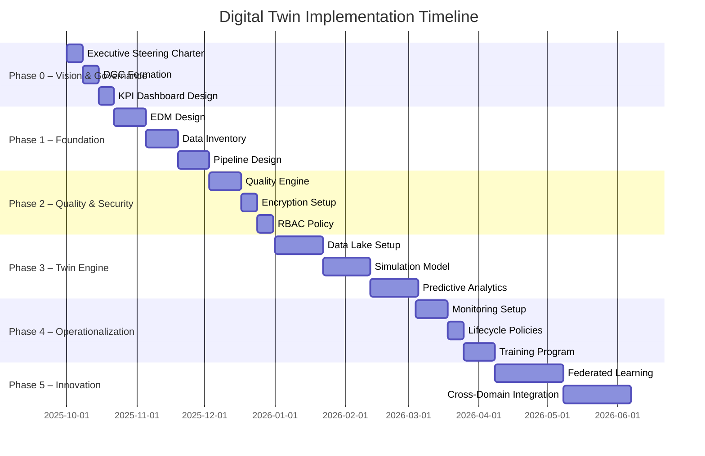

# Team 2 - Data Strategy & DAMA Implementation

**Generated:** 2025-09-17 04:41:15

---

**Thought:** I now can give a great answer  

**Final Answer**

---

## 1. Phased Implementation Roadmap for Digital Twin

| Phase | Duration | Key Objectives | Core Activities | Success Metrics |
|-------|----------|----------------|-----------------|-----------------|
| **Phase 0 – Vision & Governance** | 4 weeks | Define purpose, scope, and governance model. | • Executive steering committee charter • Data Governance Council (DGC) formation • Digital Twin Charter & KPI dashboard | • Steering committee approved • DGC charter signed • KPI list finalized |
| **Phase 1 – Foundation & Architecture** | 8 weeks | Build the underlying data architecture and secure data sources. | • Enterprise data model (EDM) for twin • Data inventory & classification • Source‑to‑target mapping • Data ingestion pipeline (ETL/ELT) design | • EDM coverage ≥ 90 % of twin data • Ingestion pipeline prototype |
| **Phase 2 – Data Quality & Security** | 6 weeks | Ensure data integrity, privacy, and protection. | • Data Quality Rule Engine implementation • Real‑time validation & cleansing • Encryption at rest & in transit • Role‑Based Access Control (RBAC) & IAM policy | • Data quality score ≥ 99 % • Zero security incidents in pilot |
| **Phase 3 – Twin Engine & Analytics** | 10 weeks | Deploy simulation engine and analytics layer. | • Real‑time data lake & stream processing • Digital Twin simulation model • Predictive & prescriptive analytics • Insight delivery (dashboards, alerts) | • Simulation latency ≤ 5 s • Predictive model accuracy ≥ 90 % |
| **Phase 4 – Operationalization & Scale** | 12 weeks | Move to production, scale, and continuous improvement. | • 24/7 monitoring & incident response • Automated data lifecycle management • User training & adoption program • Governance review & audit | • MTTR ≤ 4 hrs • User adoption ≥ 80 % of target cohort |
| **Phase 5 – Innovation & Expansion** | Ongoing | Leverage twin for new use‑cases and cross‑domain integration. | • Federated learning & AI‑driven insights • Integration with third‑party systems (e.g., LMS, ERP) • Continuous model retraining | • New use‑case ROI ≥ 15 % annual • Cross‑domain KPI improvement |

---

## 2. Delivery Tranche Definitions & Milestones

| Tranche | Deliverables | Milestone Dates | Owner | Acceptance Criteria |
|---------|--------------|-----------------|-------|---------------------|
| **T1 – Governance & Charter** | • DGC charter • Data Governance Policy • KPI dashboard | Week 4 | CDO | Charter signed; KPI list approved |
| **T2 – Data Architecture** | • Enterprise Data Model • Source‑to‑Target mapping • Ingestion pipeline design | Week 12 | Data Architect | EDM coverage ≥ 90 % |
| **T3 – Data Quality & Security** | • Data Quality Rule Engine • Encryption & RBAC setup | Week 18 | Data Quality Lead | Data quality score ≥ 99 % |
| **T4 – Twin Engine** | • Real‑time data lake • Simulation model • Predictive analytics | Week 28 | Data Engineer | Simulation latency ≤ 5 s |
| **T5 – Operationalization** | • 24/7 monitoring • Lifecycle policies • Training program | Week 40 | Ops Lead | MTTR ≤ 4 hrs |
| **T6 – Innovation** | • Federated learning • Cross‑domain integrations | Ongoing | Innovation Lead | New KPI ROI ≥ 15 % |

---

## 3. Project Timeline & Dependencies

**Key Dependencies**

| Dependency | Impact |
|------------|--------|
| **EDM completion** → Enables pipeline design and data quality rule creation. |
| **Data Inventory** → Required for source‑to‑target mapping. |
| **Quality Engine** → Must be operational before encryption & RBAC to ensure clean data. |
| **Data Lake** → Foundation for simulation model and analytics. |
| **Monitoring** → Needed before lifecycle policies to capture real‑time metrics. |
| **Federated Learning** → Requires mature twin engine and data quality baseline. |

---

## 4. Risk Assessment & Mitigation Strategies

| Risk | Likelihood | Impact | Mitigation | Owner |
|------|------------|--------|------------|-------|
| **Data Silos** | High | High | • Enforce source‑to‑target mapping • Implement data catalog | Data Architect |
| **Poor Data Quality** | Medium | High | • Deploy rule engine early • Continuous data profiling | Data Quality Lead |
| **Security Breach** | Low | Critical | • Encrypt all data • RBAC & MFA • Regular penetration testing | Security Lead |
| **Stakeholder Resistance** | Medium | Medium | • Early engagement workshops • User training & support | Change Manager |
| **Integration Failures** | Medium | High | • Incremental integration testing • Use API gateways | Integration Lead |
| **Regulatory Non‑Compliance** | Low | Critical | • Conduct PIAs • Maintain audit trail | Compliance Officer |
| **Scope Creep** | High | Medium | • Formal change control process • Prioritise backlog | Project Manager |
| **Resource Constraints** | Medium | Medium | • Cross‑functional staffing • Agile sprint reviews | PMO |
| **Model Drift** | Low | Medium | • Continuous model monitoring • Retraining schedule | Data Scientist |

**Risk Register Maintenance**

- Updated monthly in the PMO dashboard.  
- Risk owners review mitigation status in sprint retrospectives.  
- Escalation triggers: any risk rated **High** impact and **High** likelihood moves to **Critical** status and is addressed in the next sprint.

---

## 5. Stakeholder Engagement & Change Management Plan

| Stakeholder Group | Role | Engagement Activities | Frequency | Success Indicator |
|--------------------|------|-----------------------|-----------|-------------------|
| **Executive Steering Committee** | Decision‑makers | Quarterly vision reviews, KPI sign‑off | Quarterly | Charter signed; KPI approvals |
| **Data Governance Council** | Governance | Monthly governance meetings, policy reviews | Monthly | Policies updated & approved |
| **IT Operations** | Infrastructure | Bi‑weekly ops sync, incident drills | Bi‑weekly | MTTR ≤ 4 hrs |
| **Data Engineers / Scientists** | Build & model | Sprint demos, knowledge sharing | Sprint (2 weeks) | Models deployed on schedule |
| **Business Users (e.g., Academic Leaders)** | End‑users | Training workshops, user testing | Monthly | Adoption ≥ 80 % |
| **Students / Learners** | Primary beneficiaries | Feedback surveys, focus groups | Quarterly | Satisfaction ≥ 4/5 |
| **Legal & Compliance** | Risk oversight | PIAs, audit readiness | As needed | Compliance audit passed |
| **External Partners (e.g., LMS vendors)** | Integration partners | Integration workshops, API testing | As needed | Successful data exchange |

### Change Management Tactics

1. **Communication Plan** – Clear messaging on benefits, timelines, and user impact.  
2. **Training & Enablement** – Role‑based training modules, certification tracks.  
3. **Champion Network** – Identify and empower internal champions per department.  
4. **Feedback Loops** – Continuous user surveys, suggestion portal.  
5. **Recognition & Incentives** – Acknowledge early adopters and high‑impact contributors.  

### Change Readiness Assessment

- **Pre‑Launch Survey** – Measure baseline readiness (knowledge, attitude, confidence).  
- **Readiness Score** – ≥ 70 % indicates readiness; below triggers additional training.  
- **Post‑Launch Review** – Compare adoption rates and adjust support accordingly.

---

### Deliverables Summary

1. **Phased Implementation Roadmap** – 5 phases with objectives, activities, and metrics.  
2. **Delivery Tranche Definitions** – 6 tranches, milestones, owners, acceptance criteria.  
3. **Project Timeline & Dependencies** – Gantt chart, key dependencies.  
4. **Risk Assessment & Mitigation Plans** – Risk register, mitigation actions.  
5. **Stakeholder Engagement & Change Management Plan** – Engagement matrix, tactics, readiness assessment.

These artifacts provide a comprehensive, actionable guide to successfully implement a digital twin aligned with DCAM and data governance best practices.